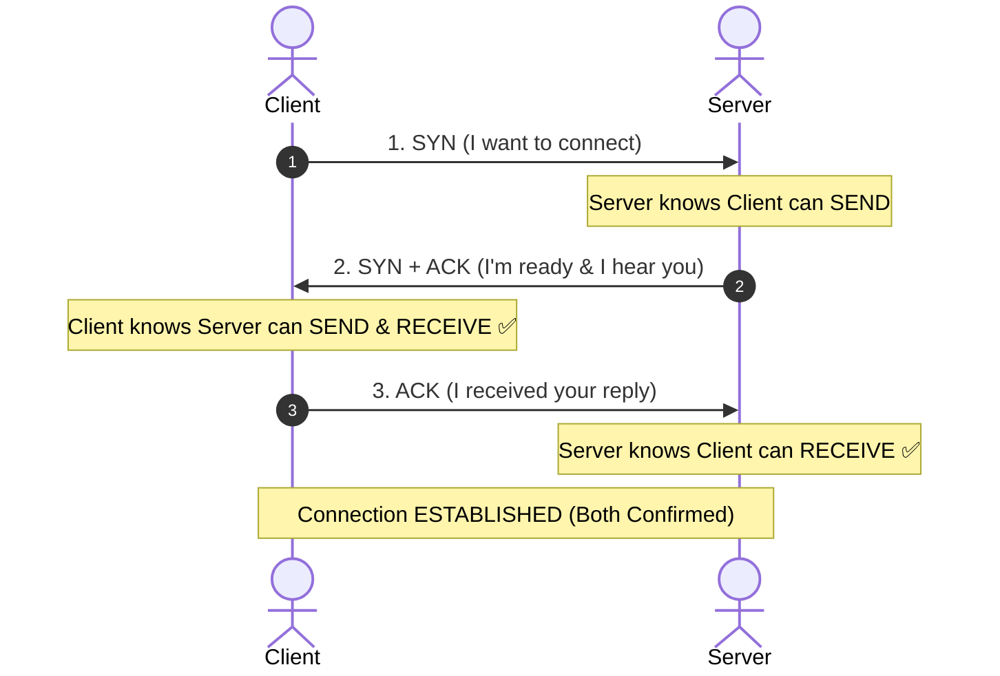

# Why TCP Uses a 3-Way Handshake Instead of 2

## 🎯 The Question

> **"Why does TCP need 3 packets (SYN, SYN-ACK, ACK) to establish a connection? Why isn't a 2-way handshake (SYN, SYN-ACK) enough?"**

---

## ⚡ 30-Second Elevator Pitch

In a **2-Way Handshake**, the client sends a `SYN` (*"I want to connect"*), and the server replies with `SYN-ACK` (*"I am ready to connect"*). 

At this point, the client knows the server is alive and ready, but **the server has no confirmation whether its reply ever reached the client**. 

To prevent half-open / phantom connections and ensure **mutual confirmation from both sides**, TCP requires a third packet—the final `ACK` from the client. Only after this packet is received is the full-duplex connection marked `ESTABLISHED`.

---

## 🧠 Deep Dive: Bidirectional Confirmation & Sequence Sync

### 1. Step-by-Step Packet Exchange

- **Step 1 — SYN (Client $\to$ Server)**:  
  The Client initiates the handshake saying: *"I want to connect."*  
  **What is verified**: Server learns that Client can **send** data.

- **Step 2 — SYN + ACK (Server $\to$ Client)**:  
  The Server responds: *"I received your request, and I am ready to connect."*  
  **What is verified**: Client confirms Server can **receive and send** data. However, Server is still unconfirmed if its reply reached Client.

- **Step 3 — ACK (Client $\to$ Server)**:  
  The Client sends the final confirmation: *"I received your SYN-ACK."*  
  **What is verified**: Server now knows Client can **receive** data. Both sides are 100% synchronized and ready for full-duplex data transfer.

---

## 💡 What Interviewers Ask Next (Follow-Up Traps)

1. **"What happens if the 3rd ACK packet gets lost?"**
   - *Answer*: The server will not transition to `ESTABLISHED` immediately. It will retransmit the `SYN-ACK` packet after a timeout. If the client tries to send data immediately, the first data packet will also carry the `ACK` flag, completing the connection implicitly.

2. **"Can delayed old duplicate SYN packets cause ghost connections in a 2-way handshake?"**
   - *Answer*: Yes. In a 2-way handshake, if an old delayed SYN packet arrives at the server, the server would immediately allocate memory buffers and open a connection for a client that might not even exist anymore. The 3-way handshake prevents this because the client will reject stale connection attempts with an `RST` (Reset) packet.

---

## 📌 Summary Cheatsheet

| Property | 2-Way Handshake (Insufficient) | 3-Way Handshake (TCP Standard) |
| :--- | :--- | :--- |
| **Client Confirmation** | ✅ Knows server is reachable | ✅ Knows server is reachable |
| **Server Confirmation** | ❌ Cannot confirm if reply reached | ✅ Confirms client received response |
| **Connection Safety** | ❌ Vulnerable to ghost/half-open state | ✅ Mutual synchronized state |
| **Final State** | Ambiguous server state | `ESTABLISHED` on both endpoints |

:::tip Placement Takeaway
**Interview Answer**: TCP uses a 3-way handshake because a 2-way exchange leaves the server unconfirmed about whether its reply reached the client. The final ACK guarantees bidirectional confirmation and prevents phantom/half-open connections on the server.
:::

---

## 📺 Video Explanation

<YouTubeEmbed 
  id="pnBKL-qbbBY" 
  title="Why Isn't a 2-Way Handshake Enough? | TCP Interview Question #1" 
/>
