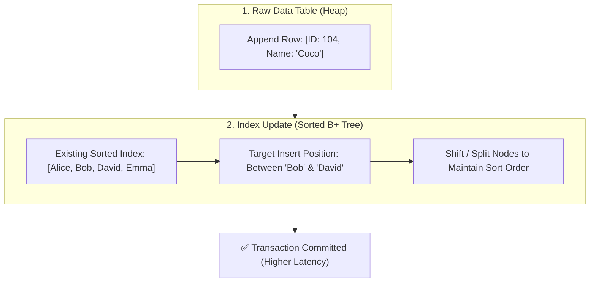

## 🎯 The Question

> **"If database indexes make SELECT queries so fast, why shouldn't we index every single column? Why do indexes make INSERT operations slower?"**

---

## ⚡ 30-Second Elevator Pitch

When a table has **no indexes**, an `INSERT` is simply an append operation to the end of the heap file / data page ($O(1)$ sequential write). 

However, database indexes (like B+ Trees) must be maintained in **strictly sorted order**. When a table has one or more secondary indexes, every single `INSERT` triggers **write amplification**:
1. The database writes the raw row to heap storage.
2. It traverses and updates **every single secondary index**, shifting elements and potentially causing expensive **Page Splits** and random disk I/O to preserve sorted order.

---

## 🧠 Under-the-Hood: Read Speed vs. Write Amplification

When inserting a new record (for example, adding `"Coco"` into an alphabetical index), the database cannot just append it to the end. It must search for the exact sorted position, shift existing keys down, or split nodes if the leaf page is full:

---

## ⚡ The 2 Operations Performed During an Indexed INSERT

Whenever you execute an `INSERT` statement on an indexed table, the storage engine executes two distinct phases:

1. **Row Insertion (Heap Storage)**:
   - The actual data tuple is written into the table's data blocks/pages on disk.
   - Without an index, this is a fast sequential write.

2. **Index Traversal & Page Rebalancing**:
   - The database traverses each secondary index's B+ Tree down to the appropriate leaf page.
   - Because indexes are strictly sorted, keys must be shifted down to insert the new value into the correct position.
   - **Page Splits**: If a page is full, the engine must allocate a new disk page, migrate half the keys over, and update parent routing pointers. This turns a single row write into multiple cascading disk and Write-Ahead Log (WAL) writes.

---

## 📌 Comparison Matrix: No Index vs. With Index

| Operation / Property | Table Without Indexes | Table With Multiple Indexes |
| :--- | :--- | :--- |
| **SELECT Query Speed** | 🐢 Slow (Full Table Scan $O(N)$) | ⚡ Fast (B+ Tree Lookup $O(\log N)$) |
| **INSERT Operation Cost** | ⚡ Fast ($O(1)$ Append to Heap) | 🐢 Slower (1 Row Insert + $K$ Index Updates) |
| **I/O Complexity on Write** | Sequential Page Write | Multiple Random Disk Page Seeks / Writes |
| **Storage Mechanics** | Unordered raw data pages | Node shifting, page splits & tree rebalancing |

---

## 💡 What Interviewers Ask Next (Follow-Up Traps)

1. **"What is a B+ Tree Page Split, and why does it hurt write throughput?"**
   - *Answer*: When a leaf page in a B+ Tree is 100% full and a new key needs to be inserted into that sorted range, the database must allocate a new page, migrate half the existing keys to it, and update parent node pointers. This turns what would be a single row insert into multiple cascading disk writes and WAL entries.

2. **"How do you optimize bulk data loads on heavily indexed tables in production?"**
   - *Answer*: Drop or disable secondary indexes before executing the bulk load (`LOAD DATA` / `COPY`), insert the raw data in batch, and rebuild the indexes in a single pass afterward. This avoids row-by-row page splitting and sorts the index data in bulk.

---

:::tip Placement & Interview Takeaway
**Interview Answer**: Database indexes speed up queries because they maintain data in sorted order, but this same sorted requirement penalizes write operations. Every `INSERT` requires both writing the raw row and traversing/rebalancing every index tree, creating write amplification and page split overhead.
:::

---

## 📺 Video Explanation

<YouTubeEmbed 
  id="OKCzHs3odRE" 
  title="Why Do Database Indexes Slow Down INSERTs? | Interview Question #2" 
/>
