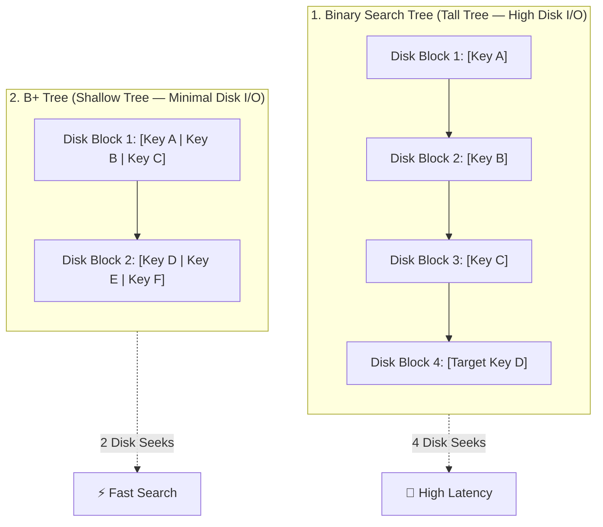

## 🎯 The Question

> **"If Binary Search Trees (BST) provide $O(\log N)$ search time in memory, why do database storage engines use B+ Trees instead?"**

---

## ⚡ 30-Second Elevator Pitch

In memory (RAM), a Binary Search Tree (BST) is fast because memory pointers have negligible access cost. But database performance is bounded by **Disk I/O**. Reading a disk block/page from secondary storage is thousands of times slower than RAM.

A **BST has a fan-out of only 2** (1 key, 2 children), creating a tall, deep tree that requires multiple sequential disk seeks. 

A **B+ Tree has a massive fan-out** (typically 100 to 500+ keys per 4KB–16KB disk block). This keeps the entire tree extremely flat (typically only 3 to 4 levels for tens of millions of records), meaning any record can be retrieved in just **3 to 4 disk reads**.

---

## 🧠 The Bookshelf Analogy: Disk Blocks vs. Tree Nodes

Database performance is governed by how many **Disk Blocks (Pages)** the storage engine must fetch from disk into memory:

* **Binary Search Tree (BST) Model:** Each shelf holds only **1 book** (1 key per disk block). To find your book, you have to walk to and inspect multiple shelves one by one.
* **B+ Tree Model:** Each shelf holds **hundreds of books** (multiple sorted keys per disk block). You only check 2 or 3 shelves to locate the exact book.

In database storage:
* **Shelves** = Disk Blocks / Buffer Pool Pages
* **Books** = Indexed Keys & Pointers

---

## 🔬 Under-the-Hood: High Fan-Out vs. Tall Trees

Because disk page seeks are expensive, databases pack as many keys as possible into each page to minimize tree height:

---

## ⚡ Why Packing Multiple Keys per Block Wins

1. **Massive Fan-Out Minimizes Disk Page Seeks**:
   - A single disk block (typically 4 KB to 16 KB) matches the hardware disk sector / page boundary.
   - Packing hundreds of keys per block keeps tree height flat ($\approx \log_{M} N$ instead of $\log_2 N$). For an index with 10,000,000 records, a BST might take ~24 disk seeks, whereas a B+ Tree takes only 3 or 4.

2. **Blazing-Fast Sequential Range Queries**:
   - In a B+ Tree, all data pointers live exclusively in the leaf nodes, and **all leaf nodes are linked together in a doubly linked list**.
   - Range queries (`WHERE age BETWEEN 20 AND 30`) only require searching down the tree once to find the first key, then scanning sequentially across the linked leaves without traversing back up internal nodes.

---

## 📌 Comparison Matrix: BST vs. B+ Tree

| Metric / Property | Binary Search Tree (BST) | B+ Tree (Database Standard) |
| :--- | :--- | :--- |
| **Keys per Disk Block** | 1 key per node | Hundreds of keys per node (High Fan-out) |
| **Tree Height** | Deep / Tall ($\approx \log_2 N$) | Short / Flat ($\approx \log_{M} N$) |
| **Disk Block Accesses** | 🐢 High (1 disk seek per level) | ⚡ Extremely Low (3–4 disk seeks for millions of rows) |
| **Range Queries** | In-order traversal across tree levels | Sequential scan along linked leaf nodes |
| **Hardware Alignment** | Poor (ignores disk page block sizes) | Excellent (1 node size = 1 disk page block) |

---

## 💡 What Interviewers Ask Next (Follow-Up Traps)

1. **"Why don't we store actual data records in the internal nodes of a B+ Tree?"**
   - *Answer*: If internal nodes stored row data, each node would take up significantly more bytes, drastically reducing the number of routing keys a page can hold. Keeping internal nodes strictly for routing keys maximizes the branching factor (fan-out) and keeps the tree shallow.

2. **"Why do databases prefer B+ Trees over standard B-Trees?"**
   - *Answer*: In a B-Tree, data records are stored in both internal and leaf nodes, so range scans require complex recursive tree traversals. In a B+ Tree, all data records are in the leaves and connected via a linked list, making sequential range scans ($O(K)$) much faster and cache-friendly.

---

:::tip Placement & Interview Takeaway
**Interview Answer**: Databases prefer B+ Trees over Binary Search Trees because disk access is the primary bottleneck. B+ Trees match the filesystem's block size, packing hundreds of keys into a single disk page. This high fan-out keeps the tree height to just 3–4 levels for millions of rows, reducing slow disk seeks, while linked leaf nodes make range scans extremely fast.
:::

---

## 📺 Video Explanation

<YouTubeEmbed 
  id="YFWu6hYCmDU" 
  title="Why Do Databases Use B+ Trees Instead of Binary Search Trees? | Interview Question #3" 
/>
