## 🎯 The Question

> **"Why is switching between two processes significantly more expensive than switching between two threads of the same process? Isn't it just saving and restoring CPU registers in both cases?"**

---

## ⚡ 30-Second Elevator Pitch

While both a process switch and a thread switch require saving CPU registers and program counters into a Control Block (PCB/TCB), **a thread switch stays within the exact same virtual address space**.

A **process switch**, however, forces the OS to:
1. **Switch the memory address space** by reloading the Page Table Base Register (e.g., `CR3` on x86).
2. **Invalidate (flush) the Translation Lookaside Buffer (TLB)**, which caches virtual-to-physical address mappings.

Following a process switch, the CPU suffers heavy **TLB misses and cache cold misses**, forcing slow multi-level memory page table walks for subsequent instructions.

---

## 🧠 Under-the-Hood: Context Switch Overhead

When switching between threads belonging to the same parent process, shared memory mappings (code, heap, global data) remain intact in the CPU hardware cache and TLB:

```mermaid
flowchart TD
    subgraph TS["1. Thread Switch (Lightweight)"]
        T1["Save Thread 1 Registers & Stack Pointer to TCB"]
        T2["Load Thread 2 Registers & Stack Pointer from TCB"]
        T3["✅ Virtual Address Space & TLB Preserved (No Cache Flush)"]
        T1 --> T2 --> T3
    end

    subgraph PS["2. Process Switch (Heavyweight)"]
        P1["Save Process A State (Registers, SP) to PCB"]
        P2["Switch Page Table Base Register (CR3)"]
        P3["Flush / Invalidate TLB Entries"]
        P4["Load Process B State from PCB"]
        P5["🐢 Subsequent memory accesses trigger TLB Misses & Cache Penalties"]
        P1 --> P2 --> P3 --> P4 --> P5
    end
```

---

## 🔬 The Hidden Cost: The TLB Invalidation

The **Translation Lookaside Buffer (TLB)** is an on-chip hardware cache for page table translations ($O(1)$ virtual $	o$ physical lookup).

1. **In a Thread Switch:**
   - Thread $T_1$ and Thread $T_2$ share the same page table.
   - The TLB entries remain 100% valid.
   - Context switch takes **~1–2 microseconds**.

2. **In a Process Switch:**
   - Process $A$ and Process $B$ have distinct page tables.
   - Unless PCID (Process-Context Identifiers) / ASID hardware tags are used, the CPU must flush all TLB entries.
   - Every subsequent memory access causes a **TLB Miss**, requiring 4 to 5 memory seeks to traverse the hierarchical page table in RAM.
   - Context switch overhead increases to **~5–10+ microseconds**, plus prolonged cache warm-up latency.

---

## 📌 Comparison Matrix: Thread Switch vs. Process Switch

| Metric / Step | Thread Context Switch | Process Context Switch |
| :--- | :--- | :--- |
| **State Saved / Restored** | CPU Registers, SP, PC (TCB) | CPU Registers, SP, PC, Memory Limits (PCB) |
| **Address Space Change** | ❌ None (Shared text, data, heap) | ✅ Yes (Switches CR3 / Page Table root) |
| **TLB (Translation Buffer)** | Preserved & Hot | Flushed / Tagged (High TLB Miss rate) |
| **CPU Cache Penalty** | Minimal (Shared working set) | High (Working set cold misses) |
| **Relative Latency** | ⚡ Very Fast (~100s of ns – 1µs) | 🐢 Slow (~5µs – 10µs+) |

---

## 💡 What Interviewers Ask Next (Follow-Up Traps)

1. **"What hardware optimization reduces the cost of TLB flushing during process switches?"**
   - *Answer*: Modern CPUs support **PCID (Process Context Identifiers)** on x86 or **ASID (Address Space Identifiers)** on ARM. The TLB tags each cache line with a process ID, allowing entries from multiple processes to coexist in the TLB without requiring a full flush on every context switch.

2. **"Does a context switch involve switching between User Mode and Kernel Mode?"**
   - *Answer*: Yes. Context switching is performed by the OS kernel scheduler. The CPU must trap into Kernel Mode (via a timer interrupt or system call), save execution state, invoke the scheduler, and restore state before returning to User Mode.

---

:::tip Placement & Interview Takeaway
**Interview Answer**: A process switch is slower than a thread switch because switching processes requires swapping the entire virtual memory address space. This invalidates the CPU's Translation Lookaside Buffer (TLB) and causes cold hardware cache misses, whereas threads share the same address space and keep the TLB warm.
:::

---

## 📺 Video Explanation

<YouTubeEmbed 
  id="RubWTNyMTvw" 
  title="Why Is a Process Switch Slower Than a Thread Switch? | Interview Question #4" 
/>
