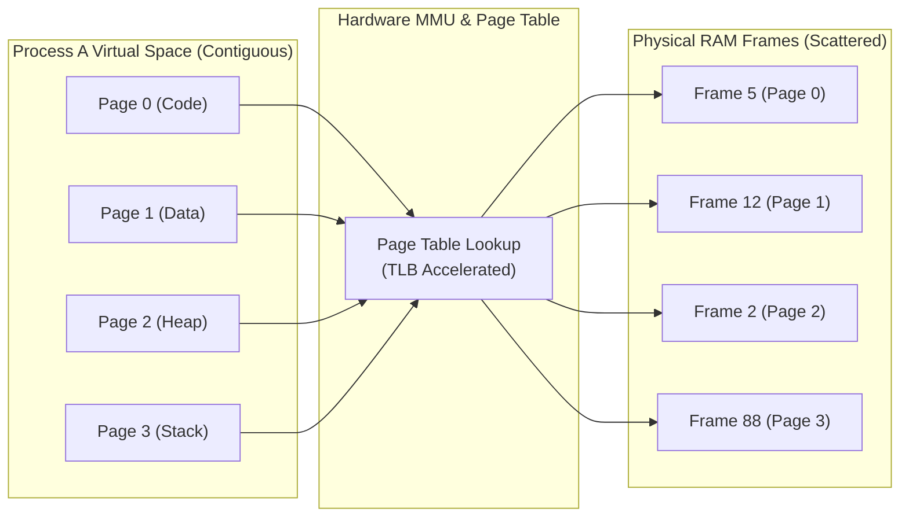

## 🎯 The Question

> **"If Virtual Memory introduces translation overhead via page tables and MMUs, why does it actually make computers faster and allow us to run dozens of apps simultaneously?"**

---

## ⚡ 30-Second Elevator Pitch

Without Virtual Memory, every program would have to be loaded into **contiguous physical RAM blocks**, and programs could easily overwrite each other's memory.

**Virtual Memory accelerates computing because:**
1. **Lazy Loading / Demand Paging**: Programs only load active pages into physical RAM. A 10 GB program only uses 50 MB of actual RAM at startup.
2. **Memory Overcommit & Isolation**: Processes believe they have full access to a contiguous 64-bit address space, allowing total RAM utilization without memory fragmentation.
3. **Shared Read-Only Pages**: Multiple processes running the same C standard library (`libc`) or executable share a single physical RAM copy.

---

## 🧠 Under-the-Hood: Virtual to Physical Translation

The **Memory Management Unit (MMU)** uses per-process **Page Tables** to map non-contiguous physical memory frames into contiguous virtual address space:

---

## ⚡ Key Architectural Advantages

1. **Elimination of External Fragmentation**:
   - Physical memory is split into fixed 4 KB frames. Any virtual page can occupy any free physical frame.
2. **Demand Paging (Load-on-Demand)**:
   - When a program starts, the OS doesn't read the whole binary from disk into RAM. It only creates virtual page table entries. Pages are faulted into RAM only when accessed.
3. **Memory Protection & Security**:
   - Every page has permission bits (`READ`, `WRITE`, `EXECUTE`). Process $A$ cannot access Process $B$'s physical frames unless explicitly configured as shared memory.

---

## 📌 Comparison Matrix: Direct Physical Addressing vs. Virtual Memory

| Feature | Direct Physical Memory (No VM) | Virtual Memory Architecture |
| :--- | :--- | :--- |
| **Address Allocation** | Must be contiguous physical chunks | Non-contiguous, scattered across RAM |
| **Program Size Limit** | Bounded strictly by available physical RAM | Can exceed physical RAM (via disk swap) |
| **Startup Latency** | Slow (loads entire binary into RAM) | Fast (Demand paging loads pages on the fly) |
| **Isolation & Security** | None (Buggy apps corrupt other apps) | Strict hardware-enforced isolation |
| **Shared Libraries** | Duplicated in RAM per process | Single physical copy mapped to all processes |

---

## 💡 What Interviewers Ask Next (Follow-Up Traps)

1. **"What is the difference between Virtual Address Space and Physical Address Space in 64-bit OS?"**
   - *Answer*: A 64-bit system theoretically provides a 16 Exabyte ($2^{64}$) virtual address space per process (practically 48-bit or 57-bit addressing, e.g. 128TB–4PB). Physical address space is strictly limited by the amount of physical RAM chips installed (e.g., 16 GB).

2. **"What is Thrashing in Virtual Memory?"**
   - *Answer*: Thrashing occurs when total working sets of active processes exceed physical RAM, causing the OS to spend more time swapping pages to/from disk than executing actual instructions, grinding system throughput to near zero.

---

:::tip Placement & Interview Takeaway
**Interview Answer**: Virtual memory makes computers faster and more efficient by decoupling virtual addresses from physical RAM. It eliminates external fragmentation, enables instantaneous process startup via demand paging, and allows multiple processes to share common read-only library pages in physical memory.
:::

---

## 📺 Video Explanation

<YouTubeEmbed 
  id="4eC9cOT3dYw" 
  title="Why Does Virtual Memory Make Computers Faster? | Interview Question #5" 
/>
