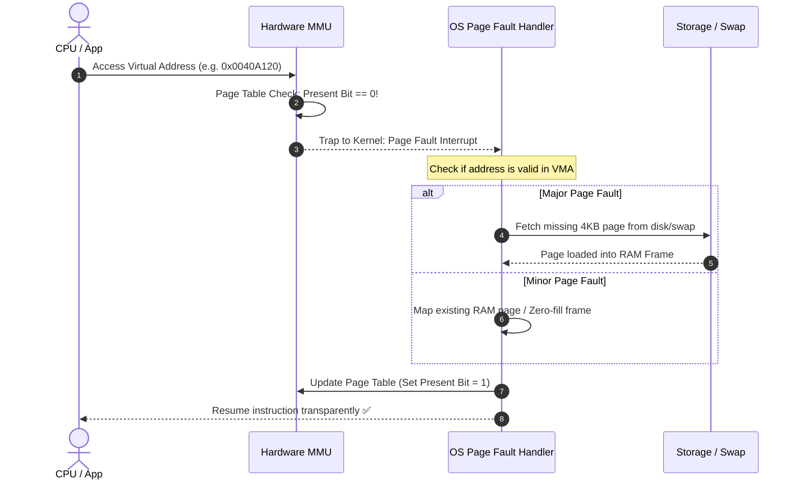

## 🎯 The Question

> **"What is a Page Fault? Is it a program error or a normal operating system mechanism? What is the difference between a Minor and a Major Page Fault?"**

---

## ⚡ 30-Second Elevator Pitch

A **Page Fault** sounds like a bug, but in 99% of cases, it is a normal and essential **hardware trap** generated by the CPU's Memory Management Unit (MMU).

When a thread requests a virtual address:
1. The MMU checks the **Valid/Present bit** in the Page Table.
2. If the bit is `0` (not in physical RAM), the MMU triggers an interrupt, pausing user code and transferring control to the OS kernel page fault handler.
3. The OS finds a free physical frame in RAM, loads the data (or allocates zeroed memory), marks the Present bit as `1`, and resumes the process.

---

## 🧠 Under-the-Hood: Page Fault Resolution Flow

---

## 🔬 Minor vs. Major vs. Invalid Page Faults

1. **Minor Page Fault (Soft Fault)**:
   - The page is already resident in physical memory (e.g., cached in page cache, or shared with another process), but not yet mapped in this process's page table.
   - **Cost**: Extremely fast (~microsecond), zero disk I/O.
2. **Major Page Fault (Hard Fault)**:
   - The page is not in RAM and must be read from disk (swap space or executable file on SSD/HDD).
   - **Cost**: Very slow (~milliseconds), blocks process on disk I/O.
3. **Invalid Fault (Segmentation Fault)**:
   - The program accessed an illegal address (e.g. dereferencing `NULL` or writing to read-only code segment).
   - **Result**: The OS sends `SIGSEGV` and terminates the process.

---

## 📌 Comparison Matrix: Page Fault Types

| Metric | Minor Page Fault | Major Page Fault | Invalid Page Fault (Segfault) |
| :--- | :--- | :--- | :--- |
| **Data Location** | Already in Physical RAM | On Secondary Disk / Swap | Nowhere (Illegal Address) |
| **Disk I/O Required** | ❌ None | ✅ Yes (Slow Disk Read) | ❌ None |
| **Latency Penalty** | Nanoseconds to Microseconds | Milliseconds (1000x slower) | Immediate Crash |
| **OS Action** | Update page table mapping | Read disk $	o$ allocate frame $	o$ update | Send `SIGSEGV` / Terminate app |

---

## 💡 What Interviewers Ask Next (Follow-Up Traps)

1. **"What happens during a Major Page Fault if physical RAM is completely full?"**
   - *Answer*: The OS must invoke a **Page Replacement Algorithm** (such as LRU or CLOCK) to evict an existing page. If the evicted page is dirty (modified), it is written back to swap space before the new page is read from disk.

2. **"Why does malloc() succeed immediately even when requesting 10GB of memory?"**
   - *Answer*: `malloc()` only allocates virtual address ranges without assigning physical RAM frames. Physical pages are allocated lazily via **Minor Page Faults** only when the process actually reads or writes to those addresses for the first time.

---

:::tip Placement & Interview Takeaway
**Interview Answer**: A page fault is an MMU hardware trap triggered when a virtual address lacks an active physical RAM mapping. In standard demand paging, the OS uses page faults to load pages into RAM on-demand, distinguishing between fast Minor faults (RAM-cached) and slow Major faults (requiring disk I/O).
:::

---

## 📺 Video Explanation

<YouTubeEmbed 
  id="9D7N2ZHlv04" 
  title="Why Do Page Faults Happen? | Interview Question #6" 
/>
