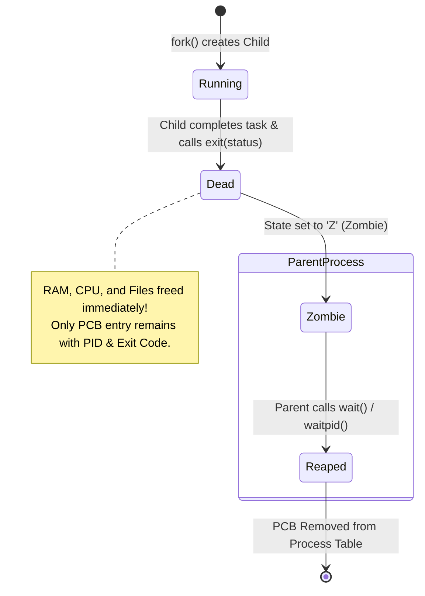

## 🎯 The Question

> **"What is a Zombie Process in Linux/Unix? If a process has already completed execution and freed all its memory, why does the OS keep it around in the process table?"**

---

## ⚡ 30-Second Elevator Pitch

When a child process finishes execution via `exit()`, the OS instantly releases all its memory, open file descriptors, and CPU resources. 

However, its entry in the **Process Table (PCB)** cannot be removed immediately because the **parent process has the right to inspect how the child finished** (its exit code, CPU usage statistics, or termination signal).

Until the parent calls `wait()` or `waitpid()` to acknowledge this exit status (known as *reaping*), the child remains in a dead **Zombie state (`Z`)**.

---

## 🧠 Lifecycle of a Zombie Process

---

## 🔬 Zombie vs. Orphan Processes

* **Zombie Process**:
  - Child dies before Parent, but Parent never calls `wait()`.
  - Consumes no RAM or CPU, but occupies a slot in the system **PID table**.
  - **Risk**: An accumulation of millions of zombies will exhaust available PIDs (`/proc/sys/kernel/pid_max`), preventing the OS from launching new processes.
* **Orphan Process**:
  - Parent dies *before* the Child.
  - The OS immediately re-parents the orphan to **`init` / `systemd` (PID 1)**, which periodically reaps any terminating children.

---

## 📌 Comparison Matrix: Zombie vs. Orphan

| Metric | Zombie Process (`Z`) | Orphan Process |
| :--- | :--- | :--- |
| **Status** | Dead / Terminated | Alive & Executing |
| **Memory / CPU Usage** | 0 MB RAM, 0% CPU | Normal memory & CPU usage |
| **Parent State** | Parent alive, but ignoring child exit | Parent died before child |
| **PID Table Entry** | Still occupied in OS process table | Normal active PID |
| **How to Clean Up** | Parent must call `wait()` (or kill parent) | Automatically adopted & reaped by PID 1 (`systemd`) |

---

## 💡 What Interviewers Ask Next (Follow-Up Traps)

1. **"Can you kill a Zombie process using `kill -9 <PID>`?"**
   - *Answer*: **No.** `kill -9` sends a `SIGKILL` signal to terminate a process, but a zombie is *already dead*. To remove a zombie, you must signal the parent to call `wait()`, or terminate the parent process so `init` (PID 1) inherits and reaps the zombie.

2. **"How do developers prevent zombies in production C/C++ backend servers?"**
   - *Answer*: Register a `SIGCHLD` signal handler that calls `waitpid(-1, NULL, WNOHANG)` asynchronously, or explicitly configure `signal(SIGCHLD, SIG_IGN)`, which instructs Linux to automatically reap child processes immediately upon termination.

---

:::tip Placement & Interview Takeaway
**Interview Answer**: A zombie process exists because the OS retains the child's exit status in the process table until the parent reads it via `wait()`. While zombies consume zero RAM/CPU, un-reaped zombies leak system PIDs, causing `fork()` failures when the PID table fills up.
:::

---

## 📺 Video Explanation

<YouTubeEmbed 
  id="x8A57kFjEUA" 
  title="Why Do Zombie Processes Exist? | Interview Question #7" 
/>
