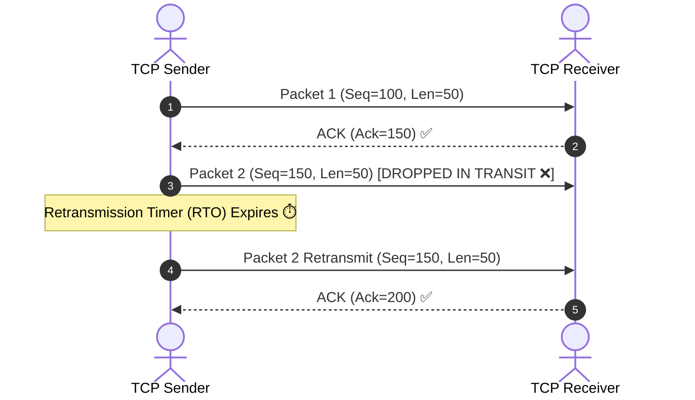

## 🎯 The Question

> **"Both TCP and UDP run on top of IP (which is inherently unreliable and lossy). How does TCP guarantee 100% reliable, in-order delivery while UDP provides no guarantees?"**

---

## ⚡ 30-Second Elevator Pitch

The underlying IP layer only provides **Best-Effort Delivery** (packets can be dropped, delayed, duplicated, or reordered). 

**TCP achieves reliability through 4 core mechanisms:**
1. **Sequence Numbers & ACKs**: Every byte is numbered; the receiver explicitly confirms received bytes.
2. **Retransmission Timers (RTO)**: If an ACK is not received before timeout, TCP automatically resends the lost segment.
3. **Flow & Congestion Control**: TCP throttles transmission to match receiver buffer capacity and network congestion.

**UDP does none of this**: It simply wraps payload data with port numbers and a checksum, transmitting raw datagrams without tracking, retransmissions, or connections.

---

## 🧠 Under-the-Hood: Reliability Mechanisms

---

## 🔬 Core Pillars of TCP Reliability

1. **Cumulative Acknowledgments**:
   - Receiver sends `ACK N`, confirming it has received all bytes up to $N-1$.
2. **Fast Retransmit**:
   - If the sender receives 3 duplicate ACKs for the same sequence number, it retransmits the missing segment immediately without waiting for RTO timeout.
3. **Reordering Buffer**:
   - Out-of-order packets are held in receiver memory buffers until missing segments arrive, ensuring the application receives a continuous stream.

---

## 📌 Comparison Matrix: TCP vs. UDP

| Feature | TCP (Transmission Control Protocol) | UDP (User Datagram Protocol) |
| :--- | :--- | :--- |
| **Connection Type** | Connection-oriented (3-Way Handshake) | Connectionless (No handshake) |
| **Reliability** | 100% Guaranteed (No loss, no duplicates) | Best effort (Packets may drop/duplicate) |
| **Ordering** | Strict sequential ordering preserved | Independent datagrams (May arrive out of order) |
| **Header Size** | 20–60 bytes (Large stateful header) | 8 bytes (Minimal stateless header) |
| **Speed / Overhead** | Higher latency (ACK round trips & backoff) | Blazing fast (Fire and forget) |
| **Primary Use Cases** | Web (HTTP/HTTPS), File Transfer (FTP), DBs | DNS, Live Video Streaming, Online Gaming, VoIP |

---

## 💡 What Interviewers Ask Next (Follow-Up Traps)

1. **"Does UDP have any error checking at all?"**
   - *Answer*: Yes. UDP contains a 16-bit **Checksum** field in its header to detect corrupted bits in the packet payload. If corruption is detected, the OS quietly drops the packet, but UDP provides no mechanism to request retransmission.

2. **"Why does HTTP/3 (QUIC) use UDP as its underlying transport instead of TCP?"**
   - *Answer*: TCP suffers from **Head-of-Line (HoL) Blocking** at the transport layer—if a single packet is lost, all multiplexed HTTP streams stall until retransmitted. HTTP/3 builds independent stream reliability on top of UDP in user space to eliminate HoL blocking and achieve 0-RTT handshakes.

---

:::tip Placement & Interview Takeaway
**Interview Answer**: IP is unreliable by design. TCP builds reliability in software using Sequence Numbers, ACKs, Retransmission Timers, and Congestion Control algorithms. UDP omits these overheads, providing raw speed and lower latency for applications that prioritize real-time delivery over 100% packet arrival.
:::

---

## 📺 Video Explanation

<YouTubeEmbed 
  id="UNRipjVwxAU" 
  title="Why is TCP Reliable but UDP Isn't? | Interview Question #8" 
/>
