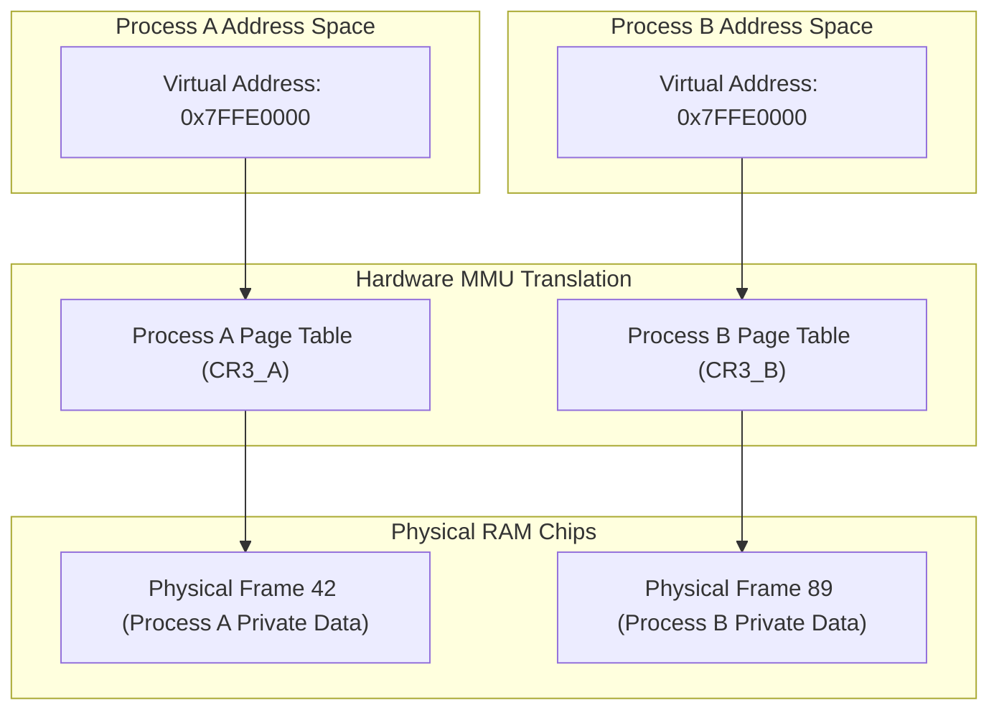

## 🎯 The Question

> **"If two programs running simultaneously both try to read or write to virtual memory address `0x7FFE0000`, why don't they collide or overwrite each other's data?"**

---

## ⚡ 30-Second Elevator Pitch

Every process in modern operating systems is given its own **isolated Virtual Address Space**.

Even if Process $A$ and Process $B$ use the identical virtual address `0x7FFE0000`:
1. The hardware **Memory Management Unit (MMU)** uses Process $A$'s page table to translate that address to Physical RAM Frame #42.
2. For Process $B$, its own independent page table maps that exact same virtual address to Physical RAM Frame #89.

Because a process cannot access or modify page table pointers without Kernel Mode CPU privileges (Ring 0), it is physically impossible for one user process to read or write another process's memory space.

---

## 🧠 Under-the-Hood: Isolated Page Tables

---

## 🔬 Hardware Protection Rings

Modern x86/ARM CPUs enforce **Privilege Rings**:
* **Ring 3 (User Mode)**: Application code runs here. Attempting to access addresses outside the process's page table raises a hardware fault.
* **Ring 0 (Kernel Mode)**: Only the OS kernel can modify page table base registers (`CR3`) and configure memory permissions (`R/W/X`).

If Process $A$ attempts to forge a pointer to physical memory outside its assigned pages, the MMU signals a General Protection Fault (`SIGSEGV`), terminating the offending process instantly.

---

## 📌 Comparison Matrix: Shared vs. Isolated Memory

| Property | Default User Space Memory | Inter-Process Shared Memory (shm) |
| :--- | :--- | :--- |
| **Isolation Level** | 100% Strict Hardware Isolation | Explicitly Shared by both processes |
| **Page Table Entry** | Maps to unique private physical frames | Both page tables point to same physical frame |
| **Security Risk** | Zero (Protected by MMU) | Requires mutex/semaphore synchronization |
| **Communication Speed** | Must use IPC (Sockets, Pipes) | Direct RAM speed access |

---

## 💡 What Interviewers Ask Next (Follow-Up Traps)

1. **"How CAN two processes legitimately share memory if needed for high-speed IPC?"**
   - *Answer*: Using **Shared Memory (POSIX `shm_open` / `mmap`)**. The OS kernel maps the same physical RAM frame into the virtual address spaces of both processes, allowing instantaneous zero-copy communication.

2. **"Can a root/admin process read another process's memory?"**
   - *Answer*: Yes, via kernel facilities like `ptrace` (used by debuggers like GDB) or by reading `/proc/<PID>/mem`. The kernel checks privileges before executing memory reads on behalf of the debugger.

---

:::tip Placement & Interview Takeaway
**Interview Answer**: Processes cannot access each other's memory because the CPU MMU maps each process's virtual addresses through separate page tables to distinct physical RAM frames. Hardware privilege rings prevent user code from altering page tables or accessing foreign frames.
:::

---

## 📺 Video Explanation

<YouTubeEmbed 
  id="psUxrloVua0" 
  title="Why Can't One Process Access Another's Memory? | Interview Question #9" 
/>
