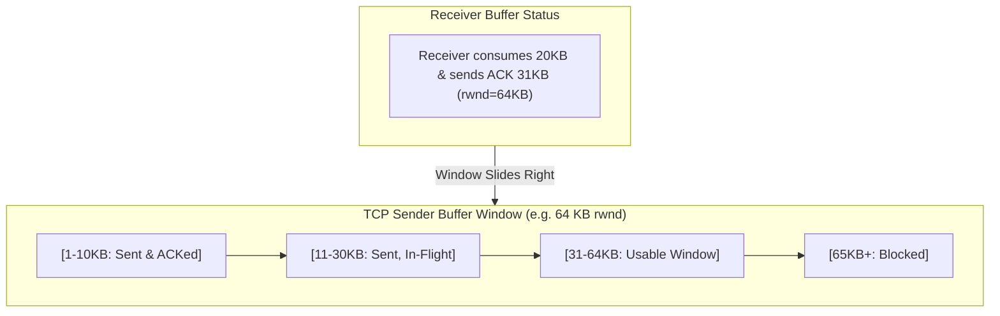

## 🎯 The Question

> **"Why does TCP use a Sliding Window protocol instead of simple Stop-and-Wait? How does it prevent a fast sender from overwhelming a slow receiver?"**

---

## ⚡ 30-Second Elevator Pitch

In a naive **Stop-and-Wait** protocol, the sender sends 1 packet and waits for 1 ACK. Over high-latency networks, throughput collapses because the pipe sits empty for most of the Round Trip Time (RTT).

**TCP Sliding Window solves this by enabling pipelining:**
1. The receiver advertises its available buffer capacity via the **Receive Window (`rwnd`)** header field.
2. The sender is allowed to transmit up to `rwnd` bytes continuously without waiting for individual ACKs.
3. As the receiver processes data and sends ACKs, the window "slides" forward, keeping the network link saturated while guaranteeing the receiver's buffer never overflows.

---

## 🧠 Under-the-Hood: Flow Control in Action

---

## 🔬 Bandwidth-Delay Product (BDP)

The theoretical maximum throughput of a connection is defined by:

$$\text{BDP} = \text{Bandwidth} \times \text{RTT}$$

* **Without Sliding Window**: Throughput is bounded to $\frac{\text{Packet Size}}{\text{RTT}}$, wasting ~99% of fiber capacity.
* **With Sliding Window**: The window size matches BDP, keeping the network pipeline full at all times.

---

## 📌 Comparison Matrix: Stop-and-Wait vs. Sliding Window

| Metric | Stop-and-Wait Protocol | TCP Sliding Window Protocol |
| :--- | :--- | :--- |
| **Packets in Flight** | Exactly 1 packet | Multiple packets (up to Window Size) |
| **Throughput Utilization** | Extremely low on high-latency links | Maximum (Saturates available bandwidth) |
| **Receiver Protection** | Natural (Slow, but safe) | Active **Flow Control** via advertised `rwnd` |
| **Network Pipe Status** | Mostly idle waiting for ACKs | Constantly full (Pipelined transmission) |

---

## 💡 What Interviewers Ask Next (Follow-Up Traps)

1. **"What happens if the receiver's application is stuck and advertises a Zero Window (`rwnd = 0`)?"**
   - *Answer*: The sender pauses transmission. To avoid permanent deadlock (if the subsequent window update ACK is lost), the sender starts a **Persist Timer** and periodically sends 1-byte **Zero-Window Probes** to query the receiver's buffer status.

2. **"What is the difference between Flow Control and Congestion Control in TCP?"**
   - *Answer*: **Flow Control** (`rwnd`) protects the *receiver's buffer* from overflowing. **Congestion Control** (`cwnd`) protects the *intermediate network routers* from congestion collapses. The sender always uses $\min(	ext{rwnd}, 	ext{cwnd})$.

---

:::tip Placement & Interview Takeaway
**Interview Answer**: TCP uses a sliding window to maximize throughput by pipelining multiple packets in flight. It simultaneously enforces receiver flow control through the advertised window (`rwnd`), ensuring high-speed data transmission without overflowing the receiver's memory buffer.
:::

---

## 📺 Video Explanation

<YouTubeEmbed 
  id="jHZQ41SqKsM" 
  title="Why Does TCP Use a Sliding Window? | Interview Question #10" 
/>
