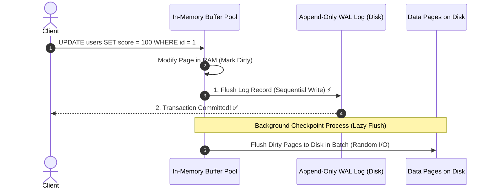

## 🎯 The Question

> **"When you commit a transaction in PostgreSQL or MySQL, why doesn't the database write the updated rows directly to table files on disk immediately? What is Write-Ahead Logging (WAL)?"**

---

## ⚡ 30-Second Elevator Pitch

Database tables are stored in 8 KB–16 KB data pages scattered across disk. Modifying rows directly on disk for every transaction would require **hundreds of slow, random disk seeks**, destroying throughput.

Instead, databases use **Write-Ahead Logging (WAL)**:
1. When a transaction commits, the engine writes a compact log of the change sequentially to an append-only WAL file on disk ($O(1)$ sequential I/O).
2. The actual table data pages are updated in **memory buffers (RAM)** and marked as *dirty*.
3. The transaction is marked `COMMITTED` instantly.

If power cuts out a millisecond later, the database simply replays the sequential WAL log during restart to restore all committed transactions.

---

## 🧠 Under-the-Hood: Fast WAL vs. Lazy Checkpointing

---

## 🔬 Why Sequential Writes Win

* **Random Disk Write**: Requires disk heads (or SSD block controllers) to find scattered 8KB pages across multiple table files. Speed: ~1,000 writes/sec.
* **Sequential WAL Append**: Appends small binary diffs to the end of a single file stream. Speed: ~100,000+ writes/sec.
* **Checkpointing**: Background threads flush dirty buffer pool pages to data files in organized batches, decoupling transaction response latency from random disk I/O.

---

## 📌 Comparison Matrix: Direct Page Flush vs. Write-Ahead Logging

| Metric | Direct In-Place Page Writes | Write-Ahead Logging (WAL) Architecture |
| :--- | :--- | :--- |
| **Commit Disk I/O** | Multiple Random 8KB/16KB page writes | Single Sequential append write |
| **Transaction Latency** | 🐢 High (Milliseconds per commit) | ⚡ Low (Microseconds per commit) |
| **Crash Recovery** | High risk of torn/corrupted pages | 100% Deterministic (Replay WAL log) |
| **Buffering Strategy** | Cannot buffer dirty writes safely | Aggressive in-memory buffer pool caching |

---

## 💡 What Interviewers Ask Next (Follow-Up Traps)

1. **"What is a Checkpoint in databases?"**
   - *Answer*: A Checkpoint is a periodic operation where the database flushes all dirty memory pages to table files on disk and records the checkpoint position in the WAL log. During crash recovery, the database only needs to replay WAL entries written *after* the latest checkpoint.

2. **"What is ARIES in database recovery?"**
   - *Answer*: ARIES (Algorithms for Recovery and Isolation Exploiting Semantics) is the standard recovery paradigm. It performs 3 phases upon restart: **Analysis** (identifies dirty pages), **Redo** (replays all WAL changes to recover exact state before crash), and **Undo** (rolls back transactions that were active and uncommitted at crash time).

---

:::tip Placement & Interview Takeaway
**Interview Answer**: Write-Ahead Logging guarantees ACID Durability with high performance by converting slow random disk page writes into fast sequential log appends. Commits only wait for the WAL log to flush, while modified data pages are written to disk lazily in the background.
:::

---

## 📺 Video Explanation

<YouTubeEmbed 
  id="0W5oDEDVlGQ" 
  title="Why Do Databases Use Write-Ahead Logging (WAL)? | Interview Question #11" 
/>
