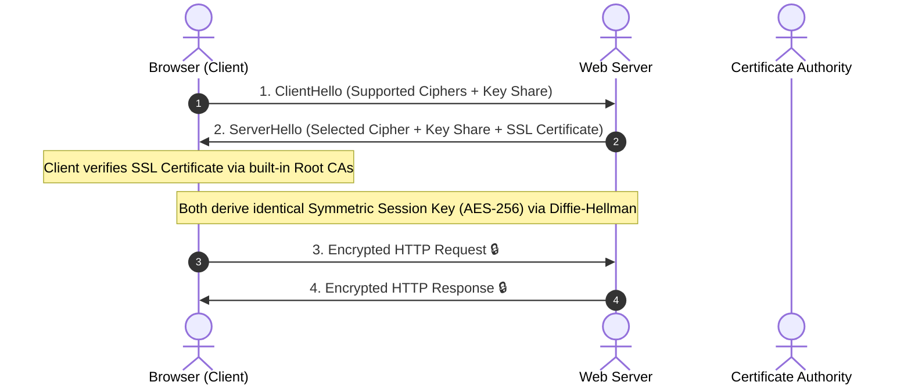

## 🎯 The Question

> **"What makes HTTPS secure compared to plain HTTP? How does the TLS handshake establish a shared encryption key over an insecure public internet?"**

---

## ⚡ 30-Second Elevator Pitch

Plain **HTTP transmits all data in plaintext**. Anyone on the same Wi-Fi router or ISP can read passwords, modify responses, or inject malicious ads (Man-in-the-Middle attack).

**HTTPS (HTTP + TLS)** provides 3 core guarantees:
1. **Confidentiality (Encryption)**: Data is encrypted using symmetric session keys (AES-GCM); eavesdroppers only see scrambled ciphertext.
2. **Authentication (Identity Verification)**: The server presents an X.509 Digital Certificate signed by a trusted Certificate Authority (CA) to prove it is genuinely `google.com`.
3. **Integrity (Tamper-Proofing)**: Message Authentication Codes (MAC / AEAD) ensure packets cannot be altered in transit without detection.

---

## 🧠 Under-the-Hood: TLS 1.3 Handshake

HTTPS combines **Asymmetric Cryptography** (for secure key exchange) and **Symmetric Cryptography** (for fast data transmission):

---

## 🔬 Why Hybrid Encryption Wins

* **Asymmetric Encryption (RSA / ECC)**: Secure, but computationally expensive ($100	imes$ slower). Used only once during the initial handshake to exchange keys.
* **Symmetric Encryption (AES-256-GCM / ChaCha20)**: Hardware-accelerated CPU instructions make encryption take nanoseconds. Used for all subsequent application data.

---

## 📌 Comparison Matrix: HTTP vs. HTTPS

| Security Feature | HTTP (Port 80) | HTTPS (Port 443 + TLS) |
| :--- | :--- | :--- |
| **Data Format** | Plaintext (ASCII) | Encrypted Binary Ciphertext |
| **Eavesdropping Risk** | High (Packets visible via Wireshark) | Zero (Protected by 256-bit encryption) |
| **Man-in-the-Middle (MitM)** | Vulnerable to packet tampering & spoofing | Prevented via CA Certificate validation |
| **Performance Overhead** | Baseline | Negligible (1-RTT in TLS 1.3, 0-RTT on reconnect) |
| **Browser Indicator** | Marked as "Not Secure" | Padlock icon / Secure connection |

---

## 💡 What Interviewers Ask Next (Follow-Up Traps)

1. **"Why can't an attacker create a fake certificate for `paypal.com` and perform a MitM attack?"**
   - *Answer*: Browsers come pre-installed with trusted Root Certificate Authorities (e.g. DigiCert, Let's Encrypt). A fraudulent certificate will lack a valid cryptographic signature from these root keys, triggering an instant browser security warning.

2. **"What is the difference between TLS 1.2 and TLS 1.3?"**
   - *Answer*: TLS 1.3 reduced handshake latency from **2 round trips (2-RTT) down to 1-RTT** (and 0-RTT for resumed sessions) by combining cipher negotiation and Diffie-Hellman key share into the very first `ClientHello`, while removing obsolete and insecure cipher algorithms (like RSA key exchange and RC4).

---

:::tip Placement & Interview Takeaway
**Interview Answer**: HTTPS secures HTTP by wrapping transport streams in TLS. It uses asymmetric cryptography (Diffie-Hellman) and CA certificates to authenticate servers and exchange keys, followed by high-speed symmetric encryption (AES) and cryptographic hashing to prevent eavesdropping and packet tampering.
:::

---

## 📺 Video Explanation

<YouTubeEmbed 
  id="GgH9X2pglBk" 
  title="Why is HTTPS More Secure Than HTTP? | Interview Question #12" 
/>
