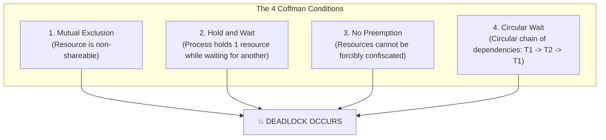

## 🎯 The Question

> **"What is a Deadlock in operating systems and multithreaded programming? What are the 4 Coffman Conditions required for a deadlock to occur, and how do we prevent it?"**

---

## ⚡ 30-Second Elevator Pitch

A **Deadlock** is a situation where two or more threads are frozen forever because each thread is waiting for a lock held by another thread.

A classic example is the **Circular Wait**:
* Thread 1 holds **Lock A** and waits to acquire **Lock B**.
* Thread 2 holds **Lock B** and waits to acquire **Lock A**.

Neither thread can proceed, and neither will release what it currently holds.

---

## 🧠 The 4 Coffman Conditions

A deadlock can happen **if and only if all 4 Coffman Conditions** hold true simultaneously:

---

## 🔬 How to Break and Prevent Deadlocks

To guarantee a system is deadlock-free, you only need to **break at least 1 of the 4 conditions**:

1. **Break Circular Wait (Most Common Production Fix)**:
   - Enforce a strict global **Lock Ordering**. If all threads must acquire Lock A before Lock B, circular wait is mathematically impossible.
2. **Break Hold and Wait**:
   - Require threads to request all required locks atomically upfront (e.g. `std::lock(m1, m2)` in C++).
3. **Break No Preemption**:
   - Use non-blocking lock acquisition with timeouts (e.g. `try_lock()`). If Lock B is unavailable, release Lock A and retry later.

---

## 📌 Comparison Matrix: Deadlock vs. Livelock vs. Starvation

| Concurrency Bug | Thread State | CPU Utilization | Progression |
| :--- | :--- | :--- | :--- |
| **Deadlock** | Blocked / Sleeping indefinitely | 0% CPU usage (Frozen) | Permanent Halt |
| **Livelock** | Active / Running state changes | 100% CPU usage (Spinning) | Permanent Halt (No useful work done) |
| **Starvation** | Ready / Waiting | Normal | Thread delayed indefinitely by greedy threads |

---

## 💡 What Interviewers Ask Next (Follow-Up Traps)

1. **"What is the Banker's Algorithm?"**
   - *Answer*: The Banker's Algorithm is a deadlock avoidance algorithm used by resource allocators. Before granting a resource request, it simulates allocation to verify whether the system will remain in a "Safe State" (where at least one sequence of process completions is guaranteed without deadlock).

2. **"How does a database detect and recover from deadlocks?"**
   - *Answer*: Databases construct a **Wait-For Graph (WFG)** where nodes represent transactions and edges represent lock requests. Background threads run cycle detection algorithms (e.g. Tarjan's). If a cycle is detected, the database aborts and rolls back the younger/cheaper transaction to break the deadlock.

---

:::tip Placement & Interview Takeaway
**Interview Answer**: Deadlocks occur when concurrent threads enter a state where progress is blocked due to circular resource dependencies. All 4 Coffman conditions must hold for a deadlock to exist: Mutual Exclusion, Hold & Wait, No Preemption, and Circular Wait. The most common fix in production software is establishing a strict lock acquisition order.
:::

---

## 📺 Video Explanation

<YouTubeEmbed 
  id="_1Dl-2_z-qk" 
  title="Why Do Deadlocks Happen? | Interview Question #13" 
/>
