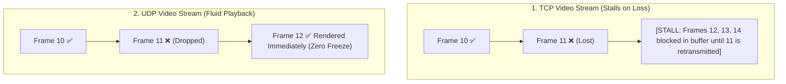

## 🎯 The Question

> **"If TCP guarantees 100% packet delivery without data loss, why do real-time apps like Zoom, Google Meet, and Discord use UDP for voice and video streaming?"**

---

## ⚡ 30-Second Elevator Pitch

In real-time audio and video calls, **latency is far more critical than 100% lossless delivery**.

When a packet is lost in **TCP**:
1. TCP stops transmitting new frames until the missing packet is retransmitted and acknowledged (**Head-of-Line Blocking**).
2. This creates stutter, freezes the video, and increases latency by hundreds of milliseconds.

With **UDP**:
1. Packets are streamed continuously without waiting for ACKs.
2. If a video frame packet is lost, the video codec simply drops that tiny artifact or interpolates the pixel data. 
3. The conversation continues in real-time ($<150\text{ ms}$ delay) with zero lag.

---

## 🧠 Under-the-Hood: Head-of-Line Blocking vs. Real-Time Stream

---

## 🔬 Timeliness vs. Completeness

In live communication, **late data is completely useless data**:
* If frame #11 arrives 400 ms late (after frame #14 is already rendered on screen), discarding it is better than pausing the entire live video stream to wait for it.
* WebRTC and RTP protocols layer minimal jitter buffers, forward error correction (FEC), and packet concealment on top of UDP to smooth out minor packet losses.

---

## 📌 Comparison Matrix: TCP vs. UDP for Media Streaming

| Streaming Property | TCP (e.g. Netflix, YouTube VOD) | UDP (e.g. Zoom, Discord, WebRTC) |
| :--- | :--- | :--- |
| **Delivery Model** | 100% Lossless, in-order byte stream | Low-latency datagrams, loss-tolerant |
| **Packet Loss Behavior** | Pauses playback for retransmission (Buffering) | Skips lost frame, maintains real-time sync |
| **Head-of-Line Blocking** | ❌ Yes (Transport layer stall) | ✅ None (Independent packets) |
| **Target Latency** | Seconds (Prefetched buffer allows delay) | Sub-150 milliseconds (Interactive live voice) |
| **Ideal For** | Prerecorded movies & file downloads | Live video conferencing, online multiplayer games |

---

## 💡 What Interviewers Ask Next (Follow-Up Traps)

1. **"Why does YouTube / Netflix use TCP (HTTPS) instead of UDP for video streaming?"**
   - *Answer*: YouTube and Netflix are **Video-on-Demand (VOD)**, not real-time 2-way calls. The video player prefetches 30–60 seconds of video into a buffer ahead of playback. A 500ms TCP retransmission is completely unnoticeable to the viewer, and users prefer high quality without missing frames.

2. **"What is Forward Error Correction (FEC) in UDP video streaming?"**
   - *Answer*: FEC is a technique where the sender transmits redundant parity packets alongside video datagrams. If 1 out of 5 packets is lost, the receiver mathematically reconstructs the lost frame instantly using the parity data without requesting a network retransmission.

---

:::tip Placement & Interview Takeaway
**Interview Answer**: Live video conferencing uses UDP because real-time interactivity requires low latency ($<150\text{ms}$). TCP retransmissions cause Head-of-Line blocking and audio/video freezing. Human perception easily ignores an occasional dropped video pixel, but cannot tolerate conversation-stopping lag.
:::

---

## 📺 Video Explanation

<YouTubeEmbed 
  id="_3t-B1YZbtI" 
  title="Why is UDP Used for Video Calls Instead of TCP? | Interview Question #14" 
/>
