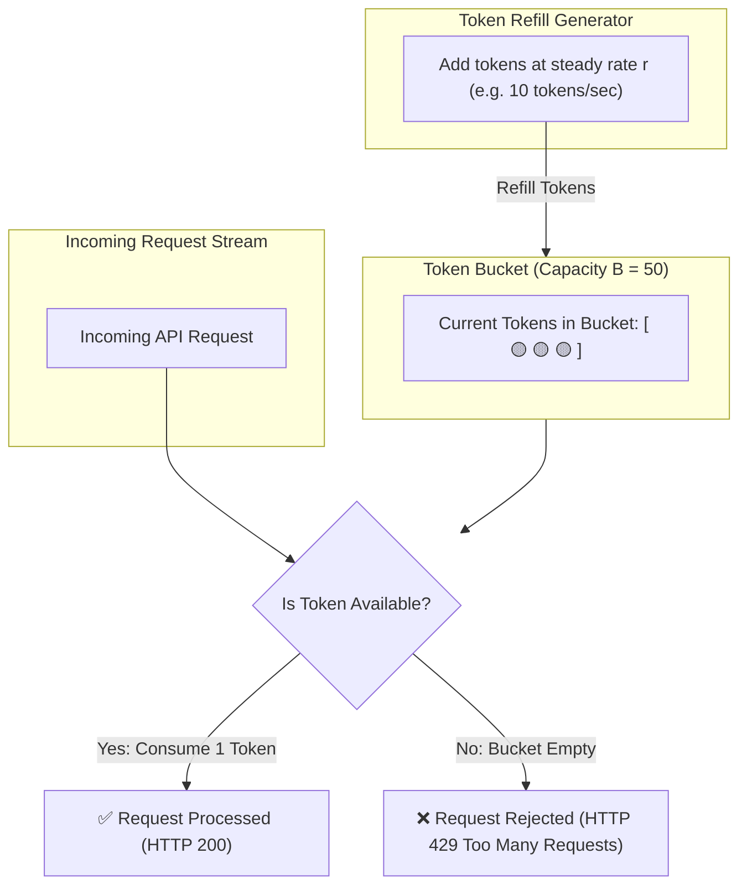

## 🎯 The Question

> **"Why do distributed systems and public APIs place Rate Limiters in front of their backend services? How do algorithms like Token Bucket and Leaky Bucket work?"**

---

## ⚡ 30-Second Elevator Pitch

Without Rate Limiting, a sudden traffic spike or malicious actor can flood your servers, exhaust database connection pools, spike cloud bills, and cause **cascading service crashes** for all legitimate users.

**Rate Limiters safeguard systems by:**
1. **Preventing Resource Starvation**: Enforcing quotas per user/IP so one "noisy neighbor" cannot monopolize backend CPU and database capacity.
2. **Mitigating Abuse & Attacks**: Stopping automated credential-stuffing bots, scrapers, and DoS floods.
3. **Smooth Traffic Spikes**: Converting bursts into predictable, steady throughput.

When requests exceed the limit, the rate limiter immediately rejects them with **`HTTP 429 Too Many Requests`**.

---

## 🧠 Under-the-Hood: The Token Bucket Algorithm

The **Token Bucket** algorithm allows short bursts of traffic while enforcing a constant average rate:

---

## 🔬 Top 4 Rate Limiting Algorithms

1. **Token Bucket**: Tokens added at fixed rate; bursts allowed up to bucket capacity $B$. Widely used in AWS & Stripe.
2. **Leaky Bucket**: Requests enter a FIFO queue and leak out at a constant rate. Smooths out traffic bursts into a uniform stream.
3. **Fixed Window Counter**: Divides time into 1-minute windows. Prone to double-traffic bursts at window boundaries.
4. **Sliding Window Log / Counter**: Tracks timestamps or weighted window averages to prevent boundary burst exploits.

---

## 📌 Comparison Matrix: Rate Limiting Algorithms

| Algorithm | Handles Bursts? | Memory Footprint | Accuracy | Common Use Cases |
| :--- | :--- | :--- | :--- | :--- |
| **Token Bucket** | ✅ Yes (Up to bucket size) | ⚡ Minimal (Tokens + Timestamp) | High | General API Gateway (Stripe, AWS) |
| **Leaky Bucket** | ❌ No (Strict constant flow) | Moderate (Queue buffer) | High | E-Commerce checkout queues |
| **Fixed Window** | ❌ No (Spike at boundary) | ⚡ Minimal (1 integer counter) | Low (Boundary flaws) | Basic internal service limits |
| **Sliding Window Counter**| ✅ Smooth | Low | Very High | Distributed API Gateways with Redis |

---

## 💡 What Interviewers Ask Next (Follow-Up Traps)

1. **"How do you implement a distributed rate limiter across 50 API gateway instances?"**
   - *Answer*: Use a centralized in-memory store like **Redis** running an atomic Lua script (`EVAL`) or Redis Cell. By executing token calculation atomically inside Redis, multiple gateway instances avoid race conditions without distributed locks.

2. **"What standard HTTP response headers should a rate limiter return?"**
   - *Answer*: 
     - `X-RateLimit-Limit`: Maximum allowed requests in current period.
     - `X-RateLimit-Remaining`: Number of remaining requests available.
     - `X-RateLimit-Reset`: Unix timestamp when the quota resets.
     - `Retry-After`: Seconds to wait before retrying (sent with `HTTP 429`).

---

:::tip Placement & Interview Takeaway
**Interview Answer**: Rate limiters protect distributed systems from overload, DDoS attacks, and noisy neighbors by throttling incoming request velocity. The Token Bucket algorithm is the industry standard because it supports legitimate traffic bursts while enforcing strict average throughput limits.
:::

---

## 📺 Video Explanation

<YouTubeEmbed 
  id="SDFi25Jc98k" 
  title="Why Do Systems Use Rate Limiters? | Interview Question #16" 
/>
