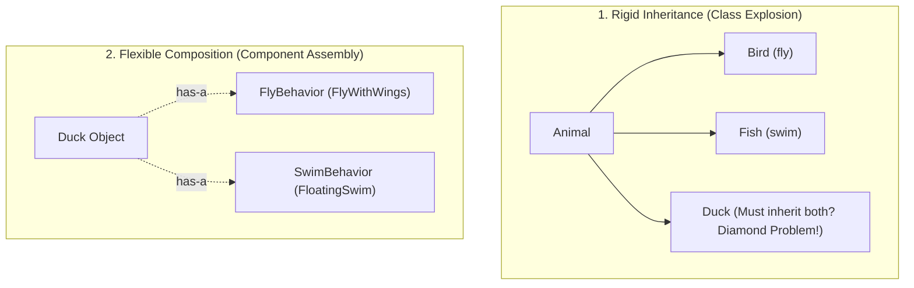

## 🎯 The Question

> **"Why does the Gang of Four (GoF) design principle state: 'Favor object composition over class inheritance'? What problems arise with deep inheritance hierarchies?"**

---

## ⚡ 30-Second Elevator Pitch

Inheritance establishes an **"is-a"** relationship compiled into code permanently. While simple for toy examples, in large codebases it creates:
1. **The Fragile Base Class Problem**: Changing one method in a parent class inadvertently breaks dozens of subclasses across the application.
2. **Rigid Compile-Time Coupling**: A subclass is forced to inherit all fields and behaviors of its parent, even ones it doesn't need or want.
3. **Class Explosion**: Trying to combine multiple behaviors (e.g. `FlyingMonster`, `SwimmingMonster`, `FlyingSwimmingMonster`) results in an unmanageable explosion of classes.

**Composition** models a **"has-a"** relationship: objects contain references to modular components, allowing behavior to be swapped dynamically at runtime without modifying class hierarchies.

---

## 🧠 Under-the-Hood: Class Explosion vs. Modular Composition



---

## 🔬 Code Contrast: Composition in Action

### ❌ Fragile Inheritance (Java / C++)
```java
// Subclass is tightly coupled to Parent implementation details
class SuperList extends ArrayList<Object> {
    @Override
    public boolean addAll(Collection<?> c) {
        // If parent's addAll internally calls add(), double-counting bug occurs!
        return super.addAll(c);
    }
}
```

### ✅ Clean Composition (Strategy Pattern)
```java
class Duck {
    private FlyBehavior flyBehavior;     // Swappable at runtime
    private QuackBehavior quackBehavior;

    public Duck(FlyBehavior f, QuackBehavior q) {
        this.flyBehavior = f;
        this.quackBehavior = q;
    }
    public void performFly() { flyBehavior.fly(); }
}
```

---

## 📌 Comparison Matrix: Inheritance vs. Composition

| Dimension | Inheritance ("is-a") | Composition ("has-a") |
| :--- | :--- | :--- |
| **Coupling Level** | Tight (White-box reuse; exposes internal details) | Loose (Black-box reuse; interacts via interfaces) |
| **Flexibility** | Static (Fixed at compile time) | Dynamic (Behaviors swapped at runtime) |
| **Encapsulation** | Weak (Subclass depends on parent state) | Strong (Components encapsulate their own state) |
| **Unit Testing** | Difficult (Must mock entire parent hierarchy) | Trivial (Inject mock behavior interfaces) |

---

## 💡 What Interviewers Ask Next (Follow-Up Traps)

1. **"When IS inheritance actually the right choice?"**
   - *Answer*: When a genuine polymorphic "is-a" relationship exists, where the subclass is a strict subtype that obeys the **Liskov Substitution Principle (LSP)** without overriding parent behavior (e.g. defining framework interfaces or GUI widgets).

2. **"How does the Strategy Pattern demonstrate composition over inheritance?"**
   - *Answer*: The Strategy Pattern defines a family of algorithms behind a common interface and encapsulates each one inside a component class. The host context delegates tasks to the strategy component rather than inheriting from multiple concrete parent implementations.

---

:::tip Placement & Interview Takeaway
**Interview Answer**: Prefer composition over inheritance because inheritance creates tight coupling and the fragile base class problem. Composition allows modular, interface-driven components to be combined and swapped dynamically at runtime, improving testability and eliminating class explosion.
:::

---

## 📺 Video Explanation

<YouTubeEmbed 
  id="9vXqF3vg_2g" 
  title="Why Prefer Composition Over Inheritance? | Interview Question #17" 
/>
