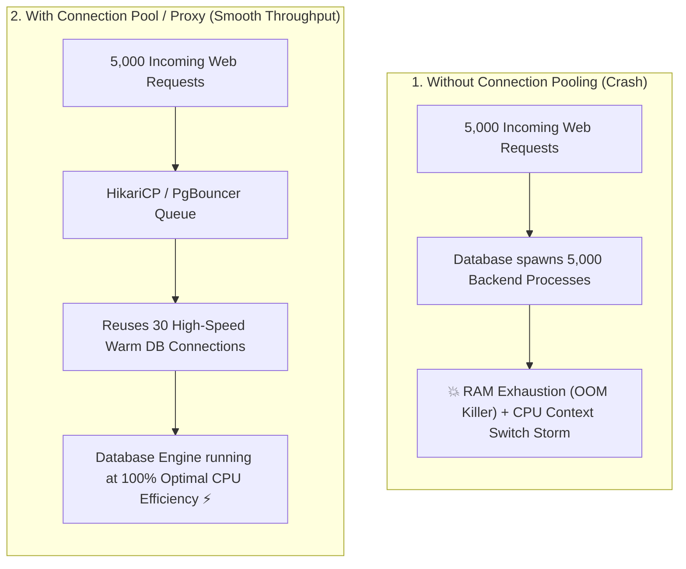

## 🎯 The Question

> **"Why can't a database like PostgreSQL or MySQL simply open 10,000 direct client connections when user traffic surges? Why do unpooled connections crash database servers?"**

---

## ⚡ 30-Second Elevator Pitch

Every direct database connection is not just a lightweight socket; it is a **heavyweight operating system process or thread**.

In PostgreSQL, every connection spawns a backend process consuming **5 MB–10 MB of RAM** plus private memory buffers. Opening 5,000 connections instantly burns **25 GB–50 GB of RAM**, exhausts file descriptors, and forces the CPU to spend 90% of its cycles on **context-switching thrashing** rather than executing SQL queries.

**The Solution is Connection Pooling**:
1. A pool maintains a small, fixed number of warm connections (e.g., 20–50 connections matching CPU core count).
2. Incoming application requests borrow a connection, execute their query in milliseconds, and return it to the pool immediately.

---

## 🧠 Under-the-Hood: Unpooled Crashes vs. Connection Pooling

---

## 🔬 The "Connection Pool Size Formula"

Contrary to developer intuition, **more database connections make queries slower, not faster**.

The PostgreSQL and HikariCP teams recommend sizing connection pools based on hardware CPU cores and disk spindles:

$$	ext{Pool Size} = (	ext{CPU Cores} 	imes 2) + 	ext{Effective Spindle Count}$$

For a 16-core database server with fast SSDs, a pool of **32 to 40 connections** can easily handle tens of thousands of requests per second without bottlenecking hardware threads.

---

## 📌 Comparison Matrix: Direct Connections vs. Connection Pool

| Metric | Direct Client Connections | Connection Pool (e.g. HikariCP, PgBouncer) |
| :--- | :--- | :--- |
| **Connection Handshake** | TCP + SSL + Auth on every query (Slow) | Pre-established warm connections (Zero latency) |
| **Memory Consumption** | Scales linearly ($O(N)$ MBs per user) | Fixed, bounded footprint |
| **CPU Context Switching** | Catastrophic during high traffic | Minimal (Matches physical hardware cores) |
| **Max Concurrency** | Hard ceiling (~hundreds before crash) | Tens of thousands of queued client requests |

---

## 💡 What Interviewers Ask Next (Follow-Up Traps)

1. **"What is the difference between Application-Level Pooling and Server-Side Proxy Pooling?"**
   - *Answer*: Application pooling (like HikariCP) runs inside the application JVM/process. Server-side proxy pooling (like PgBouncer or ProxySQL) sits between microservice fleets and the database server, multiplexing thousands of serverless/lambda connections into a tiny set of database backend workers.

2. **"What is Connection Leaking and how do you prevent it?"**
   - *Answer*: A connection leak happens when application code acquires a database connection but fails to call `close()` (e.g., inside an unhandled exception block). Over time, all pool connections become exhausted. Modern connection pools detect leaks using timeout alerts (e.g. `leakDetectionThreshold` in HikariCP).

---

:::tip Placement & Interview Takeaway
**Interview Answer**: Databases cannot scale by creating thousands of raw connections because each connection incurs heavy memory allocation and CPU context-switching overhead. Connection pools maintain a small, optimal set of reused connections, maximizing throughput and preventing Out-of-Memory crashes during traffic spikes.
:::

---

## 📺 Video Explanation

<YouTubeEmbed 
  id="Gh5F9OSyy-M" 
  title="How Databases Handle Connection Spikes | Interview Question #18" 
/>
