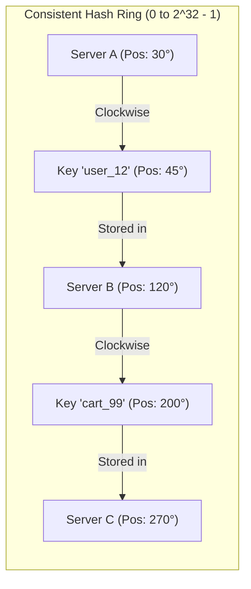

## 🎯 The Question

> **"In a distributed cache with $N$ servers, why is modulo hashing (`hash(key) % N`) catastrophic when scaling up or down? How does Consistent Hashing solve key redistribution?"**

---

## ⚡ 30-Second Elevator Pitch

With traditional **Modulo Hashing** ($	ext{Server} = 	ext{hash}(	ext{key}) \pmod N$):
* If you have 4 servers and 1 server crashes (or you add a 5th server), $N$ changes.
* **Almost 100% of existing keys remap to different servers**, triggering a catastrophic **Cache Miss Storm** that cascades and crashes your underlying databases.

**Consistent Hashing solves this:**
1. Both servers and keys are hashed onto a circular **360° Hash Ring** ($[0, 2^{32}-1]$).
2. A key is assigned to the **first server encountered moving clockwise**.
3. When a server is added or removed, **only $rac{K}{N}$ keys are moved** on average; the rest stay on their existing servers.

---

## 🧠 Under-the-Hood: The 360° Hash Ring

---

## 🔬 Virtual Nodes (V-Nodes) for Uniform Distribution

In a naive ring with 3 servers, nodes might land close to each other, creating **Hotspot imbalance** (one node handling 70% of keys).

**Solution: Virtual Nodes**:
* Each physical server is assigned multiple positions on the ring (e.g. `ServerA-01`, `ServerA-02`, ... `ServerA-100`).
* Virtual nodes interleave across the ring, ensuring an even, uniform distribution of keys and predictable load balancing.

---

## 📌 Comparison Matrix: Modulo Hashing vs. Consistent Hashing

| Property | Naive Modulo Hashing (`hash % N`) | Consistent Hashing with V-Nodes |
| :--- | :--- | :--- |
| **Key Redistribution on Node Change**| **~100% of keys re-hashed** (Massive Cache Thrash) | **Only $rac{1}{N}$ of keys moved** |
| **Horizontal Scalability** | Disastrous (Requires full data reload) | Seamless (Zero-downtime scaling) |
| **Hotspot Prevention** | None | Solved using Virtual Nodes (V-Nodes) |
| **Industry Adoption** | Monolithic single-node systems | DynamoDB, Cassandra, Memcached, CDNs |

---

## 💡 What Interviewers Ask Next (Follow-Up Traps)

1. **"How does binary search find the assigned server in $O(\log N)$ time?"**
   - *Answer*: Server positions are maintained in a sorted array or red-black tree (e.g., `std::map` or Java `TreeMap`). When a key hash is computed, `upper_bound()` or `ceilingEntry()` performs a binary search to find the nearest clockwise server in $O(\log S)$ time.

2. **"How do DynamoDB and Cassandra handle data replication using Consistent Hashing?"**
   - *Answer*: To replicate data with a replication factor $R=3$, the coordinator node assigns the key to the first node on the ring, and then automatically replicates copies to the next $R-1$ successive distinct physical nodes clockwise along the ring.

---

:::tip Placement & Interview Takeaway
**Interview Answer**: Consistent Hashing maps both data keys and server nodes to a circular hash ring. It decouples cache distribution from the node count, ensuring that adding or removing a node only redistributes $rac{1}{N}$ of the keys, preventing catastrophic cache stampedes in distributed systems.
:::

---

## 📺 Video Explanation

<YouTubeEmbed 
  id="HLfBjxPQt5s" 
  title="Why Distributed Systems Use Consistent Hashing | Interview Question #19" 
/>
