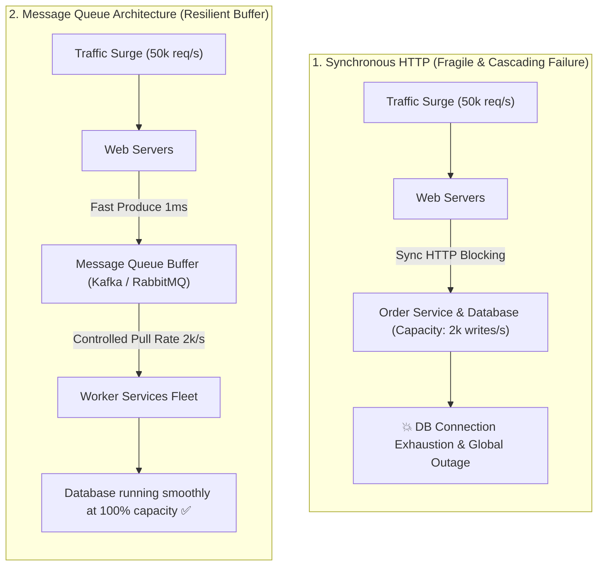

## 🎯 The Question

> **"During flash sales (like Black Friday), why do high-scale architectures place Message Queues (Kafka / RabbitMQ) between web servers and order processing services instead of making direct synchronous HTTP/gRPC calls?"**

---

## ⚡ 30-Second Elevator Pitch

In a synchronous architecture, when 50,000 orders/sec hit the frontend, the frontend sends 50,000 synchronous requests to the payment and inventory services. If the database can only handle 2,000 writes/sec, the backend instantly runs out of threads, times out, and crashes.

**A Message Queue provides 3 architectural superpowers:**
1. **Asynchronous Decoupling & Buffering**: Web servers push order events into the queue in $<1\text{ ms}$ and return instant confirmation to the user.
2. **Load Leveling (Traffic Smoothing)**: The queue absorbs massive traffic peaks, acting as a buffer.
3. **Consumer Backpressure Control**: Worker services pull and process orders at their own safe, sustainable rate ($2,000\text{ orders/sec}$) without crashing database clusters.

---

## 🧠 Under-the-Hood: Synchronous Cascades vs. Queue Load Leveling

---

## 🔬 Core Benefits of Queue-Based Architectures

1. **Temporal Decoupling**: Producers and consumers don't need to be online at the same time. If downstream invoice workers crash, orders remain safe in the persistent queue until workers restart.
2. **Horizontal Elasticity**: You can autoscale consumer worker pools based on the queue's **Consumer Lag** metric.
3. **Fault Tolerance & Dead Letter Queues (DLQ)**: Poison-pill messages that fail processing are routed to a DLQ for offline inspection without stalling the main pipeline.

---

## 📌 Comparison Matrix: Synchronous REST vs. Message Queue

| Feature | Direct Synchronous API (HTTP/gRPC) | Asynchronous Message Queue |
| :--- | :--- | :--- |
| **Coupling** | Tight (Sender blocks until receiver responds) | Loose (Sender enqueues and continues) |
| **Response Latency** | Cumulative latency of all downstream services | Sub-millisecond (Time to append to queue) |
| **Traffic Spike Behavior** | Downstream servers overwhelmed & crash | Queue safely buffers peak messages |
| **Downstream Outage** | Immediate failure returned to end-user | Zero data loss; messages processed upon recovery |

---

## 💡 What Interviewers Ask Next (Follow-Up Traps)

1. **"What is the difference between Kafka (Pull model) and RabbitMQ (Push model)?"**
   - *Answer*: RabbitMQ is a traditional message broker that pushes messages to consumers and removes them once ACKed. Kafka is an append-only distributed commit log where consumers pull messages at their own pace and maintain their own offset pointers, enabling high-throughput stream replay.

2. **"How do you handle Idempotency when processing queue messages?"**
   - *Answer*: Since distributed queues typically guarantee **At-Least-Once Delivery**, network retries may deliver duplicate messages. Workers must record unique message/order IDs in a database unique index or Redis cache to ignore duplicate deliveries.

---

:::tip Placement & Interview Takeaway
**Interview Answer**: Message queues prevent system outages during traffic spikes by acting as a shock absorber. They decouple fast ingestion from downstream processing, allowing backend workers to consume events at a steady, sustainable rate without exhausting database connection pools.
:::

---

## 📺 Video Explanation

<YouTubeEmbed 
  id="IvSRCgKdGOc" 
  title="How Message Queues Handle Traffic Spikes | Interview Question #20" 
/>
