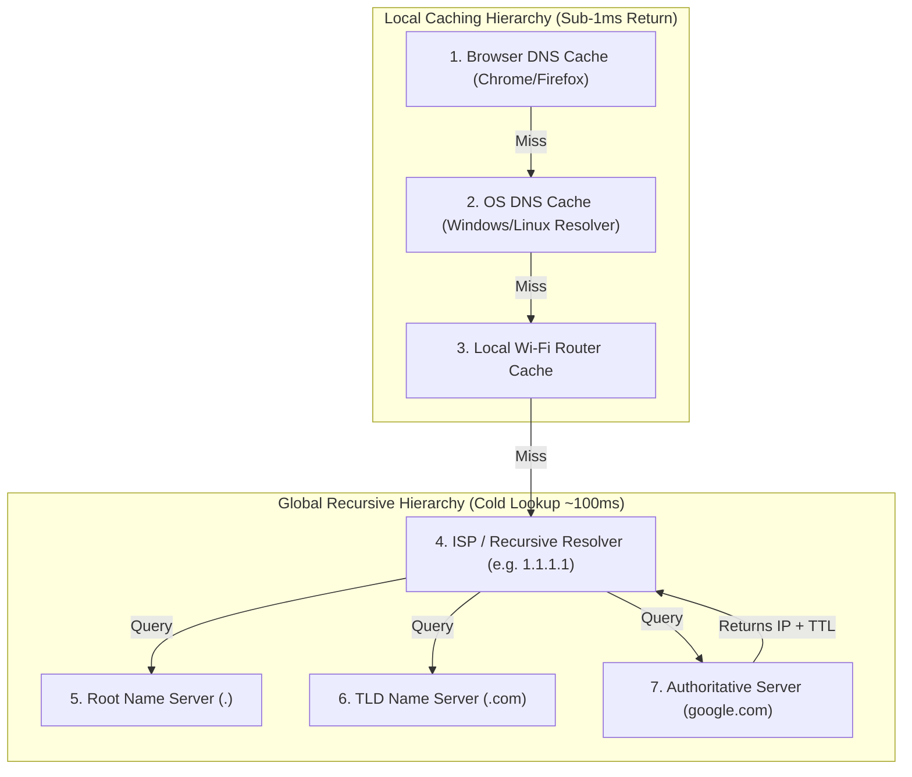

## 🎯 The Question

> **"When you type `google.com` into your browser for the first time, DNS lookup takes 100+ ms. Why does the second visit take 0 ms? How does hierarchical DNS caching work?"**

---

## ⚡ 30-Second Elevator Pitch

The Domain Name System (DNS) is the phonebook of the internet, translating human-friendly names (`google.com`) into machine IP addresses (`142.250.190.46`).

* **First Lookup (Cold Cache)**:
  Your computer must execute an expensive **Iterative Query** across 4 global server tiers:
  1. Recursive DNS Resolver (ISP / 8.8.8.8)
  2. Root DNS Server (`.`)
  3. Top-Level Domain (TLD) Server (`.com`)
  4. Authoritative Name Server (`ns1.google.com`)

* **Second Lookup (Hot Cache)**:
  The response is cached at **4 local layers** with a **Time-To-Live (TTL)**. Your browser or OS resolver returns the cached IP in **$<1\text{ ms}$** without touching the internet.

---

## 🧠 Under-the-Hood: Cold Lookup vs. Multi-Tier DNS Cache

---

## 🔬 The 4 Levels of DNS Caching

1. **Browser Cache**: Chrome/Edge maintain an internal in-memory DNS table for ~1 minute.
2. **OS Resolver Cache**: Windows (`ipconfig /displaydns`) / Linux `systemd-resolved` caches records according to TTL.
3. **Home Gateway / Router**: Local router caches IP mappings for all connected household devices.
4. **ISP / Anycast Recursive Resolver**: Services like Cloudflare (`1.1.1.1`) or Google (`8.8.8.8`) serve cached records shared across millions of nearby users.

---

## 📌 Comparison Matrix: Recursive vs. Iterative DNS Queries

| Query Type | Initiator | Responder | Workflow |
| :--- | :--- | :--- | :--- |
| **Recursive Query** | Client Browser | Recursive Resolver (ISP) | "Find the complete IP address for me and return the final answer." |
| **Iterative Query** | Recursive Resolver | Root / TLD / Auth Servers | "I don't know the IP, but here is the address of the next server to ask." |

---

## 💡 What Interviewers Ask Next (Follow-Up Traps)

1. **"What is DNS TTL (Time To Live) and what are the trade-offs of setting it too high or too low?"**
   - *Answer*: TTL specifies how many seconds a record can be cached before re-querying authoritative servers.
     - **High TTL (e.g. 86400s / 24h)**: Maximizes cache hits and minimizes latency, but delays propagation during server migrations.
     - **Low TTL (e.g. 60s)**: Enables fast failover and zero-downtime DNS updates, but increases lookup load and latency.

2. **"What is Anycast Routing in DNS?"**
   - *Answer*: Anycast assigns the exact same IP address (e.g. `8.8.8.8`) to hundreds of DNS server nodes worldwide. BGP routing automatically directs client queries to the topologically nearest physical datacenter, minimizing RTT.

---

:::tip Placement & Interview Takeaway
**Interview Answer**: The first DNS lookup is slow because it performs an iterative walk across Root, TLD, and Authoritative servers. Subsequent lookups are instant ($<1\text{ms}$) because the IP address is cached with a TTL across multiple local layers (Browser, OS, Router, and Recursive Resolver).
:::

---

## 📺 Video Explanation

<YouTubeEmbed 
  id="q_UQfoSnMVQ" 
  title="Why DNS is Super Fast the Second Time | Interview Question #21" 
/>
