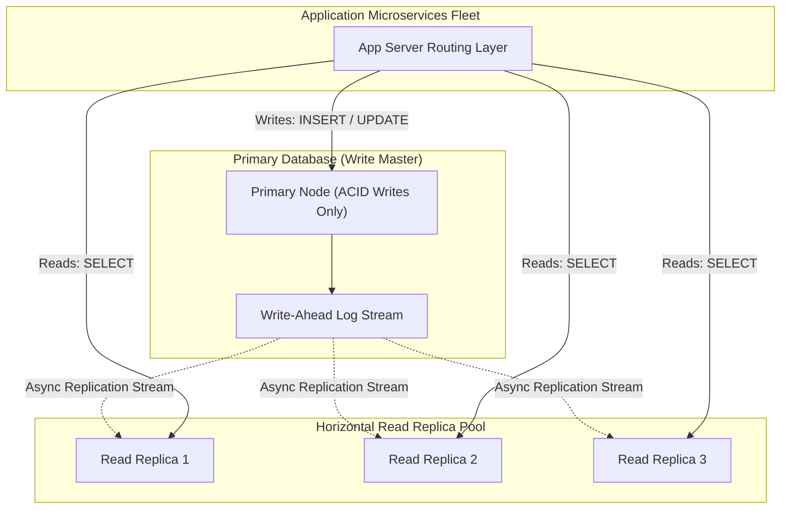

## 🎯 The Question

> **"In high-traffic systems, why do architects route all INSERT/UPDATE statements to a Primary Database and all SELECT queries to Read Replicas? What challenges does this introduce?"**

---

## ⚡ 30-Second Elevator Pitch

Most web applications (e.g. Twitter, Instagram, E-Commerce) have a **90:10 or 99:1 Read-to-Write Ratio** (millions of users reading posts, but only thousands publishing updates).

If all queries hit a single database instance:
1. Long-running `SELECT` queries take read locks, consuming CPU and starving high-priority write transactions.
2. The database becomes a single point of failure and scaling bottleneck.

**The Solution is Read-Write Separation**:
* **Primary (Leader)**: Handles 100% of write transactions (`INSERT`, `UPDATE`, `DELETE`) with strict ACID guarantees.
* **Read Replicas (Followers)**: Asynchronously stream WAL logs from the leader to serve read queries across multiple horizontally scaled instances.

---

## 🧠 Under-the-Hood: Primary-Replica Replication Architecture

---

## 🔬 The Great Trade-off: Replication Lag & Eventual Consistency

Because replication is usually **Asynchronous** (to prevent slow replicas from delaying write commits on the primary):
* **Replication Lag**: A replica might be 50 ms–500 ms behind the primary.
* **Read-Your-Own-Writes Inconsistency**: If a user updates their profile picture and immediately refreshes the page, the read request might hit a lagging replica, showing the old picture!

**How Production Systems Solve This**:
* **Sticky Sessions / Cache Routing**: Route read queries from the updating user to the Primary database for 5 seconds after a write, while other users read from replicas.

---

## 📌 Comparison Matrix: Single Database vs. Read-Write Separation

| Dimension | Single Primary Database | Primary-Replica Architecture |
| :--- | :--- | :--- |
| **Read Scalability** | Bounded by single machine CPU/RAM | Horizontally scalable (Add 10+ replicas) |
| **Write Contention** | High (Reads lock tables and compete for CPU) | Zero read contention on Primary node |
| **Consistency Model** | Strict Immediate Consistency | Eventual Consistency on Replicas |
| **Disaster Recovery** | High risk of single point of failure | Fast failover (Promote replica to primary) |

---

## 💡 What Interviewers Ask Next (Follow-Up Traps)

1. **"What is CQRS (Command Query Responsibility Segregation)?"**
   - *Answer*: CQRS is an architectural pattern that completely separates the data model for mutating data (Commands) from the data model for reading data (Queries). For example, writes update a normalized relational database, while an event handler syncs denormalized read-optimized views into Elasticsearch or Redis.

2. **"What is the difference between Synchronous and Asynchronous Replication?"**
   - *Answer*: In **Synchronous Replication**, the primary waits for at least one replica to write the WAL record to disk before confirming commit to the client (guarantees zero data loss, but increases write latency). In **Asynchronous Replication**, the primary commits immediately and streams logs in background (low latency, but minor risk of data loss on sudden primary crash).

---

:::tip Placement & Interview Takeaway
**Interview Answer**: Production systems separate reads and writes because web traffic is overwhelmingly read-heavy ($>90\%$). Directing writes to a single primary and reads to horizontally scaled replicas isolates write throughput and prevents heavy analytical queries from degrading transactional latency.
:::

---

## 📺 Video Explanation

<YouTubeEmbed 
  id="Ncy-1_sE0lM" 
  title="Why Production Systems Separate Reads & Writes | Interview Question #23" 
/>
