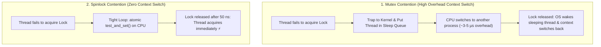

## 🎯 The Question

> **"What is the fundamental difference between a Mutex and a Spinlock? Why would a developer ever want a thread to burn 100% CPU in a while loop instead of going to sleep?"**

---

## ⚡ 30-Second Elevator Pitch

When a lock is contested:
* **Mutex (Sleeping Lock)**: The thread gives up the CPU and is put into a sleep queue by the OS kernel scheduler. Putting a thread to sleep and waking it back up costs **~2 to 5 microseconds** of context-switch latency.
* **Spinlock (Busy-Waiting Lock)**: The thread continuously polls an atomic variable in a tight loop (`while (test_and_set()) {}`), consuming 100% CPU on that core.

**The Golden Rule**:
* If the critical section executes in **nanoseconds / microseconds** (shorter than the time it takes to context-switch), a **Spinlock is significantly faster**.
* If the lock is held for **long durations** (I/O, network calls), a **Mutex is essential** to prevent wasting valuable CPU cycles.

---

## 🧠 Under-the-Hood: Sleep vs. Spin Mechanics

---

## 🔬 Hardware Mechanics: Atomic Instructions & PAUSE

Spinlocks rely on hardware atomic primitives:
* `Compare-And-Swap (CAS)` or `Test-And-Set (TAS)`.
* On modern x86 processors, spinlock loops execute the `_mm_pause()` assembly instruction to prevent CPU pipeline memory order violations and reduce power consumption while spinning.

---

## 📌 Comparison Matrix: Mutex vs. Spinlock

| Metric / Dimension | Mutex (Mutual Exclusion) | Spinlock |
| :--- | :--- | :--- |
| **Contention Behavior** | Thread yields CPU & sleeps in OS wait queue | Busy-waits (Spins) on CPU core |
| **CPU Utilization** | 0% CPU while waiting | 100% CPU utilization on the spinning core |
| **Context Switch Overhead** | High (~2,000–5,000 ns) | Zero (Immediate acquisition) |
| **Single-Core Systems** | ✅ Safe | ❌ Catastrophic (Livelock unless preempted) |
| **Ideal Lock Duration** | Long operations (Disk I/O, DB queries, UI) | Ultra-short operations (Updating a counter/queue) |

---

## 💡 What Interviewers Ask Next (Follow-Up Traps)

1. **"Why is using a Spinlock on a Single-Core CPU a critical bug?"**
   - *Answer*: On a single CPU core, the thread holding the lock cannot execute because the spinning thread is monopolizing 100% of the CPU. The spinning thread will spin until its OS time slice expires, creating pointless latency before the holding thread can finally run.

2. **"What is an Adaptive Mutex (used in Linux `pthread_mutex`)?"**
   - *Answer*: An Adaptive Mutex dynamically combines both approaches. When a lock is contested on a multi-core machine, it first spins for a few hundred iterations. If the lock is not released quickly, it falls back to putting the thread to sleep in the kernel queue.

---

:::tip Placement & Interview Takeaway
**Interview Answer**: Mutexes put waiting threads to sleep via OS context switches, making them ideal for long-running critical sections. Spinlocks busy-wait on CPU cores to avoid context-switch overhead, making them ideal for ultra-fast critical sections that release in nanoseconds.
:::

---

## 📺 Video Explanation

<YouTubeEmbed 
  id="7BWoBTerdso" 
  title="Mutex vs. Spinlock: Why Sleeping Kills Performance | Interview Question #24" 
/>
