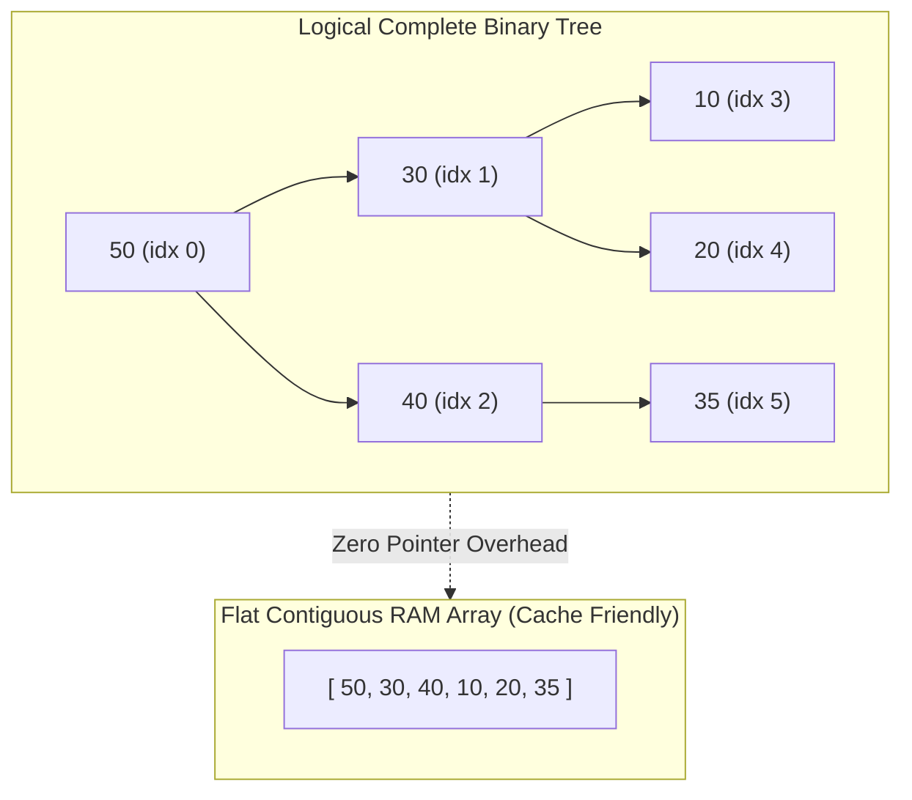

## 🎯 The Question

> **"Why is a Priority Queue implemented using a Binary Heap rather than a simple Sorted Array or Unsorted Array? How does a Heap achieve the optimal trade-off?"**

---

## ⚡ 30-Second Elevator Pitch

A Priority Queue requires two primary operations: **`insert(item)`** and **`extractMax()` / `extractMin()`**.

* **Unsorted Array**: Fast insertion ($O(1)$ append), but finding and removing the highest-priority element requires a slow **$O(N)$ full scan**.
* **Sorted Array**: Instant extraction ($O(1)$ pop from end), but inserting a new element requires shifting existing elements, costing **$O(N)$ linear time**.
* **Binary Heap (Optimal)**: Stored as a complete binary tree inside a flat array. It balances both operations in **$O(\log N)$ time** via parent-child index arithmetic ($2i+1, 2i+2$).

---

## 🧠 Under-the-Hood: Complete Binary Tree Array Storage

A Binary Heap is a complete binary tree that satisfies the **Heap Property** (each parent is $\ge$ its children in a Max-Heap):

---

## 🔬 Fast Bitwise Index Arithmetic

No pointers or dynamic node allocations are needed:
* **Parent Index**: `parent = (i - 1) / 2`
* **Left Child**: `left = 2 * i + 1`
* **Right Child**: `right = 2 * i + 2`

During `insert()`, the element is appended to the array and sifted up ($O(\log N)$ swaps). During `extractMax()`, the root is replaced with the last element and sifted down ($O(\log N)$).

---

## 📌 Comparison Matrix: Priority Queue Implementations

| Data Structure | `insert()` Time | `peekMax()` Time | `extractMax()` Time | Memory Footprint |
| :--- | :--- | :--- | :--- | :--- |
| **Unsorted Array** | ⚡ $O(1)$ | 🐢 $O(N)$ | 🐢 $O(N)$ | $O(N)$ Contiguous |
| **Sorted Array** | 🐢 $O(N)$ (Shifting) | ⚡ $O(1)$ | ⚡ $O(1)$ | $O(N)$ Contiguous |
| **Linked List (Sorted)**| 🐢 $O(N)$ (Traversal)| ⚡ $O(1)$ | ⚡ $O(1)$ | $O(N)$ Node pointers |
| **Binary Heap (Standard)**| ⚡ $O(\log N)$ | ⚡ $O(1)$ | ⚡ $O(\log N)$ | ⚡ $O(N)$ Zero pointers |

---

## 💡 What Interviewers Ask Next (Follow-Up Traps)

1. **"What is the time complexity of building a heap from an unsorted array (`heapify`)?"**
   - *Answer*: **$O(N)$ Linear Time**, not $O(N \log N)$. By sifting down from the bottom non-leaf nodes upwards, the majority of nodes are near the bottom and only move down 1 or 2 levels ($\sum \frac{h}{2^h} = 2$).

2. **"What is a Fibonacci Heap and where is it used?"**
   - *Answer*: A Fibonacci Heap provides amortized **$O(1)$ `insert` and `decreaseKey`** operations and $O(\log N)$ `extractMin`. It is used in Dijkstra's Shortest Path and Prim's MST algorithms to achieve theoretical $O(E + V \log V)$ runtime on dense graphs.

---

:::tip Placement & Interview Takeaway
**Interview Answer**: Priority queues use Binary Heaps because they provide balanced $O(\log N)$ time complexity for both insertions and extractions. Storing the complete binary tree inside a flat array provides zero-pointer overhead and superior CPU cache locality compared to linked trees.
:::

---

## 📺 Video Explanation

<YouTubeEmbed 
  id="Hac-ONh-5yU" 
  title="Why Priority Queues Use Heaps Instead of Arrays | Interview Question #26" 
/>
