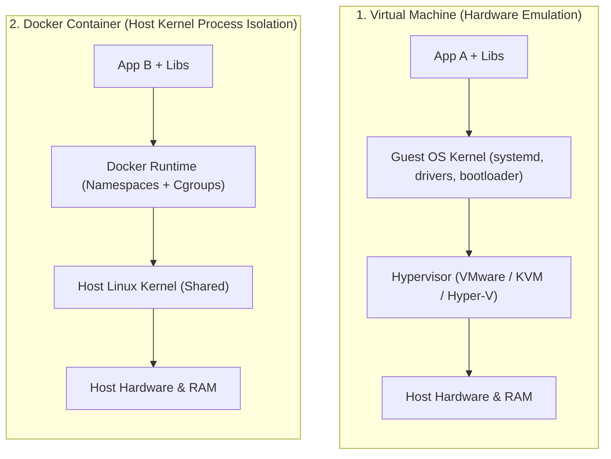

## 🎯 The Question

> **"Why does a Docker container start in 50 milliseconds while a Virtual Machine (VM) takes 1 to 2 minutes to boot? What is happening under the hood in the OS kernel?"**

---

## ⚡ 30-Second Elevator Pitch

A **Virtual Machine (VM)** virtualizes **Hardware**:
* Runs a Hypervisor (Type-1 or Type-2) that emulates virtual CPUs, RAM, and BIOS.
* Must boot a complete **Guest Operating System kernel** from scratch, initialize drivers, start `systemd`, and allocate gigabytes of fixed RAM.

A **Docker Container** virtualizes the **Operating System**:
* Does **not** boot an OS kernel. It is simply an ordinary user-space Linux process running directly on the **Host Kernel**.
* Isolation is enforced instantaneously using two Linux kernel features:
  1. **Namespaces**: Isolates what the process can *see* (Process IDs, Network, Mounts).
  2. **Control Groups (cgroups)**: Limits what the process can *use* (CPU, RAM, Disk I/O).

---

## 🧠 Under-the-Hood: Hypervisor Architecture vs. Container Isolation

---

## 🔬 The 2 Pillars of Linux Container Isolation

1. **Linux Namespaces (Visibility Walls)**:
   - `pid`: Process sees itself as PID 1 inside the container.
   - `net`: Private IP addresses and virtual Ethernet adapters (`veth`).
   - `mnt`: Private root filesystem isolated via overlayfs (`chroot`).
   - `ipc`, `uts`, `user`: Independent inter-process queues and hostnames.
2. **Control Groups / cgroups (Resource Governors)**:
   - Enforces hard limits (e.g. `docker run -m 512m --cpus=2`). The kernel halts or throttles the process if limits are breached.

---

## 📌 Comparison Matrix: Docker Container vs. Virtual Machine

| Dimension | Docker Container | Virtual Machine (VM) |
| :--- | :--- | :--- |
| **Startup Time** | ⚡ Milliseconds (Instant process launch) | 🐢 Minutes (Full OS boot cycle) |
| **RAM Footprint** | Megabytes (Shares kernel & page cache) | Gigabytes (Dedicated guest OS memory allocation) |
| **Kernel Layer** | Shared Host Linux Kernel | Independent Guest OS Kernel |
| **Performance / CPU I/O**| Near Native bare-metal speed | Minor hypervisor virtualization penalty |
| **Security Isolation** | Process isolation (Weaker than hardware) | Hardware hypervisor boundary (Stronger) |

---

## 💡 What Interviewers Ask Next (Follow-Up Traps)

1. **"Can you run a native Linux Docker container directly on Windows without a VM?"**
   - *Answer*: No. Because containers share the host kernel, Linux containers require a Linux kernel. Docker Desktop on Windows runs a lightweight virtualized Linux kernel via **WSL2 (Windows Subsystem for Linux)** to execute containers.

2. **"What happens if a container process crashes with a Kernel Panic?"**
   - *Answer*: A container process cannot panic its own kernel because it doesn't have one. However, if a container exploits a kernel vulnerability that panics the host kernel, the entire physical host server crashes, affecting all co-located containers.

---

:::tip Placement & Interview Takeaway
**Interview Answer**: Docker containers boot in milliseconds because they are lightweight host kernel processes isolated via Linux Namespaces and Cgroups, sharing the host OS. VMs take minutes because they emulate hardware and boot an entire guest OS kernel with dedicated virtual memory.
:::

---

## 📺 Video Explanation

<YouTubeEmbed 
  id="BTL1Nx-7TL0" 
  title="Why Docker Boots in Milliseconds While VMs Take Minutes | Interview Question #27" 
/>
