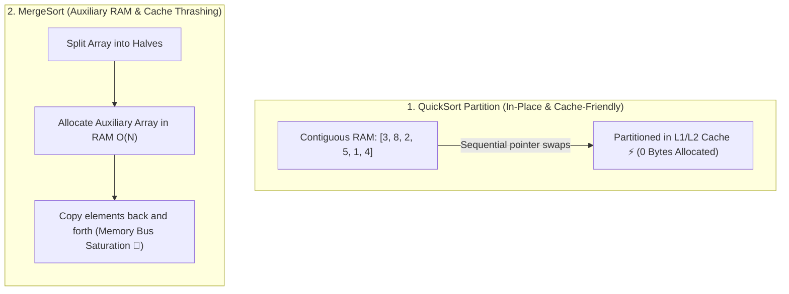

## 🎯 The Question

> **"MergeSort guarantees $O(N \log N)$ in all cases, whereas QuickSort has an $O(N^2)$ worst case. Why is QuickSort standard in language runtimes (C `qsort`, C++ `std::sort`) and 2x to 3x faster in practice?"**

---

## ⚡ 30-Second Elevator Pitch

Asymptotic Big-O notation hides **constant factors ($c$) and hardware memory hierarchy costs**.

**QuickSort outperforms MergeSort in practice because:**
1. **$O(1)$ In-Place Partitioning**: QuickSort partitions data directly inside the array without allocating extra RAM.
2. **CPU Cache Locality & Spatial Prefetching**: QuickSort sequentially scans contiguous array elements, hitting ultra-fast L1/L2 CPU hardware caches with near 100% cache hit rates.
3. **MergeSort Allocation Overhead**: MergeSort requires allocating an auxiliary $O(N)$ array and constantly copying elements back and forth, incurring heavy memory allocator and cache-thrashing overhead.

---

## 🧠 Under-the-Hood: In-Place Cache Locality vs. Memory Allocation

---

## 🔬 How Real-World Engines Avoid $O(N^2)$ Worst-Case

Production standard libraries don't use naive QuickSort; they use **Introsort** or **Dual-Pivot QuickSort**:
1. **Median-of-3 / Median-of-5 Pivot Selection**: Avoids worst-case quadratic degradation on sorted arrays.
2. **Fallback to HeapSort**: If QuickSort recursion depth exceeds $2 \log N$, it automatically switches to HeapSort to guarantee $O(N \log N)$ worst-case.
3. **InsertionSort for Small Subarrays**: When partition size drops below 16 elements, it switches to InsertionSort for maximum CPU register efficiency.

---

## 📌 Comparison Matrix: QuickSort vs. MergeSort

| Metric / Dimension | QuickSort (Introsort) | MergeSort |
| :--- | :--- | :--- |
| **Average Time Complexity** | $O(N \log N)$ (Smaller constant factor) | $O(N \log N)$ (Larger constant factor) |
| **Worst-Case Time** | $O(N^2)$ (Mitigated by Introsort) | $O(N \log N)$ (Guaranteed) |
| **Auxiliary Memory Space** | ⚡ $O(\log N)$ stack space (In-place) | 🐢 $O(N)$ extra memory array |
| **CPU Cache Locality** | ⭐ Outstanding (Linear contiguous scan) | Poor (Constant copying to temp buffer) |
| **Stability** | ❌ Unstable | ✅ Stable (Preserves relative order) |
| **Best Used For** | Primitive arrays, high-speed in-memory sort | Linked lists, external disk sorting, stable sort |

---

## 💡 What Interviewers Ask Next (Follow-Up Traps)

1. **"Why is MergeSort preferred over QuickSort for sorting Linked Lists?"**
   - *Answer*: Linked lists cannot be indexed in $O(1)$ time, making QuickSort's random pivot partitioning slow. However, splitting and merging linked lists in MergeSort requires zero extra memory allocation—just rewiring next pointers in $O(1)$ space.

2. **"What is Timsort?"**
   - *Answer*: Timsort is a hybrid sorting algorithm derived from MergeSort and InsertionSort, used in Python (`sorted()`) and Java (`Arrays.sort()` for objects). It exploits existing ordered runs in real-world data to achieve $O(N)$ best-case time while maintaining stability.

---

:::tip Placement & Interview Takeaway
**Interview Answer**: QuickSort is faster in practice than MergeSort because of its smaller constant factors and exceptional CPU cache locality. QuickSort sorts in-place with $O(1)$ auxiliary space, whereas MergeSort requires allocating and copying to an auxiliary $O(N)$ memory buffer.
:::

---

## 📺 Video Explanation

<YouTubeEmbed 
  id="psOnGAxKq64" 
  title="Why QuickSort beats MergeSort (O(N²) vs O(N log N))! | Interview Question #28" 
/>
