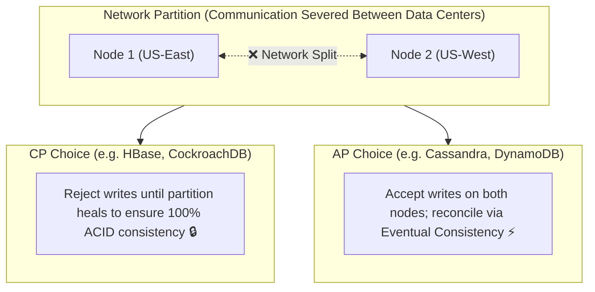

## 🎯 The Question

> **"Why do distributed NoSQL databases (like DynamoDB, Cassandra, MongoDB) relax ACID guarantees and adopt Eventual Consistency (BASE)? What does the CAP Theorem dictate during network splits?"**

---

## ⚡ 30-Second Elevator Pitch

In a single-node database, you can have both 100% Consistency and 100% Availability. But distributed systems span multiple servers across networks, where **Network Partitions ($P$) are inevitable** (cables get cut, switches fail, latency spikes).

**The CAP Theorem proves that when a Network Partition occurs, you MUST choose:**
1. **Consistency (CP)**: Reject incoming writes to prevent stale data. The system guarantees correctness, but **sacrifices availability** (returns error/downtime).
2. **Availability (AP)**: Accept writes on both sides of the network split. The system **guarantees 100% uptime**, but **sacrifices strict consistency** (data syncs eventually).

High-scale consumer apps (Amazon Cart, Social Media) prioritize **Availability over Consistency** because 1 minute of downtime costs millions of dollars.

---

## 🧠 Under-the-Hood: The CAP Theorem Trade-off

---

## 🔬 ACID vs. BASE Model

| ACID (Traditional SQL - CP) | BASE (Distributed NoSQL - AP) |
| :--- | :--- |
| **Atomicity**: All or nothing transaction | **Basically Available**: System stays up during failures |
| **Consistency**: Strict immediate constraint enforcement | **Soft State**: Data state may change without input |
| **Isolation**: Transactions isolated from each other | **Eventual Consistency**: Replicas converge over time |
| **Durability**: Committed data is never lost | |

---

## 📌 Comparison Matrix: CP vs. AP Distributed Systems

| Property | CP Systems (Consistency + Partition Tolerance) | AP Systems (Availability + Partition Tolerance) |
| :--- | :--- | :--- |
| **Network Split Response** | Returns error or blocks until sync | Returns success immediately using local node state |
| **Data Guarantee** | Linearizable / Immediate Consistency | Eventual Consistency (Read-your-writes possible) |
| **Conflict Resolution** | Two-Phase Commit (2PC) / Raft consensus | Last-Write-Wins (LWW) / Vector Clocks |
| **Examples** | PostgreSQL (Single), Spanner, Etcd, ZooKeeper | Cassandra, DynamoDB, Couchbase, Riak |

---

## 💡 What Interviewers Ask Next (Follow-Up Traps)

1. **"What is the PACELC Theorem?"**
   - *Answer*: PACELC extends CAP: **If Partitioned ($P$)**, choose between **Availability ($A$)** or **Consistency ($C$)**; **Else ($E$)**, choose between **Latency ($L$)** or **Consistency ($C$)**. It describes database trade-offs during normal operating conditions when no network failure exists.

2. **"What is Tunable Consistency in Apache Cassandra?"**
   - *Answer*: Cassandra allows developers to configure consistency per query using quorum math:
     $$	ext{Read Quorum } (R) + 	ext{Write Quorum } (W) > 	ext{Replication Factor } (N)$$
     If $R + W > N$, the application is guaranteed to read the latest written value (Strong Consistency), balancing AP and CP dynamically.

---

:::tip Placement & Interview Takeaway
**Interview Answer**: Under the CAP theorem, distributed systems cannot prevent network partitions. When a partition occurs, databases must choose between returning errors to guarantee consistency (CP) or accepting writes with eventual consistency to guarantee availability (AP).
:::

---

## 📺 Video Explanation

<YouTubeEmbed 
  id="OpL7btPmmQo" 
  title="Why NoSQL Sacrifices ACID for High Availability | Interview Question #29" 
/>
