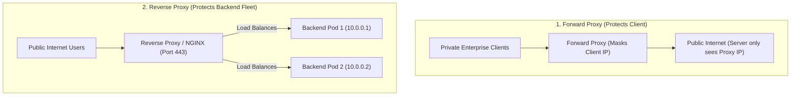

## 🎯 The Question

> **"What is the difference between a Forward Proxy and a Reverse Proxy? What is the golden rule to never confuse them in a System Design interview?"**

---

## ⚡ 30-Second Elevator Pitch

Here is the **Golden Rule**:
* **Forward Proxy protects the CLIENT** (The server doesn't know who the real client is).
* **Reverse Proxy protects the SERVER** (The client doesn't know which backend server actually answered).

1. **Forward Proxy (e.g. Corporate VPN, Tor)**:
   - Sits between a private client network and the public internet.
   - Used for content filtering, bypassing geo-restrictions, and anonymizing client IP addresses.
2. **Reverse Proxy (e.g. NGINX, Cloudflare, HAProxy)**:
   - Sits between the public internet and private backend server fleets.
   - Used for **Load Balancing, SSL Termination, Caching, and DDoS protection**.

---

## 🧠 Under-the-Hood: Forward vs. Reverse Proxy Architecture

---

## 🔬 Core Use Cases

### Forward Proxy Use Cases:
* **Enterprise Security**: Block employees from accessing malicious websites.
* **Cache Outbound Traffic**: Cache shared external resources inside a school/office network.
* **Anonymity**: Tunnel traffic through rotating IP addresses.

### Reverse Proxy Use Cases:
* **SSL Termination**: Decrypt HTTPS at the proxy layer so internal microservices communicate via high-speed plaintext HTTP.
* **Load Balancing**: Distribute traffic evenly across 50 internal Kubernetes pods (Round Robin, Least Connections).
* **Web Acceleration & Caching**: Cache static assets (CSS, JS, images) at edge proxies to reduce backend database load.

---

## 📌 Comparison Matrix: Forward Proxy vs. Reverse Proxy

| Dimension | Forward Proxy | Reverse Proxy |
| :--- | :--- | :--- |
| **Whom does it represent?**| The **Client** | The **Server** |
| **Who knows its existence?**| Client explicitly configures proxy | Client believes proxy *is* the origin server |
| **IP Visibility** | Hides client IP from internet | Hides private backend server IPs from clients |
| **Primary Deployment** | Corporate LANs, VPNs, Tor | NGINX, Cloudflare, AWS ALB, Envoy |
| **Main Functions** | Anonymity, content filter, bypass geo-blocks | Load balancing, SSL offload, caching, DDoS defense |

---

## 💡 What Interviewers Ask Next (Follow-Up Traps)

1. **"How does a backend server know the client's real IP address when behind a Reverse Proxy?"**
   - *Answer*: The reverse proxy appends the client's original IP address to the **`X-Forwarded-For`** and **`X-Real-IP`** HTTP request headers before forwarding the packet to backend services.

2. **"What is the difference between a Reverse Proxy and an API Gateway?"**
   - *Answer*: A Reverse Proxy handles network-level routing, SSL termination, and load balancing (e.g. NGINX). An API Gateway is a specialized reverse proxy that also handles application-level concerns such as JWT authentication, API rate limiting, request validation, and protocol translation (e.g. gRPC-to-JSON).

---

:::tip Placement & Interview Takeaway
**Interview Answer**: A forward proxy acts on behalf of clients to control outbound traffic and hide client identities. A reverse proxy acts on behalf of backend servers to intercept inbound traffic, providing load balancing, SSL termination, caching, and infrastructure security.
:::

---

## 📺 Video Explanation

<YouTubeEmbed 
  id="Jjwhi4I5JC4" 
  title="Forward Proxy vs Reverse Proxy: The Only Rule You Need | Interview Question #30" 
/>
