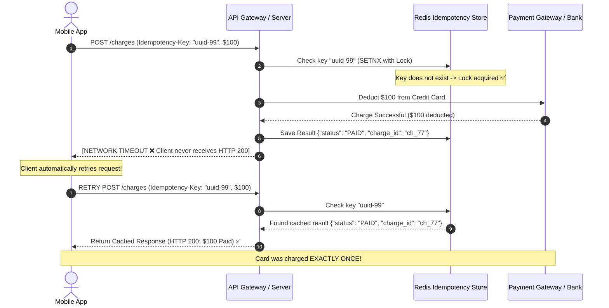

## 🎯 The Question

> **"If a customer clicks 'Pay $100' and their network disconnects before receiving a response, retrying the request could double-charge their credit card. How do APIs use Idempotency Keys to solve this?"**

---

## ⚡ 30-Second Elevator Pitch

In distributed systems, network timeouts are ambiguous: you don't know if the request failed *before* reaching the server, or if the server charged the card and only the *response* was lost.

An operation is **Idempotent** if executing it multiple times produces the exact same result as executing it once ($f(f(x)) = f(x)$).
* `GET`, `PUT`, `DELETE` are naturally idempotent by HTTP standards.
* `POST` is **non-idempotent** (each call creates a new record).

**How Idempotency Keys Work**:
1. Client generates a unique UUID (**`Idempotency-Key: abc-123`**) and sends it in the header.
2. Server checks Redis/Database:
   - If key **does not exist**: Process charge, store key + cached response, return success.
   - If key **already exists**: Skip processing and return the **cached response immediately**.

---

## 🧠 Under-the-Hood: Idempotent Payment Flow

---

## 🔬 Handling In-Flight Concurrent Race Conditions

What if two identical retry requests arrive simultaneously within 10 milliseconds?
1. Use **Atomic Locking (`SET key IN_PROGRESS NX EX 120`)** in Redis.
2. The first request acquires the lock and begins charging the card.
3. The concurrent second request sees the `IN_PROGRESS` state and returns **`HTTP 409 Conflict`** or polls until the first request completes.

---

## 📌 Comparison Matrix: HTTP Methods & Idempotency

| HTTP Method | Naturally Idempotent? | Safe (Read-Only)? | Side-Effect Behavior |
| :--- | :--- | :--- | :--- |
| `GET` | ✅ Yes | ✅ Yes | Zero mutations |
| `PUT` | ✅ Yes | ❌ No | Overwrites existing resource with exact payload |
| `DELETE` | ✅ Yes | ❌ No | Deleting resource 10 times results in resource gone |
| `POST` | ❌ **No** | ❌ No | Each execution creates a new entity (Requires Idempotency Key) |

---

## 💡 What Interviewers Ask Next (Follow-Up Traps)

1. **"What TTL (Time-To-Live) should you set on Idempotency Keys in Redis?"**
   - *Answer*: Stripe and standard payment gateways maintain idempotency records for **24 to 72 hours**. Retrying an operation after 72 hours is treated as an intentional new transaction.

2. **"What happens if the client sends the same Idempotency Key with DIFFERENT payload parameters?"**
   - *Answer*: The server must hash the request body alongside the key. If the key matches an existing record but the payload body differs, the server rejects the request with **`HTTP 422 Unprocessable Entity`** (Idempotency Key Mismatch error).

---

:::tip Placement & Interview Takeaway
**Interview Answer**: Idempotency keys prevent duplicate side-effects (like double charges) caused by network retries. The server records unique client-provided UUIDs in an atomic store (Redis), executing the transaction once and returning cached responses for any identical duplicate requests.
:::

---

## 📺 Video Explanation

<YouTubeEmbed 
  id="4q8yWJ2J4BM" 
  title="Why APIs Use Idempotency Keys (Prevent Double Payments) | Interview Question #31" 
/>
