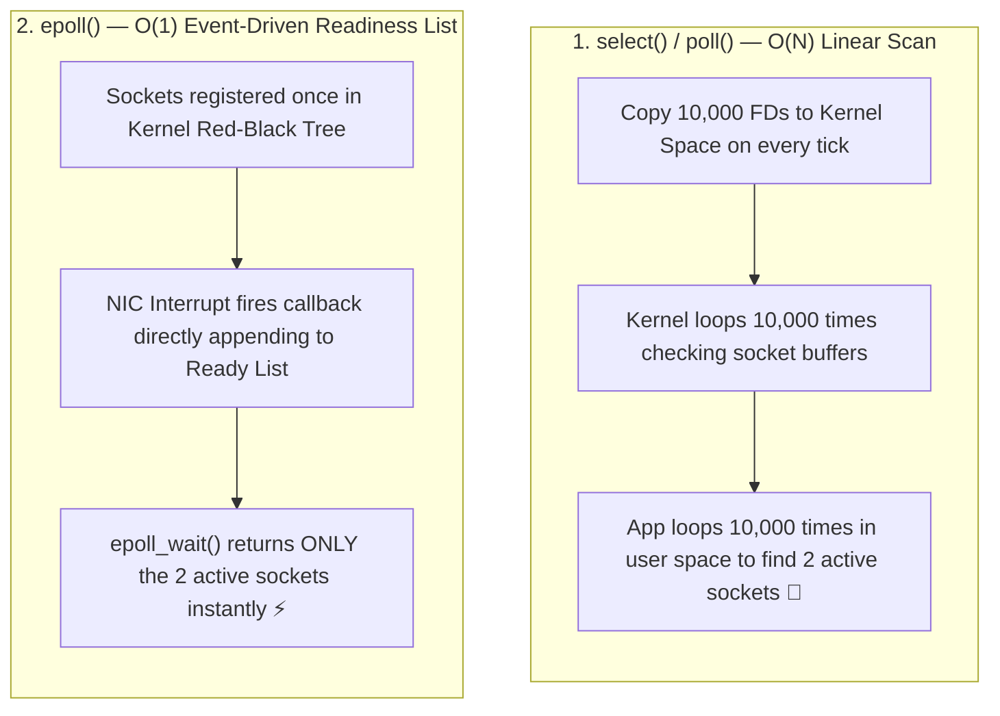

## 🎯 The Question

> **"How do high-performance servers (NGINX, Redis, Node.js) handle 100,000 concurrent client connections on a single thread? Why is Linux `epoll` $100\times$ faster than traditional `select()` and `poll()`?"**

---

## ⚡ 30-Second Elevator Pitch

When a single server thread manages 10,000 socket connections, usually only 10 of those sockets have active incoming data at any given millisecond.

* **With `select()` / `poll()` ($O(N)$ Complexity)**:
  1. The application must copy an array of all 10,000 socket file descriptors from User Space to Kernel Space **on every single poll cycle**.
  2. The kernel iterates through all 10,000 sockets one-by-one to check readiness.
  3. The application must scan all 10,000 sockets again to find the 10 ready ones.
* **With `epoll` ($O(1)$ Event-Driven)**:
  1. File descriptors are registered **once** in a kernel-maintained Red-Black Tree.
  2. When a network packet arrives, the network card interrupt puts that socket directly into an **`epoll` Ready List (Doubly Linked List)**.
  3. `epoll_wait()` returns **only the 10 ready sockets** in $O(1)$ time.

---

## 🧠 Under-the-Hood: Linear Polling vs. Kernel Event Callback

---

## 🔬 The 3 System Calls of `epoll`

1. **`epoll_create1()`**: Creates the epoll kernel context instance.
2. **`epoll_ctl()`**: Adds, modifies, or deletes monitored file descriptors in the kernel's Red-Black Tree ($O(\log N)$ one-time setup).
3. **`epoll_wait()`**: Suspends the thread until events occur, returning only the ready file descriptors in $O(1)$ time.

---

## 📌 Comparison Matrix: select vs. poll vs. epoll

| Metric | `select()` | `poll()` | `epoll()` |
| :--- | :--- | :--- | :--- |
| **Time Complexity** | $O(N)$ | $O(N)$ | ⚡ $O(1)$ (Proportional to active events) |
| **Max Descriptor Limit** | 1024 (`FD_SETSIZE`) | Unlimited (Array) | Unlimited (Kernel memory) |
| **Kernel Data Copy** | Copies entire array every call | Copies entire array every call | ⚡ Zero copy (Registered once) |
| **Kernel Search Mechanism** | Linear loop through all FDs | Linear loop through all FDs | Hardware interrupt callback to Ready List |
| **Trigger Modes** | Level Triggered only | Level Triggered only | Level Triggered & Edge Triggered |

---

## 💡 What Interviewers Ask Next (Follow-Up Traps)

1. **"What is the difference between Level-Triggered (LT) and Edge-Triggered (ET) in epoll?"**
   - *Answer*: **Level-Triggered (Default)** continuously notifies you as long as unread data remains in the socket buffer. **Edge-Triggered (High Performance)** notifies you only when new data arrives. In ET mode, the application must read using a non-blocking loop until `EAGAIN` / `EWOULDBLOCK` is returned, otherwise remaining data will stall.

2. **"What is the equivalent of `epoll` on macOS/BSD and Windows?"**
   - *Answer*: macOS/BSD uses **`kqueue`**, which operates on a similar event-driven design. Windows uses **`IOCP` (I/O Completion Ports)**, which uses an asynchronous completion notification model rather than readiness notification.

---

:::tip Placement & Interview Takeaway
**Interview Answer**: `select` degrades linearly ($O(N)$) because it repeatedly copies and scans the entire list of monitored sockets. `epoll` operates in $O(1)$ time by storing sockets in a kernel red-black tree and using hardware interrupt callbacks to deliver only active, ready file descriptors to the application.
:::

---

## 📺 Video Explanation

<YouTubeEmbed 
  id="u1NNgKVHu2A" 
  title="Why Epoll is 100x Faster Than Select (I/O Multiplexing) | Interview Question #31" 
/>
