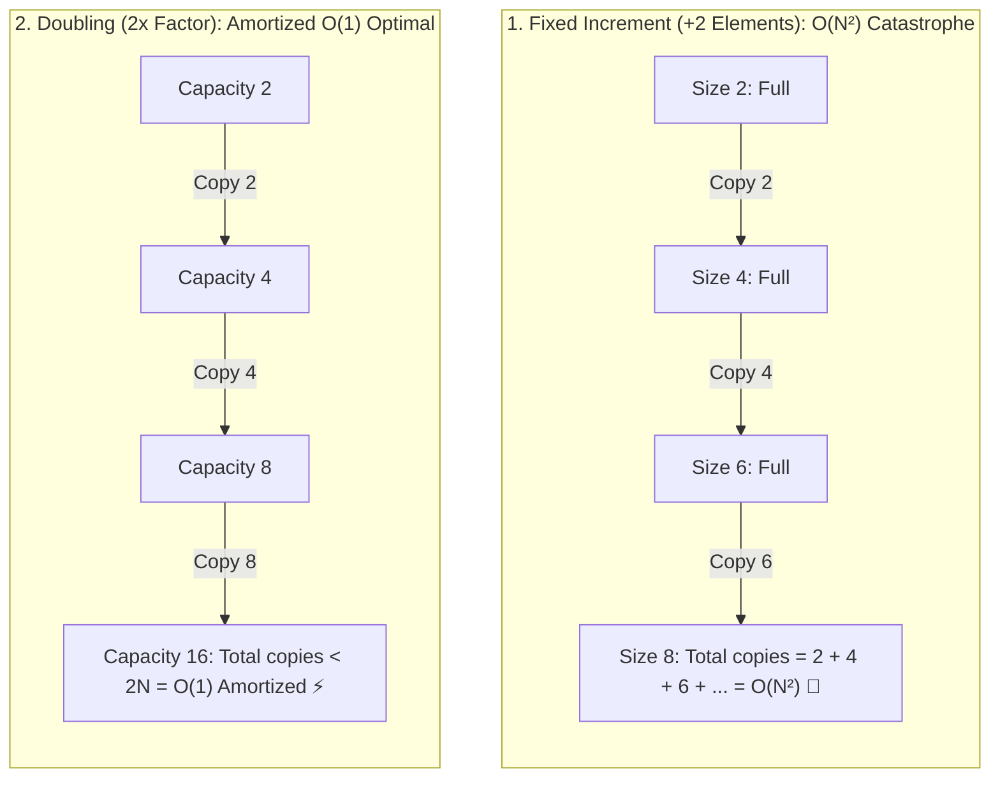

## 🎯 The Question

> **"When a dynamic array (like Java `ArrayList` or C++ `std::vector`) runs out of capacity, why does it double its size ($2\times$ geometric growth) instead of growing by a fixed amount (like $+10$ or $+1000$ elements)?"**

---

## ⚡ 30-Second Elevator Pitch

Arrays require **contiguous physical memory**. When an array is full and a new element is appended:
1. The allocator cannot simply expand in place (adjacent RAM might be occupied).
2. It must allocate a brand new, larger block of RAM elsewhere, **copy all $N$ existing elements** over, and free the old block.

* **If size grew by $+10$ elements (Fixed Growth)**:
  Inserting $N$ elements requires $\frac{N}{10}$ full memory copies, resulting in **$O(N^2)$ Quadratic Time**—catastrophically slow.
* **If size doubles ($2\times$ Geometric Growth)**:
  Resizing happens exponentially less often ($1, 2, 4, 8, 16, \dots$). The total copies to insert $N$ items is:
  $$N + \frac{N}{2} + \frac{N}{4} + \dots < 2N$$
  This guarantees an **Amortized $O(1)$ Constant Time** per `push_back()`.

---

## 🧠 Under-the-Hood: Geometric Resizing & Amortized $O(1)$

---

## 🔬 Mathematical Proof: Aggregate Method

To insert $N$ elements into a doubling array:
* Cost of inserting $N$ raw elements: $N$ writes.
* Cost of copying elements during resizes:
  $$\text{Copies} = 1 + 2 + 4 + 8 + \dots + \frac{N}{2} = N - 1$$
* **Total Operations**:
  $$\text{Total Cost} = N + (N - 1) = 2N - 1$$
* **Amortized Cost per Operation**:
  $$\text{Amortized Cost} = \frac{2N - 1}{N} \approx 2 = O(1)$$

---

## 📌 Comparison Matrix: Fixed Growth vs. Geometric Growth

| Growth Strategy | Total Copy Work for $N$ Inserts | Amortized Cost per `append()` | Memory Waste Overhead |
| :--- | :--- | :--- | :--- |
| **Fixed Increment ($+K$)** | $\approx \frac{N^2}{2K} = O(N^2)$ | 🐢 $O(N)$ Linear | Minimal ($+K$ slots) |
| **$2.0\times$ Growth (Java / C++)** | $\approx 2N = O(N)$ | ⚡ **$O(1)$ Constant** | Max 50% unused capacity |
| **$1.5\times$ Growth (MSVC / Folly)**| $\approx 3N = O(N)$ | ⚡ **$O(1)$ Constant** | Max 33% unused capacity (Memory recycling friendly) |

---

## 💡 What Interviewers Ask Next (Follow-Up Traps)

1. **"Why do some implementations (like MSVC `std::vector` and Facebook's `FBVector`) use a $1.5\times$ growth factor instead of $2.0\times$?"**
   - *Answer*: With a $2.0\times$ factor, the new allocated memory block is always strictly larger than the sum of all previously freed memory chunks ($2^k > \sum_{i=0}^{k-1} 2^i$), preventing the memory allocator from reusing previously deallocated memory. A growth factor of $1.5\times$ (or the Golden Ratio $\phi \approx 1.618$) allows the allocator to reuse previously freed memory segments, reducing fragmentation.

2. **"How do you eliminate all reallocation overhead in production?"**
   - *Answer*: Call `reserve(expected_size)` before inserting elements. This pre-allocates contiguous memory upfront, reducing resize operations and copying overhead to absolute zero.

---

:::tip Placement & Interview Takeaway
**Interview Answer**: Dynamic arrays double their capacity because geometric progression ensures that the total number of element copies across $N$ insertions is bounded by $2N$. This mathematical property yields an amortized $O(1)$ insertion time, whereas growing by a fixed constant incurs an $O(N^2)$ copying penalty.
:::

---

## 📺 Video Explanation

<YouTubeEmbed 
  id="HwPxGhu8TQ8" 
  title="Why Dynamic Arrays Double Their Size (ArrayList / std::vector) | Interview Question #33" 
/>
