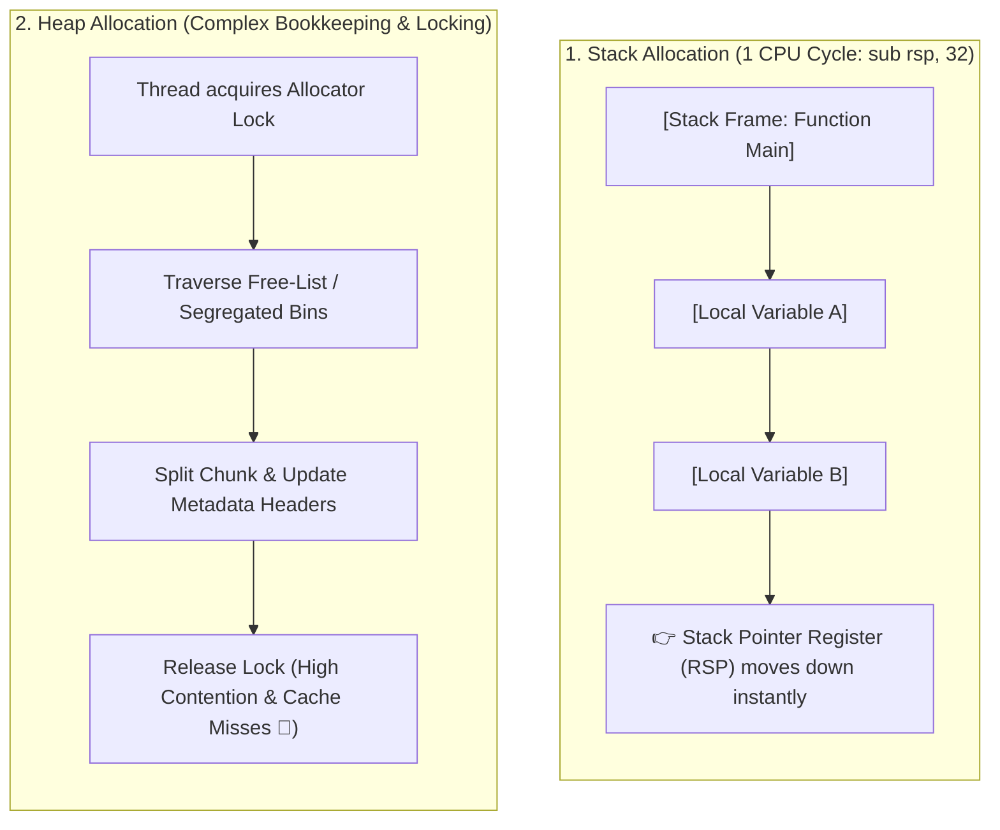

## 🎯 The Question

> **"Why is allocating memory on the Stack orders of magnitude faster than allocating on the Heap? What CPU and operating system mechanisms make the Stack so fast?"**

---

## ⚡ 30-Second Elevator Pitch

* **Stack Allocation ($O(1)$ in 1 CPU cycle)**:
  The Stack is managed strictly in LIFO order. Allocating a local variable requires **one CPU instruction**: subtracting the size from the Stack Pointer register (`sub rsp, 32`). Deallocation is just as fast (`add rsp, 32`).
* **Heap Allocation ($O(N)$ with synchronization)**:
  The Heap is a dynamic, fragmented pool. Calling `malloc()` / `new` requires:
  1. Searching complex free-lists (Buddy allocator, jemalloc, tcmalloc) to find an available contiguous chunk.
  2. Acquiring **thread synchronization locks** to prevent concurrent allocator corruption.
  3. Potential system calls (`brk()` / `mmap()`) to request pages from the OS kernel.

---

## 🧠 Under-the-Hood: Stack Pointer vs. Heap Free-List

---

## 🔬 Hardware Cache Advantage of the Stack

Beyond allocation speed, the **Stack has superior CPU Cache Locality**:
* The top of the stack is constantly accessed and resides almost permanently in the ultra-fast **L1 CPU Hardware Cache (1 nanosecond access time)**.
* Heap allocations are scattered across arbitrary virtual addresses, resulting in frequent **L1/L2 cache misses and page table TLB misses (100–200x slower)**.

---

## 📌 Comparison Matrix: Stack vs. Heap Memory

| Property | Stack Memory | Heap Memory |
| :--- | :--- | :--- |
| **Allocation Mechanism** | Adjust CPU Stack Pointer (`RSP`) register | Free-list search, splitting, locking (`malloc`) |
| **Allocation Cost** | ⚡ **1 CPU Cycle (~0.5 ns)** | 🐢 **Hundreds of cycles (~20–100 ns)** |
| **Deallocation Cost** | ⚡ Automatic upon function return | Manual (`free()` / `delete`) or Garbage Collection |
| **Memory Fragmentation** | Zero (Strict contiguous LIFO order) | High (External and internal fragmentation) |
| **Thread Safety** | Thread-local (Each thread has private stack) | Shared globally across all threads (Requires locks) |
| **CPU Cache Locality** | ⭐ Extreme (Always hot in L1/L2 cache) | Poor (Scattered random memory locations) |

---

## 💡 What Interviewers Ask Next (Follow-Up Traps)

1. **"What causes a Stack Overflow?"**
   - *Answer*: Thread stacks have a small, fixed size limit (typically 1 MB to 8 MB). Infinite recursion or allocating massive local arrays (e.g. `int arr[1000000];` on stack) exceeds the allocated guard page, triggering a page fault that terminates the process with `StackOverflowError` / `SIGSEGV`.

2. **"How do modern high-performance memory allocators (like Google's TCMalloc and Facebook's JeMalloc) speed up heap allocations?"**
   - *Answer*: They use **Thread-Local Caching (Thread Caches)**. Small size-class allocations are fulfilled directly from thread-local bins without acquiring global mutex locks, eliminating multi-core lock contention.

---

:::tip Placement & Interview Takeaway
**Interview Answer**: Stack allocation is instantaneous because it simply increments or decrements the CPU stack pointer register in a single instruction, enjoying 100% L1 cache locality. Heap allocation requires searching free-lists, managing metadata headers, handling thread locks, and dealing with memory fragmentation.
:::

---

## 📺 Video Explanation

<YouTubeEmbed 
  id="u6ibq0M6Xm0" 
  title="Why Stack Memory is 10x FASTER Than Heap | Interview Question #34" 
/>
