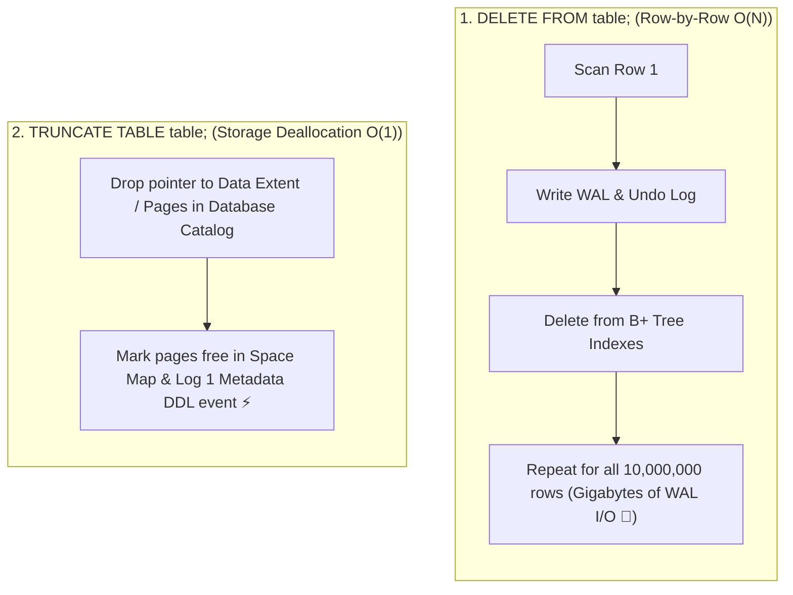

## 🎯 The Question

> **"If both `DELETE FROM table;` and `TRUNCATE TABLE table;` remove all records from a table, why does TRUNCATE execute in 5 milliseconds while DELETE takes 2 minutes on 10 million rows?"**

---

## ⚡ 30-Second Elevator Pitch

* **`DELETE` is a Data Manipulation Language (DML) row-by-row operation**:
  1. Scans every single row in the table.
  2. Writes a full rollback record to the **Undo / WAL log** for every deleted row so the transaction can be rolled back.
  3. Updates and rebalances every index for every single deletion.
  4. Fires row-level triggers (`ON DELETE`) for every row.
* **`TRUNCATE` is a Data Definition Language (DDL) storage operation**:
  1. Deallocates the entire data pages / extents assigned to the table at the metadata level.
  2. Logs only the page deallocation in the WAL log (a few bytes).
  3. Bypasses all row-level triggers and index rebalancing, completing in **constant $O(1)$ time**.

---

## 🧠 Under-the-Hood: Row-by-Row Logging vs. Page Extent Deallocation

---

## 🔬 Space Reclamation & Identity Resets

* **Space Reclamation**:
  - `DELETE` marks rows as dead tuples, but **leaves the disk space allocated** to the table file (causing table bloat until `VACUUM FULL` / `OPTIMIZE TABLE` runs).
  - `TRUNCATE` immediately releases all disk pages back to the operating system or tablespace free pool.
* **Auto-Increment Counters**:
  - `TRUNCATE` resets the `AUTO_INCREMENT` / `IDENTITY` sequence back to 1.
  - `DELETE` retains the current sequence counter.

---

## 📌 Comparison Matrix: DELETE vs. TRUNCATE

| Feature | `DELETE FROM table;` | `TRUNCATE TABLE table;` |
| :--- | :--- | :--- |
| **Command Type** | DML (Data Manipulation) | DDL (Data Definition) |
| **Execution Mechanics** | Row-by-row deletion & logging | Page extent deallocation in metadata |
| **Time Complexity** | 🐢 $O(N)$ Linear | ⚡ $O(1)$ Constant |
| **WAL / Undo Log Generation** | Massive (Logs every deleted row) | Minimal (Logs page deallocations) |
| **WHERE Clause Filter** | ✅ Supported (`WHERE id > 50`) | ❌ Not Supported (All rows cleared) |
| **Triggers** | Fires `ON DELETE` row triggers | Does NOT fire row-level triggers |
| **Identity Counter Reset** | Counter preserved | Resets `AUTO_INCREMENT` to seed |
| **Disk Space Recovery** | Requires manual VACUUM/OPTIMIZE | Reclaims physical disk space instantly |

---

## 💡 What Interviewers Ask Next (Follow-Up Traps)

1. **"Can TRUNCATE be rolled back inside a transaction?"**
   - *Answer*: **In PostgreSQL and SQL Server: YES!** Because DDL commands are transactional in Postgres and SQL Server, `TRUNCATE` can be rolled back if inside `BEGIN ... ROLLBACK;`. **In MySQL (InnoDB): NO**, because DDL operations issue an implicit commit in MySQL.

2. **"Why does TRUNCATE fail if a foreign key references the table?"**
   - *Answer*: Because `TRUNCATE` does not scan rows or check foreign key constraints row-by-row. To prevent orphaned records in child tables, SQL engines block `TRUNCATE` on tables referenced by foreign keys until the foreign key constraint is dropped or disabled.

---

:::tip Placement & Interview Takeaway
**Interview Answer**: `TRUNCATE` is 100x faster than `DELETE` because it deallocates the table's underlying storage pages via DDL metadata operations in $O(1)$ time. In contrast, `DELETE` processes rows individually, writing extensive undo logs and updating secondary indexes for every row.
:::

---

## 📺 Video Explanation

<YouTubeEmbed 
  id="pImPbfQTH2A" 
  title="Why TRUNCATE is 100x Faster Than DELETE | Interview Question #35" 
/>
