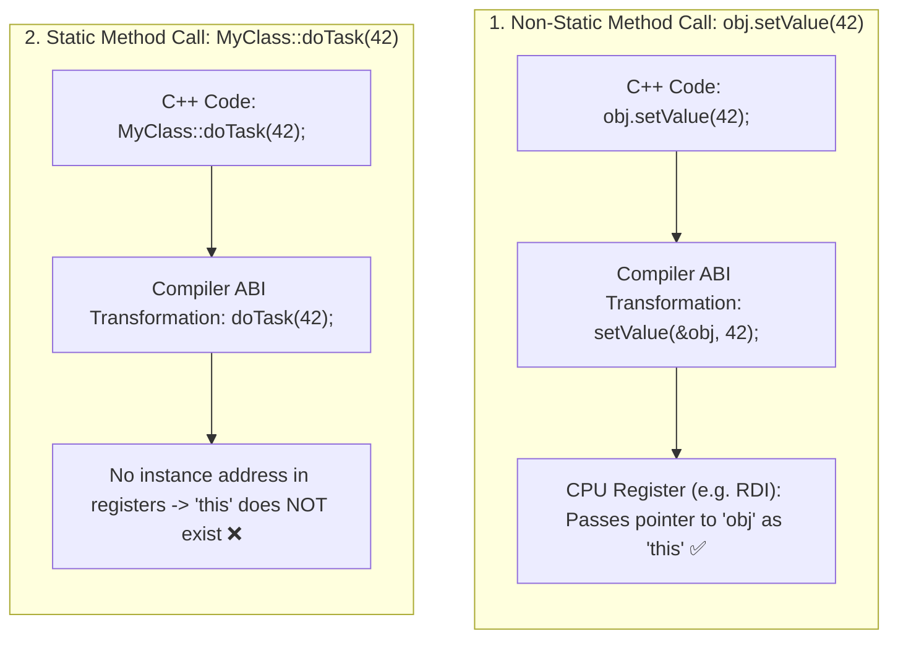

## 🎯 The Question

> **"Why can't a static member function in C++ or Java access non-static member variables or call the `this` pointer? What is happening at the machine code / ABI level during method calls?"**

---

## ⚡ 30-Second Elevator Pitch

In C++ and Java, non-static member methods are not stored inside each object; they are regular global functions in the code segment.

When you call a **non-static method** `obj.doWork(10)`:
* The compiler secretly injects a hidden first argument: the pointer to that object instance (**`doWork(&obj, 10)`**), which is accessible inside the function as **`this`**.

When you call a **static method** `User::validate()`:
* The function belongs to the **Class blueprint**, not to any instance.
* The compiler does **not** pass a hidden `this` pointer.
* Because no instance address exists in the CPU registers, attempting to access instance fields (`this->score`) is a compilation error.

---

## 🧠 Under-the-Hood: How the Compiler Injects `this`



---

## 🔬 Assembly / ABI Level Breakdown

Consider this C++ class:
```cpp
class Calculator {
public:
    int offset = 10;
    
    // Non-static: Compiled as int add(Calculator* this, int x)
    int add(int x) { return this->offset + x; }

    // Static: Compiled as int multiply(int x, int y)
    static int multiply(int x, int y) { return x * y; }
};
```

* In standard x86-64 System V AMD64 ABI:
  - `add(&calc, 5)`: Register `RDI` holds `&calc` (`this`), Register `RSI` holds `5`.
  - `multiply(5, 3)`: Register `RDI` holds `5`, Register `RSI` holds `3`. There is nowhere for `offset` to be retrieved from!

---

## 📌 Comparison Matrix: Static vs. Non-Static Methods

| Feature | Non-Static Member Function | Static Member Function |
| :--- | :--- | :--- |
| **Association** | Bound to a specific Object Instance | Bound to the Class Blueprint Type |
| **`this` Pointer** | ✅ Implicitly passed as 1st argument | ❌ Does not exist |
| **Instance Variable Access**| ✅ Can read/write `this->field` | ❌ Cannot access instance fields |
| **Virtual Dispatch / Polymorphism** | ✅ Can be `virtual` and overridden | ❌ Cannot be `virtual` (Resolved statically) |
| **Invocation Syntax** | `object.method()` or `ptr->method()` | `ClassName::method()` (No object required) |

---

## 💡 What Interviewers Ask Next (Follow-Up Traps)

1. **"Can a static function access private non-static members if an object pointer is explicitly passed to it as an argument?"**
   - *Answer*: **YES!** Because access specifiers (`private`, `protected`) are enforced at the **Class level, not the object level**, a static member function can access private fields of any instance explicitly passed as an argument (e.g. `static void reset(User& u) { u.privateKey = 0; }`).

2. **"Why can't static member functions be marked `const` or `virtual` in C++?"**
   - *Answer*: `const` on a member function specifies that the implicit `this` pointer is `const MyClass* const this`. Since static functions have no `this` pointer, `const` is meaningless. Static functions cannot be `virtual` because virtual dispatch relies on the instance's vtable pointer (`vptr`), which requires an instance.

---

:::tip Placement & Interview Takeaway
**Interview Answer**: Static member functions cannot access `this` because they are bound to the class type rather than an object instance. At the compiler level, non-static methods receive the instance address as an implicit hidden first parameter (`this`), which is omitted in static function signatures.
:::

---

## 📺 Video Explanation

<YouTubeEmbed 
  id="qeagqdYO4Vc" 
  title="Why Static Functions Cannot Access this in C++ | Interview Question #36" 
/>
