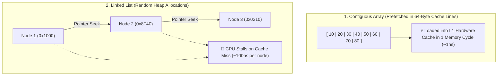

## 🎯 The Question

> **"Both traversing an Array and traversing a Linked List have an $O(N)$ linear time complexity. Why is iterating over a 10-million element Array 10x to 50x faster than iterating over a Linked List on modern CPUs?"**

---

## ⚡ 30-Second Elevator Pitch

Modern CPU registers compute in **0.5 nanoseconds**, but fetching data from physical RAM takes **50 to 100 nanoseconds**. To bridge this speed gap, CPUs use ultra-fast **L1/L2/L3 Hardware Caches**.

* **Array (Spatial Locality & Hardware Prefetching)**:
  Arrays are contiguous blocks of RAM. When the CPU reads `arr[0]`, the hardware prefetcher loads an entire **64-byte Cache Line** containing `arr[0]` through `arr[15]`. The next 15 iterations hit L1 Cache ($1\text{ ns}$) with **0% RAM latency**.
* **Linked List (Pointer Chasing & Cache Misses)**:
  Linked list nodes are allocated independently across the Heap. Traversing to `node->next` requires dereferencing random memory pointers, triggering a **CPU Cache Miss on almost every single hop** and stalling the CPU pipeline.

---

## 🧠 Under-the-Hood: 64-Byte Cache Lines vs. Heap Pointer Chasing

---

## 🔬 Memory Overhead: Payload vs. Pointer Waste

Consider storing 32-bit integers (`int` = 4 bytes):
* **Array of 10M integers**: $10\text{M} \times 4\text{ bytes} = \mathbf{40\text{ MB}}$ of compact contiguous RAM.
* **Linked List of 10M integers (64-bit)**:
  Each node needs 4 bytes (data) + 4 bytes (alignment padding) + 8 bytes (`next` pointer) + 16 bytes (malloc allocator chunk header) = **32 bytes per node**.
  Total = $\mathbf{320\text{ MB}}$ ($8\times$ memory bloat!), consuming valuable cache space.

---

## 📌 Comparison Matrix: Array vs. Linked List Traversal

| Dimension | Contiguous Array | Singly Linked List |
| :--- | :--- | :--- |
| **Theoretical Time Complexity** | $O(N)$ Linear Scan | $O(N)$ Linear Scan |
| **Actual Hardware Runtime** | ⚡ Blazing fast (~1–5 ms for 1M items) | 🐢 Slow (~50–100 ms for 1M items) |
| **Spatial Locality** | ⭐ Perfect (Consecutive addresses) | None (Scattered across heap) |
| **Hardware Prefetcher** | ✅ 100% Effective (L1 Cache hits) | ❌ Ineffective (Cannot predict next pointer) |
| **Memory per Integer** | 4 bytes | 24–32 bytes ($8\times$ memory bloat) |

---

## 💡 What Interviewers Ask Next (Follow-Up Traps)

1. **"What is Bjarne Stroustrup's famous benchmark on `std::vector` vs `std::list`?"**
   - *Answer*: Bjarne Stroustrup demonstrated that even when inserting elements into random sorted positions (where `std::list` is theoretically $O(1)$ after finding position and `std::vector` is $O(N)$ due to shifting), `std::vector` beats `std::list` by large margins for moderate $N$ because cache locality and contiguous block memory copying (`memmove`) massively outperform pointer chasing.

2. **"What is an Unrolled Linked List?"**
   - *Answer*: An Unrolled Linked List is a hybrid structure where each linked list node contains a small array of 16–64 elements instead of 1 element. This combines the $O(1)$ node insertion benefits of linked lists with the cache locality of arrays.

---

:::tip Placement & Interview Takeaway
**Interview Answer**: Arrays traverse 10x faster than linked lists because contiguous memory enables CPU hardware prefetchers to load entire 64-byte cache lines into L1 cache ahead of time. Linked lists suffer from pointer chasing across scattered heap addresses, resulting in continuous cache misses.
:::

---

## 📺 Video Explanation

<YouTubeEmbed 
  id="7CdxjHp1qtI" 
  title="Why Array Traversal is 10x FASTER Than Linked Lists | Interview Question #37" 
/>
