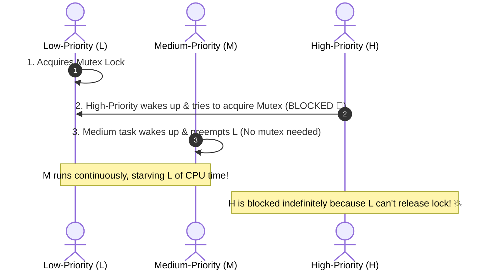

## 🎯 The Question

> **"What is Priority Inversion in real-time operating systems? How did this concurrency bug almost destroy NASA's Mars Pathfinder mission in 1997, and how does Priority Inheritance fix it?"**

---

## ⚡ 30-Second Elevator Pitch

In a priority-based OS scheduler, a **High-Priority task ($H$)** should never be blocked by a **Medium-Priority task ($M$)**.

**Priority Inversion occurs when:**
1. A **Low-Priority thread ($L$)** acquires a shared lock.
2. The **High-Priority thread ($H$)** wakes up and blocks waiting for that lock.
3. A **Medium-Priority thread ($M$)** (which needs no lock) starts running and **preempts $L$** because $M > L$.
4. Because $L$ cannot get CPU time to finish its task and release the lock, **$H$ is indirectly frozen by $M$!**

---

## 🧠 Under-the-Hood: The Priority Inversion Scenario

---

## 🔬 The Solution: Priority Inheritance Protocol (PIP)

To prevent priority inversion, the OS scheduler implements **Priority Inheritance**:
* When High-Priority thread $H$ blocks on a lock held by Low-Priority thread $L$:
* The OS **temporarily elevates $L$'s priority to match $H$'s priority** ($L_{\text{elevated}} = H$).
* Medium thread $M$ can no longer preempt $L$.
* $L$ quickly finishes its critical section, releases the lock, drops back to its low priority, and $H$ immediately acquires the lock and runs.

---

## 📌 Comparison Matrix: Standard Scheduling vs. Priority Inheritance

| Parameter | Standard Priority Scheduling | With Priority Inheritance Protocol (PIP) |
| :--- | :--- | :--- |
| **Lock Contention Behavior** | Low-priority thread runs at baseline priority | Low thread temporarily inherits High priority |
| **Medium Thread Preemption** | $M$ preempts $L$, freezing $H$ | $M$ cannot preempt elevated $L$ |
| **High Priority Latency** | Unbounded delay (System freeze) | Bounded to the duration of $L$'s critical section |
| **Real-Time Safety** | ❌ Prone to watchdog timeouts & crashes | ✅ Deterministic execution guarantee |

---

## 💡 What Interviewers Ask Next (Follow-Up Traps)

1. **"What happened on the Mars Pathfinder spacecraft in 1997?"**
   - *Answer*: Pathfinder ran VxWorks RTOS. A low-priority meteorological data gathering task acquired an information bus mutex. A medium-priority communications task preempted it, preventing the high-priority attitude control task from acquiring the bus mutex. A watchdog timer detected the frozen high-priority task and continuously rebooted the spacecraft until engineers remotely enabled Priority Inheritance.

2. **"What is the Priority Ceiling Protocol (PCP)?"**
   - *Answer*: Priority Ceiling Protocol assigns each mutex a priority ceiling equal to the highest priority of any thread that can ever lock it. When a thread locks the mutex, its priority is immediately raised to that ceiling, preventing deadlocks and chained priority inversions.

---

:::tip Placement & Interview Takeaway
**Interview Answer**: Priority Inversion is a hazard where a medium-priority thread indirectly blocks a high-priority thread by preempting a low-priority thread holding a shared lock. The industry-standard fix is Priority Inheritance, where the low-priority lock holder temporarily inherits the high-priority rating until the lock is released.
:::

---

## 📺 Video Explanation

<YouTubeEmbed 
  id="3CAR99KUyd4" 
  title="Why Low-Priority Threads FREEZE High-Priority Tasks | Interview Question #38" 
/>
