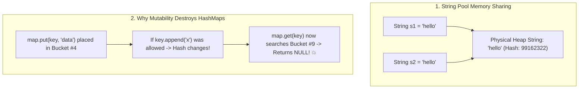

## 🎯 The Question

> **"Why did language designers in Java, Python, and JavaScript make the `String` class immutable? Why can't you modify characters of an existing string in place?"**

---

## ⚡ 30-Second Elevator Pitch

If strings were mutable, modern software architectures would suffer severe performance, memory, and security bugs.

**Strings are immutable for 4 core reasons:**
1. **String Constant Pool (Memory Optimization)**: Identical string literals (`"admin"`) share a single memory address across the entire application, saving hundreds of megabytes of RAM.
2. **Hash Code Caching for $O(1)$ HashMaps**: The string calculates its `hashCode()` once. If strings were mutable, modifying a string key after inserting into a `HashMap` would corrupt the hash bucket and lose the data.
3. **Thread Safety Without Locks**: Immutable strings can be shared across multiple concurrent threads with zero mutex synchronization overhead.
4. **Security**: Passwords, file paths, and database URLs passed into APIs cannot be mutated by malicious concurrent threads.

---

## 🧠 Under-the-Hood: String Pool & HashMap Corruption



---

## 🔬 Security Isolation in Action

Consider database connections or file access:
```java
void openFile(String path) {
    checkSecurityPermissions(path); // 1. Validated as safe
    // If strings were mutable, a malicious background thread 
    // could modify 'path' here between validation and file open (TOCTOU attack)!
    systemOpenFile(path);           // 2. Opens sensitive file
}
```
Immutability guarantees that once validated, the string parameter cannot be altered in memory.

---

## 📌 Comparison Matrix: String vs. StringBuilder / StringBuffer

| Feature | `String` | `StringBuilder` | `StringBuffer` |
| :--- | :--- | :--- | :--- |
| **Mutability** | ❌ Immutable | ✅ Mutable | ✅ Mutable |
| **Thread Safety** | ✅ 100% Thread Safe (Lock-free) | ❌ Not Thread Safe | ✅ Thread Safe (Synchronized methods) |
| **String Pool Storage** | ✅ Yes | ❌ Heap memory only | ❌ Heap memory only |
| **Performance in Loops**| 🐢 Creates new object per `+` | ⚡ Blazing fast in-place append | Moderate (Synchronization overhead) |
| **Best Used For** | Keys, constants, data transfer | High-speed string concatenation | Legacy multithreaded appends |

---

## 💡 What Interviewers Ask Next (Follow-Up Traps)

1. **"Why should passwords be stored in `char[]` instead of `String` in Java?"**
   - *Answer*: Because `String` is immutable and cached in the String Pool / Garbage Collector heap, it remains in memory indefinitely until GC runs, leaving passwords vulnerable in memory dumps. A `char[]` array can be explicitly wiped (`Arrays.fill(password, '0')`) immediately after use.

2. **"What happens under the hood when you do `str = str + 'a'` in a loop?"**
   - *Answer*: Each iteration allocates a new `String` object and copies all previous characters, creating an **$O(N^2)$ quadratic memory and CPU bottleneck**. Always use `StringBuilder` for loop concatenations.

---

:::tip Placement & Interview Takeaway
**Interview Answer**: Strings are immutable to enable String Pool memory deduplication, deterministic hash code caching for $O(1)$ HashMaps, lock-free thread safety across concurrent workers, and security parameter protection against race conditions.
:::

---

## 📺 Video Explanation

<YouTubeEmbed 
  id="fwWkY0nNWLo" 
  title="Why Strings are IMMUTABLE (Python, JS, Java) | Interview Question #40" 
/>
