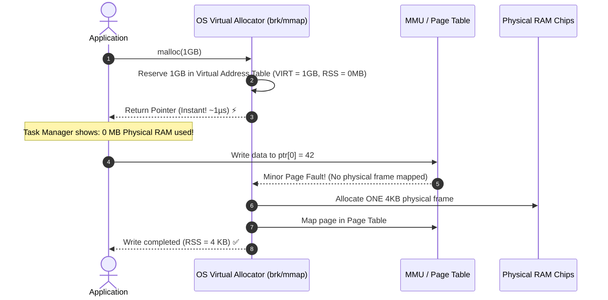

## 🎯 The Question

> **"If a computer only has 2 GB of physical RAM, why does `void *ptr = malloc(1024 * 1024 * 1024);` (1 GB) return in 1 microsecond without RAM usage moving on Task Manager / htop?"**

---

## ⚡ 30-Second Elevator Pitch

When you call `malloc(1GB)`:
* The OS **does NOT allocate 1 GB of physical RAM chips**.
* It simply reserves a 1 GB range in the process's **Virtual Address Space** and marks the Virtual Memory Area (VMA) as valid.

**Physical RAM is allocated Lazily via Demand Paging**:
1. Until the program actually **writes** to an address (e.g. `ptr[0] = 'A'`), physical RAM usage remains **0 bytes**.
2. When the CPU writes to a page, the hardware MMU raises a minor **Page Fault**.
3. The OS assigns **one 4 KB physical RAM frame** on demand.

---

## 🧠 Under-the-Hood: Virtual Allocation vs. Resident Set Size (RSS)

---

## 🔬 VIRT vs. RES in Linux `top` / `htop`

* **VIRT (Virtual Memory Size)**: The total virtual address space reserved by the process (e.g. 10 GB). Costs zero RAM.
* **RES / RSS (Resident Set Size)**: The actual **physical RAM frames** currently occupied by the process.
* **SHR (Shared Memory)**: Physical RAM shared with other processes (e.g. shared libraries).

---

## 📌 Comparison Matrix: malloc() Call vs. First Memory Touch

| Metric / Property | At `malloc(1GB)` Call | At `ptr[i] = 10` (First Write) |
| :--- | :--- | :--- |
| **Latency** | ⚡ Microseconds ($O(1)$ virtual pointer reservation) | Few microseconds per page (Minor Page Fault) |
| **Physical RAM Allocated** | **0 Bytes** | **4 KB per written page** |
| **System Call Used** | `mmap(MAP_ANONYMOUS)` or `brk()` | OS Kernel Page Fault Handler |
| **Out-Of-Memory Risk** | None | High if physical RAM + Swap is exhausted (OOM Killer) |

---

## 💡 What Interviewers Ask Next (Follow-Up Traps)

1. **"What is Linux Memory Overcommit and what happens when all allocated memory is actually written?"**
   - *Answer*: Linux allows total virtual allocations to exceed physical RAM (`vm.overcommit_memory`). If multiple processes write to all their allocated pages simultaneously and RAM runs out, the **OOM Killer (Out-of-Memory Killer)** wakes up, calculates badness scores, and sends `SIGKILL` to sacrifice the highest-consuming process.

2. **"How does `calloc()` differ from `malloc()` in memory allocation?"**
   - *Answer*: While `malloc()` returns uninitialized virtual memory, `calloc()` zero-initializes memory. Linux optimizes `calloc()` by mapping all requested virtual pages to a single, shared, read-only **Zero Page** in physical RAM using Copy-on-Write, consuming zero extra RAM until modified!

---

:::tip Placement & Interview Takeaway
**Interview Answer**: `malloc(1GB)` does not consume physical RAM because the OS only reserves a virtual address range. Physical memory frames are allocated lazily via Demand Paging on a 4 KB per-page basis only when the process performs a write.
:::

---

## 📺 Video Explanation

<YouTubeEmbed 
  id="iGbDrfXTUFQ" 
  title="Why malloc(1GB) DOES NOT Consume 1GB RAM | Interview Question #41" 
/>
