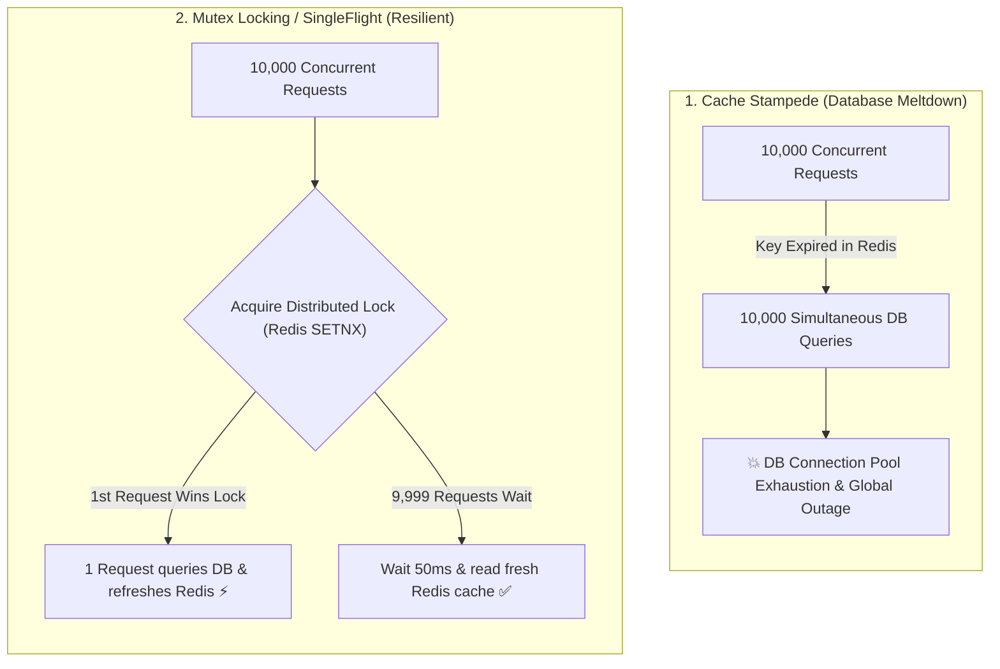

## 🎯 The Question

> **"If an e-commerce website caches its home page product catalog in Redis with a 1-hour TTL, why does the database crash at exactly the 1-hour mark when traffic is completely normal? What is a Cache Stampede?"**

---

## ⚡ 30-Second Elevator Pitch

In high-traffic systems, a popular key (e.g., `"top_products"`) might serve **10,000 requests per second** directly from Redis ($1\text{ ms}$ latency), keeping database load at 0%.

The moment that key hits its TTL and expires:
1. All 10,000 concurrent incoming requests experience a **Cache Miss** at the exact same millisecond.
2. All 10,000 requests bypass the cache and **simultaneously execute the expensive SQL query on the database**.
3. The database connection pool is instantly exhausted, CPU hits 100%, queries time out, and the database crashes—known as a **Cache Stampede (Thundering Herd Problem)**.

---

## 🧠 Under-the-Hood: Cache Stampede Failure vs. Mutex Lock Fix

---

## 🔬 Top 3 Industry Solutions to Cache Stampede

1. **Distributed Mutex Lock (SingleFlight / Redis `SETNX`)**:
   - Only the first thread that misses the cache acquires the lock to query the DB and update Redis. All other threads wait briefly and read the repopulated cache.
2. **Probabilistic Early Expiration (XFetch Algorithm)**:
   - Before the key officially expires, background worker threads probabilistically calculate whether to refresh the cache early based on request frequency:
     $$\Delta \times \beta \times \ln(\text{random}()) > \text{TTL}_{\text{remaining}}$$
3. **Background Asynchronous Cache Warming**:
   - The key **never expires** (`TTL = infinity` in Redis). A background cron job periodically queries the database every 10 minutes and refreshes the cache asynchronously.

---

## 📌 Comparison Matrix: Cache Stampede Mitigation Strategies

| Strategy | Implementation Complexity | DB Query Count on Expiry | Latency Impact |
| :--- | :--- | :--- | :--- |
| **No Protection** | None | 10,000+ simultaneous queries | 💥 System Crash |
| **Distributed Mutex (`SETNX`)** | Low | Exactly 1 DB query | +50 ms for waiting threads |
| **XFetch (Probabilistic)** | Moderate (Algorithm) | Exactly 1 DB query (Pre-emptive) | ⚡ 0 ms (Zero latency hit) |
| **Background Cron Warming** | Low | 1 scheduled DB query | ⚡ 0 ms (Data always hot) |

---

## 💡 What Interviewers Ask Next (Follow-Up Traps)

1. **"What is the difference between Cache Penetration, Cache Breakdown, and Cache Avalanche?"**
   - *Answer*:
     - **Cache Breakdown**: A single popular hot key expires, causing a stampede on the DB (Solved by Mutex).
     - **Cache Avalanche**: Millions of keys expire at the *exact same second* (Solved by adding **jitter / random TTL offsets**).
     - **Cache Penetration**: Queries for non-existent IDs bypass cache and hit DB (Solved by caching nulls or **Bloom Filters**).

2. **"How does adding Random Jitter prevent Cache Avalanche?"**
   - *Answer*: Instead of setting a fixed TTL of `3600s` for all keys, set `TTL = 3600 + rand(0, 300)` seconds. This staggers expirations across a 5-minute window, preventing massive simultaneous batch drops.

---

:::tip Placement & Interview Takeaway
**Interview Answer**: A cache stampede occurs when a high-traffic cache key expires, causing thousands of concurrent requests to simultaneously hit the database. Production systems prevent this using distributed mutex locking (SingleFlight), adding random jitter to TTLs, or refreshing caches proactively using probabilistic early expiration.
:::

---

## 📺 Video Explanation

<YouTubeEmbed 
  id="EmorKmfITQE" 
  title="Why Expired Cache Keys CRASH Databases | Interview Question #42" 
/>
