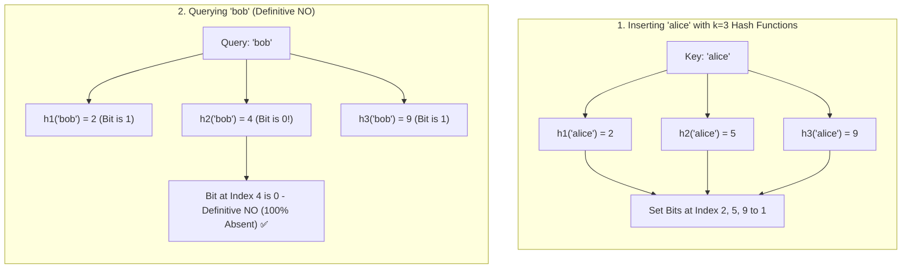

## 🎯 The Question

> **"How do high-scale databases like Cassandra and Bigtable check whether a key exists across billions of records on disk without performing expensive disk seeks? How does a Bloom Filter work under the hood?"**

---

## ⚡ 30-Second Elevator Pitch

A **Bloom Filter** is a memory-efficient, probabilistic data structure designed to answer one question: *"Is this element in the set?"*

Instead of storing full strings or objects (which takes gigabytes of RAM), a Bloom filter uses:
1. A **single bit array of size $m$**, initially all zeros (`0`).
2. **$k$ independent, uniform hash functions**.

**The Core Guarantee**:
* **Definitive NO (0% False Negatives)**: If any of the $k$ bit positions is `0`, the element is **guaranteed 100% NOT to be in the set**.
* **Probable YES (Possible False Positives)**: If all $k$ bit positions are `1`, the element is **probably in the set** (hash collisions could have set those same bits from other keys).

---

## 🧠 Under-the-Hood: Insertion and Membership Check

---

## 🔬 Mathematical Foundations & Tuning

The probability of a false positive ($p$) depends on:
* $m$: Number of bits in the bit array.
* $n$: Number of elements inserted.
* $k$: Number of hash functions used.

The optimal number of hash functions that minimizes false positives is given by:

$$k = \frac{m}{n} \ln 2 \approx 0.693 \times \frac{m}{n}$$

For a false positive rate of $\approx 1\%$, you only need about **9.6 bits per element**, regardless of how long or complex the original data strings are. Storing 100 million username strings would normally consume gigabytes in a hash set, but takes only **~115 MB in a Bloom filter**.

---

## 📌 Comparison Matrix: Hash Set vs. Bloom Filter

| Dimension | Standard Hash Set (e.g. HashSet / Unordered Set) | Bloom Filter |
| :--- | :--- | :--- |
| **Membership Accuracy** | 100% Exact (No False Positives, No False Negatives) | Probabilistic (Possible False Positives, 0% False Negatives) |
| **Memory Footprint** | Heavy (Stores raw keys + object pointers in RAM) | Ultra-compact (~10 bits per item in a bit array) |
| **Element Retrieval** | ✅ Can retrieve original key/values | ❌ Cannot retrieve elements (Membership query only) |
| **Deletion Support** | ✅ Simple $O(1)$ deletion | ❌ Cannot delete (Flipping 1 to 0 corrupts other keys) |
| **Time Complexity** | $O(1)$ average | $O(k)$ deterministic (Hashing $k$ times) |

---

## 💡 What Interviewers Ask Next (Follow-Up Traps)

1. **"Why can't you delete an element from a standard Bloom Filter, and how do Counting Bloom Filters solve this?"**
   - *Answer*: You cannot simply reset bits back to `0` upon deletion because other active elements might share those same hash bit indices. A **Counting Bloom Filter** replaces each single bit with a small integer counter (e.g. 4 bits). Inserting increments the counters, and deleting decrements them, enabling deletions at the cost of $3\times$ to $4\times$ more memory.

2. **"Where are Bloom Filters used in real-world infrastructure?"**
   - *Answer*: 
     - **Apache Cassandra & RocksDB**: Before reading an SSTable from disk, the engine queries a memory-resident Bloom filter. If it returns "NO", the database skips that disk file completely, saving expensive disk seeks.
     - **Google Chrome**: Used to check malicious URLs locally before making an external cloud query.
     - **CDN Caching**: Akamai uses Bloom filters to prevent "one-hit wonders" from polluting edge caches.

---

:::tip Placement & Interview Takeaway
**Interview Answer**: A Bloom filter is a space-efficient probabilistic data structure that uses a shared bit array and $k$ hash functions. It guarantees zero false negatives (if any bit is 0, the item is definitely absent), allowing databases to skip expensive disk reads for non-existent records while accepting a controllable, tiny false positive rate.
:::

---

## 📺 Video Explanation

<YouTubeEmbed 
  id="xya00v9a7Aw" 
  title="How BLOOM FILTERS Actually Work | Interview Question #44" 
/>
