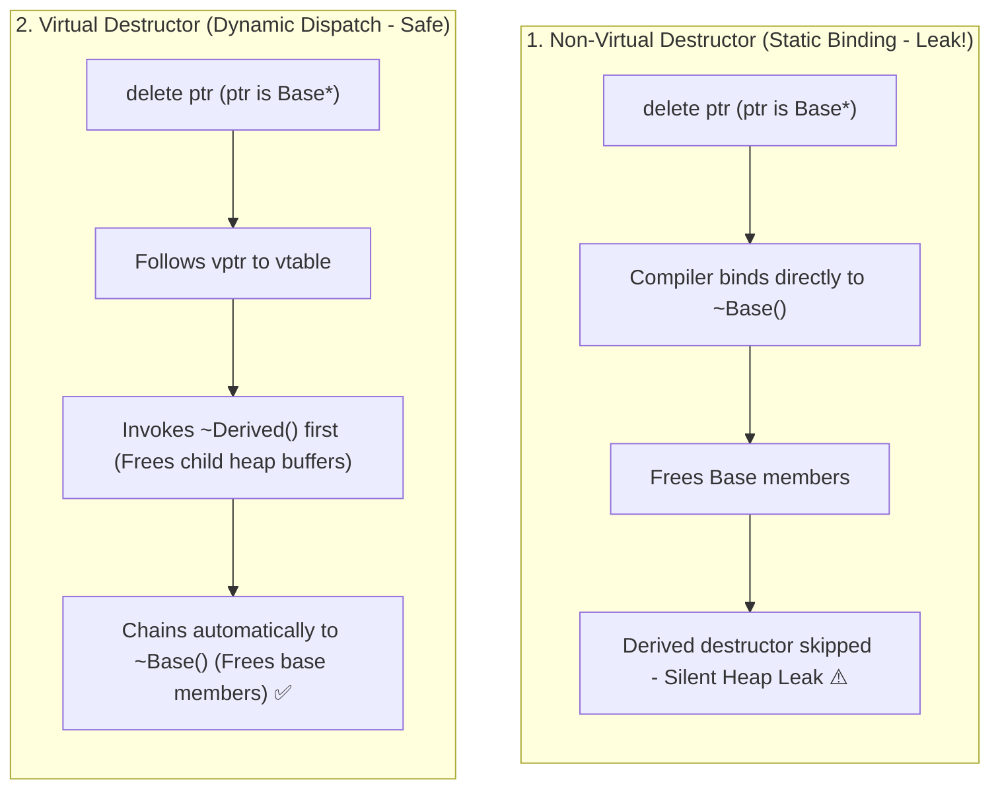

## 🎯 The Question

> **"Why must any C++ base class with virtual functions declare a virtual destructor (`virtual ~Base()`)? What happens at runtime if you delete a derived object through a base pointer with a non-virtual destructor?"**

---

## ⚡ 30-Second Elevator Pitch

When you delete an object polymorphically through a pointer to its base class:

```cpp
Base* ptr = new Derived();
delete ptr;
```

* **If `~Base()` is NOT virtual**:
  The compiler uses **Static Binding** at compile time based on the pointer type (`Base*`). It invokes only `~Base()`. The child destructor `~Derived()` is **completely skipped**, causing undefined behavior and silently leaking any heap allocations, file handles, or network sockets held by `Derived`.
* **If `~Base()` IS virtual**:
  The destructor call uses **Dynamic Dispatch** through the object's Virtual Method Table (`vtable`). It invokes `~Derived()` first to clean up child resources, and then automatically chains up to `~Base()`, guaranteeing safe, complete deallocation.

---

## 🧠 Under-the-Hood: Static Binding vs. Vtable Resolution



---

## 🔬 Code Walkthrough: The Silent Leak Bug

```cpp
class Base {
public:
    Base() { std::cout << "Base created\n"; }
    // ❌ Missing virtual keyword!
    ~Base() { std::cout << "Base destroyed\n"; }
};

class Derived : public Base {
    int* largeArray;
public:
    Derived() { 
        largeArray = new int[1000000]; // 4 MB allocated on heap
        std::cout << "Derived created\n"; 
    }
    ~Derived() { 
        delete[] largeArray; // Never executed if Base destructor is not virtual!
        std::cout << "Derived destroyed\n"; 
    }
};

int main() {
    Base* obj = new Derived();
    delete obj; // Output: Only "Base destroyed"! 4 MB leaked!
}
```

By adding `virtual ~Base() = default;`, the runtime looks up the destructor in the object's `vtable`, ensuring `Derived::~Derived()` executes before `Base::~Base()`.

---

## 📌 Comparison Matrix: Non-Virtual vs. Virtual Base Destructor

| Behavior / Aspect | Non-Virtual Base Destructor | Virtual Base Destructor (`virtual ~Base()`) |
| :--- | :--- | :--- |
| **Binding Mechanism** | Early / Static Binding (Compile-time) | Late / Dynamic Binding via `vtable` |
| **Destructor Call Order** | `~Base()` only | `~Derived()` first, then `~Base()` (Bottom-up) |
| **Derived Heap Cleanup** | ❌ Skipped (Undefined behavior & memory leak) | ✅ Guaranteed complete cleanup |
| **Object Size (`sizeof`)** | No extra pointer overhead | Adds 8 bytes for `vptr` pointer (if not already virtual) |
| **When to Use** | Non-polymorphic / Value classes (e.g. final struct) | Any class intended to be inherited polymorphically |

---

## 💡 What Interviewers Ask Next (Follow-Up Traps)

1. **"Why aren't ALL destructors in C++ virtual by default (like in Java)?"**
   - *Answer*: C++ adheres to the **"Zero-Overhead Principle"** (you don't pay for what you don't use). Making a destructor virtual adds a hidden virtual table pointer (`vptr`, 8 bytes on 64-bit systems) to every instance. For lightweight structs like `Point2D { int x, y; }` (8 bytes), adding a `vptr` would double memory consumption to 16 bytes and break C-ABI layout compatibility.

2. **"What is the construction and destruction order in class hierarchies?"**
   - *Answer*: 
     - **Construction is Top-Down**: Base constructor executes first, then Derived constructor.
     - **Destruction is Bottom-Up**: Derived destructor executes first, then Base destructor. Virtual destructors ensure this bottom-up sequence is preserved when deleting through base pointers.

---

:::tip Placement & Interview Takeaway
**Interview Answer**: If a base class is used polymorphically, its destructor must be declared `virtual`. Without a virtual destructor, deleting a derived instance through a base pointer uses static binding, invoking only `~Base()` and skipping `~Derived()`, silently leaking derived resources and causing undefined behavior.
:::

---

## 📺 Video Explanation

<YouTubeEmbed 
  id="FuIKuqbnzZc" 
  title="Why Base Destructors MUST Be Virtual | Interview Question #45" 
/>
