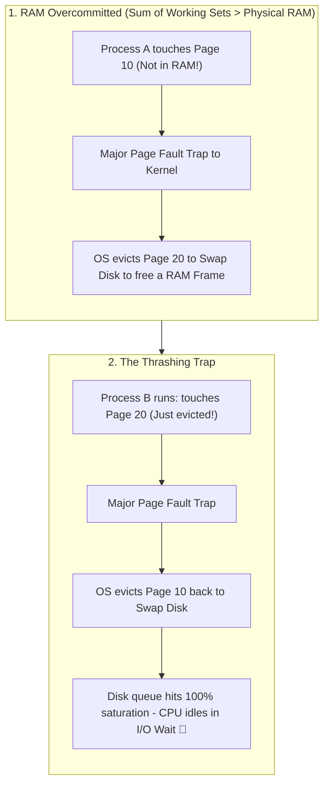
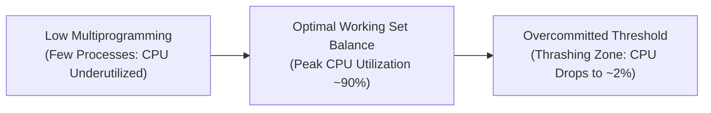

## 🎯 The Question

> **"When your computer runs out of physical RAM and starts swapping to disk, why does the entire operating system freeze up while CPU utilization unexpectedly drops to near zero? What is Thrashing?"**

---

## ⚡ 30-Second Elevator Pitch

When physical RAM is completely full, the operating system uses **Virtual Memory Swapping** to move inactive pages to secondary disk storage (HDD or SSD).

Every running program has a **Working Set**—the subset of memory pages it actively needs right now to execute instructions.

When the sum of all processes' working sets exceeds physical RAM:
1. Every time Process $A$ runs, it needs Page $X$, forcing the OS to evict Page $Y$ to disk.
2. A millisecond later, Process $B$ runs and needs Page $Y$, forcing the OS to evict Page $X$ back to disk.
3. This creates a vicious cycle of continuous, high-frequency **Major Page Faults**.
4. Because disk I/O is thousands of times slower than RAM, **the CPU spends 99% of its time idling in I/O wait state**, waiting for disk page transfers. This state is called **Thrashing**.

---

## 🧠 Under-the-Hood: The Thrashing Cycle

---

## 🔬 The Degree of Multiprogramming Curve

In OS theory, increasing the number of active processes (Degree of Multiprogramming) initially increases CPU utilization because when one process waits for I/O, another can compute:

Once the physical memory threshold is crossed, CPU utilization plummets toward 0% because the hardware scheduler queue has zero runnable threads—every thread is blocked in an uninterruptible sleep state (`D` state in Linux) waiting for disk blocks.

---

## 📌 Comparison Matrix: Normal Demand Paging vs. Thrashing

| Metric | Normal Demand Paging | Thrashing State |
| :--- | :--- | :--- |
| **Page Fault Rate** | Occasional / Low (Few per second) | Continuous storm (Thousands per second) |
| **CPU Utilization** | High (Executing real application code) | Collapses to near zero (Trapped in I/O Wait) |
| **Disk Activity** | Minimal / Periodic bursts | 100% Continuous disk seek saturation |
| **Working Set Status** | All active working sets fit in RAM | Working sets exceed physical RAM |
| **User Experience** | Smooth, responsive UI | Mouse freezes, UI halts, total system freeze |

---

## 💡 What Interviewers Ask Next (Follow-Up Traps)

1. **"How does the OS Kernel detect and prevent Thrashing?"**
   - *Answer*:
     - **Working Set Model**: The OS monitors the pages referenced by each process over a sliding time window $\Delta$. If the sum of all working sets $\sum WSS_i > \text{Total Physical RAM}$, the kernel temporarily suspends (swaps out) one entire process to free up memory for the others.
     - **Page Fault Frequency (PFF)**: If a process's page fault rate exceeds an upper threshold, the OS allocates more frames to it; if below a lower threshold, it reclaims frames.

2. **"What is the Linux `vm.swappiness` parameter?"**
   - *Answer*: `vm.swappiness` (range 0 to 100) controls how aggressively the Linux kernel swaps anonymous memory pages to disk relative to reclaiming file page cache. A value of `60` is standard desktop default, while database servers (PostgreSQL/Redis) frequently set it to `1` or `10` to avoid swap-induced latency spikes.

---

:::tip Placement & Interview Takeaway
**Interview Answer**: Thrashing occurs when total process working sets exceed physical RAM, triggering a cascading storm of page faults. The CPU spends virtually all its cycles waiting on high-latency disk swap I/O rather than executing user code, causing CPU utilization to collapse and freezing the system.
:::

---

## 📺 Video Explanation

<YouTubeEmbed 
  id="l8uhIxgcPtQ" 
  title="Why Running Out of RAM Freezes Your CPU | Interview Question #46" 
/>
