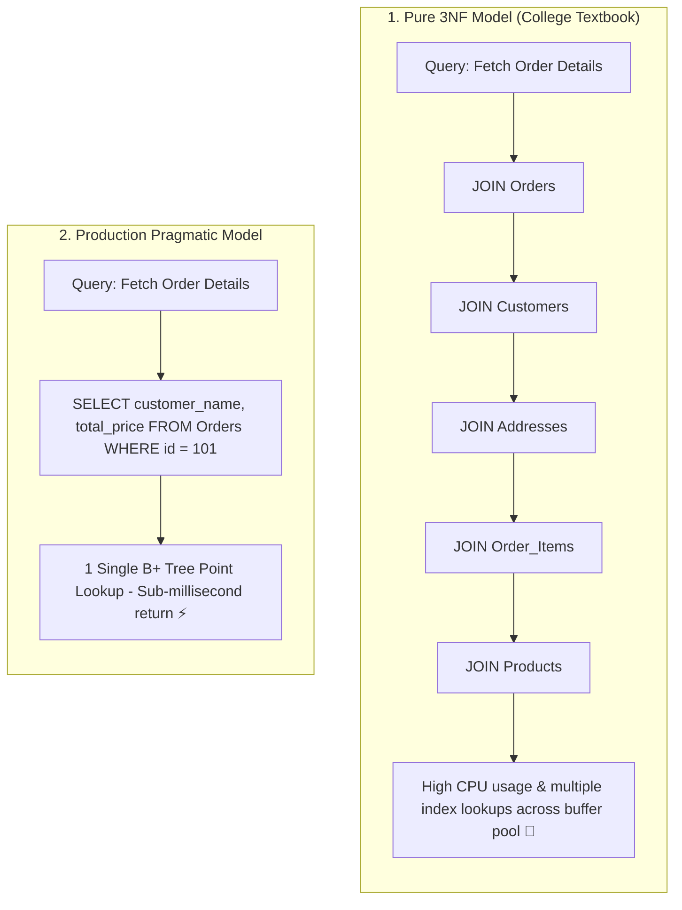

## 🎯 The Question

> **"Should database tables always be normalized to 3rd Normal Form (3NF)? Why do high-scale production systems intentionally violate 3NF and duplicate data across tables?"**

---

## ⚡ 30-Second Elevator Pitch

College textbooks teach that **data redundancy is evil** and that all tables must be normalized to 3rd Normal Form (3NF) to prevent insertion, update, and deletion anomalies.

In production engineering, **disk storage is virtually free, but CPU cycles and memory bandwidth are extremely expensive**:
* **The 3NF Bottleneck**: In a strictly normalized 3NF database, fetching an order page requires joining 6 to 8 separate tables (`orders`, `order_items`, `customers`, `addresses`, `products`, `taxes`, `discounts`). Under 20,000 requests/sec, these multi-table JOINs saturate CPU, blow out buffer pool caches, and exhaust connection pools.
* **Production Denormalization**: By intentionally duplicating frequently read columns (e.g. embedding `customer_name` directly in `orders`), queries become simple single-table lookups, eliminating JOIN overhead and speeding up reads by **$10\times$ to $50\times$**.

---

## 🧠 Under-the-Hood: Multi-Table JOINs vs. Single-Table Scan

---

## 🔬 The Hardware Reality: Storage vs. Compute

When Codd formulated relational database normalization in the 1970s:
* 1 Megabyte of disk storage cost thousands of dollars. Minimizing bytes stored was top priority.

In modern cloud datacenters:
* 1 Gigabyte of fast NVMe SSD storage costs **less than \$0.10**.
* What actually bottlenecks web systems is **CPU saturation, locking contention, and memory bus latency** during complex SQL JOIN operations.

---

## 📌 Comparison Matrix: Normalization (3NF) vs. Denormalization

| Dimension | Normalized (3NF) Architecture | Denormalized Production Architecture |
| :--- | :--- | :--- |
| **Data Redundancy** | 0% Redundancy (Single source of truth) | Controlled redundancy across tables |
| **SELECT Query Speed** | Slower (Requires expensive nested-loop / hash JOINs) | ⚡ Blazing fast (Single-table lookups) |
| **INSERT / UPDATE Speed** | Fast (Write to 1 place; zero data anomalies) | Slower (Updates must mutate multiple tables) |
| **Storage Footprint** | Minimal disk footprint | Slightly higher disk consumption |
| **Consistency Risk** | Zero risk of inconsistent state | Requires application-level sync or triggers |
| **Best Used For** | Financial ledgers, write-heavy OLTP core | User dashboards, e-commerce storefronts, analytics |

---

## 💡 What Interviewers Ask Next (Follow-Up Traps)

1. **"What is the Golden Rule for when to Normalize vs. Denormalize?"**
   - *Answer*: 
     - **Normalize for Write Integrity**: Use 3NF when data is write-heavy, highly dynamic, and strict ACID consistency is mandatory (e.g. core bank account balances, inventory stock levels).
     - **Denormalize for Read Throughput**: Denormalize when read traffic dominates writes ($90:10$ or $99:1$ read-to-write ratio) and sub-millisecond query responses are required.

2. **"How do production architectures prevent data divergence in denormalized tables?"**
   - *Answer*:
     - **Event-Driven Asynchronous Updates**: When the primary entity updates, publish an event (e.g. Kafka message) that triggers background workers to update denormalized read replicas.
     - **Database Triggers / Materialized Views**: Use auto-refreshing Materialized Views supported natively by PostgreSQL/Oracle.

---

:::tip Placement & Interview Takeaway
**Interview Answer**: Normalization eliminates redundancy and prevents update anomalies, making it ideal for write-heavy transactions. However, production systems frequently denormalize data because disk storage is cheap while CPU and JOIN overhead under high read concurrency is expensive.
:::

---

## 📺 Video Explanation

<YouTubeEmbed 
  id="9DRRD95g1Pc" 
  title="College vs Production: Database Normalization | Interview Question #47" 
/>
