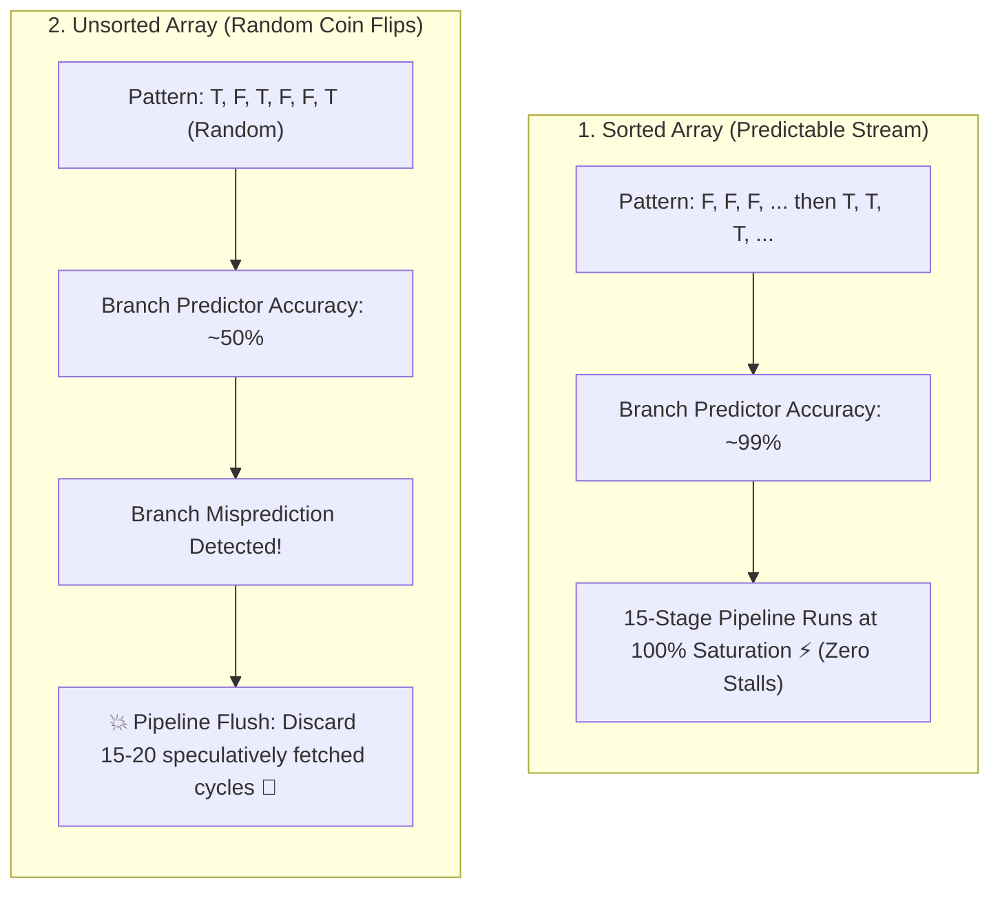

## 🎯 The Question

> **"Why does filtering and summing elements of a sorted array (`if (data[i] >= 128) sum += data[i];`) run up to 6 times faster than executing the exact same loop on an unsorted array with identical elements?"**

---

## ⚡ 30-Second Elevator Pitch

Modern CPUs use **Instruction Pipelining** (splitting instruction execution into 15 to 20 stages: Fetch, Decode, Execute, Memory, Writeback). To keep the pipeline saturated, the CPU cannot afford to wait for an `if` condition to finish executing; it must **guess** which path the code will take via **Branch Prediction**.

* **On a Sorted Array**:
  The data follows a predictable pattern: `[False, False, ..., False, True, True, ..., True]`. The hardware branch predictor quickly detects the pattern, predicting correctly $\approx 99\%$ of the time. The pipeline remains completely full, running at maximum speed.
* **On an Unsorted Array**:
  The condition outcomes are random: `[True, False, True, True, False, False, ...]`. The predictor is reduced to guessing like a coin toss (~50% accuracy). Every misprediction forces the CPU to **flush the entire pipeline**, throwing away 15 to 20 cycles of speculatively executed work and grinding throughput to a halt.

---

## 🧠 Under-the-Hood: Pipeline Flush on Branch Misprediction



---

## 🔬 The Hardware Cost of Pipeline Stalls

In a modern x86 or ARM CPU:
* A non-branching instruction executes in $\approx 1$ cycle.
* A **Branch Misprediction Penalty** costs **15 to 20 clock cycles** because the CPU must invalidate the Instruction Queue, purge speculatively decoded micro-ops, and restart fetching from the alternative instruction pointer address.

If 100,000 numbers are tested and 50,000 branches are mispredicted, the processor wastes nearly **1,000,000 clock cycles** purely on pipeline flushes!

### Branchless Optimization
High-performance code eliminates branches using conditional moves (`CMOV` in assembly) or bit manipulation:

```cpp
// Branching (Vulnerable to misprediction):
if (data[i] >= 128) sum += data[i];

// Branchless (Zero branch penalty regardless of sorting):
int mask = -(data[i] >= 128); // Generates 0 or -1 (all 1s in binary)
sum += data[i] & mask;
```

---

## 📌 Comparison Matrix: Sorted vs. Unsorted Branch Performance

| Metric | Sorted Array Execution | Unsorted Array Execution |
| :--- | :--- | :--- |
| **Branch Predictability** | Highly structured ($F \dots F \to T \dots T$) | Chaotic / Random ($50\%$ entropy) |
| **Prediction Accuracy** | $\approx 99\%$ accuracy | $\approx 50\%$ accuracy |
| **Pipeline Status** | Continuously full and flowing | Frequent pipeline invalidations |
| **Penalty per Mispredict** | Rare ($<1\%$ of branches) | Constant (15–20 wasted cycles per miss) |
| **Effective Runtime** | ⚡ Up to $6\times$ faster | 🐢 Bounded by pipeline flush latency |

---

## 💡 What Interviewers Ask Next (Follow-Up Traps)

1. **"What hardware mechanisms do modern CPUs use to predict branches?"**
   - *Answer*: Modern CPUs use sophisticated two-level adaptive predictors, **Branch Target Buffers (BTB)**, 2-bit Saturating Counters (Strongly Taken, Weakly Taken, Weakly Not Taken, Strongly Not Taken), and modern TAGE (TAgged GEometric history length) predictors that track historical branch patterns across thousands of instructions.

2. **"Does sorting the array always make code faster in practice?"**
   - *Answer*: **No.** Sorting an unsorted array takes $O(N \log N)$ time. If you only iterate through the array once or twice, the sorting overhead ($O(N \log N)$) far exceeds the time saved by branch prediction ($O(N)$). Pre-sorting only pays off if the dataset is queried repeatedly or if branchless instructions cannot be used.

---

:::tip Placement & Interview Takeaway
**Interview Answer**: Filtering a sorted array is up to 6x faster because modern CPUs rely on branch prediction to keep their instruction pipelines full. A sorted array gives the branch predictor a consistent, predictable pattern, whereas an unsorted array causes continuous mispredictions, forcing the CPU to flush its 15–20 stage pipeline and waste cycles on restarts.
:::

---

## 📺 Video Explanation

<YouTubeEmbed 
  id="3qQkVF2jfME" 
  title="Why Sorted Arrays Run 6x FASTER | Interview Question #47" 
/>
