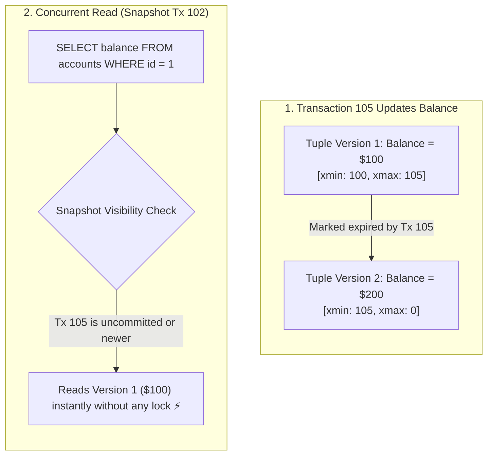

## 🎯 The Question

> **"In college DBMS courses, we learn that updating a row locks it so concurrent transactions cannot read it (Two-Phase Locking). Why doesn't an UPDATE block SELECT queries in production databases like PostgreSQL and MySQL?"**

---

## ⚡ 30-Second Elevator Pitch

In university textbooks, concurrency is taught using **Two-Phase Locking (2PL)**: when a transaction writes to a row, it acquires an **Exclusive Lock (X-Lock)**, forcing any incoming read queries to stall until the write commits. In a high-traffic production system, 2PL causes catastrophic thread contention and latency spikes.

Modern production engines solve this with **Multi-Version Concurrency Control (MVCC)**:
1. When an `UPDATE` occurs, the database **does not overwrite the existing row in place**.
2. Instead, it creates a **brand new version of the tuple** with transaction visibility metadata (`xmin` and `xmax` in PostgreSQL).
3. Concurrent `SELECT` queries continue reading the older, committed snapshot version with zero locks.

**The Golden Rule of MVCC**: *Readers never block writers, and writers never block readers.*

---

## 🧠 Under-the-Hood: Row Versioning with xmin / xmax

---

## 🔬 How PostgreSQL Implements MVCC

Every table tuple in PostgreSQL has hidden system header columns:
* **`xmin`**: The transaction ID (`txid`) of the transaction that inserted the row version.
* **`xmax`**: The transaction ID that deleted or replaced this row version (set to `0` if active).

When an `UPDATE` executes:
* Old row's `xmax` is set to the current transaction ID.
* New row is appended with `xmin` set to the current transaction ID and `xmax = 0`.
* A background maintenance worker (**VACUUM**) cleans up obsolete dead tuples once no active transaction snapshots need them.

---

## 📌 Comparison Matrix: Two-Phase Locking vs. MVCC

| Dimension | Two-Phase Locking (2PL - Academic) | Multi-Version Concurrency Control (MVCC - Production) |
| :--- | :--- | :--- |
| **Write Blocking Reads** | ❌ Yes (Exclusive X-lock blocks S-locks) | ✅ **No** (Reads see consistent older snapshot) |
| **Read Blocking Writes** | ❌ Yes (Shared S-lock blocks X-locks) | ✅ **No** (Writers create new row versions) |
| **Write Contention** | Writers only block conflicting writers | Writers only block conflicting writers on same row |
| **Storage Overhead** | Minimal (In-place data mutation) | Moderate (Requires dead tuple VACUUM cleanup) |
| **Production Engines** | Strict academic models / Distributed 2PC | PostgreSQL, MySQL (InnoDB), Oracle, CockroachDB |

---

## 💡 What Interviewers Ask Next (Follow-Up Traps)

1. **"What is Table Bloat in PostgreSQL, and why does MVCC cause it?"**
   - *Answer*: Because MVCC never updates rows in place, high-frequency `UPDATE` or `DELETE` operations create millions of dead row versions. If the background `AUTOVACUUM` daemon falls behind, the table and its B+ Tree indexes accumulate empty physical disk pages (Bloat), degrading query cache efficiency.

2. **"Does MVCC prevent Deadlocks entirely?"**
   - *Answer*: **No.** While MVCC prevents read-write deadlocks, write-write deadlocks can still happen. If Transaction A updates Row 1 and attempts to update Row 2, while Transaction B updates Row 2 and attempts to update Row 1, both transactions acquire exclusive row locks and deadlock.

---

:::tip Placement & Interview Takeaway
**Interview Answer**: Modern databases replace academic Two-Phase Locking with MVCC. Instead of in-place mutation requiring exclusive locks, writers append new row versions with transaction metadata. Readers inspect their transaction snapshot to query valid older versions without acquiring locks or waiting.
:::

---

## 📺 Video Explanation

<YouTubeEmbed 
  id="0Fr71sxUL4w" 
  title="College vs Production: Database Locking & MVCC | Interview Question #49" 
/>
