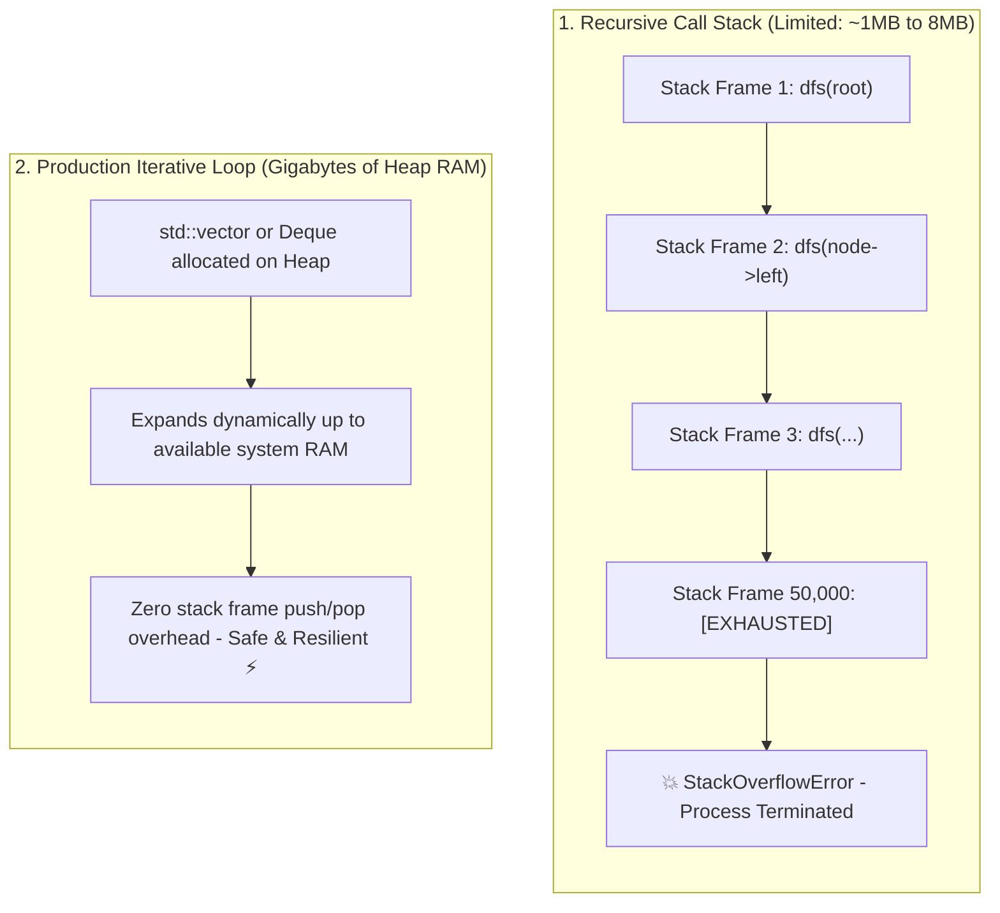

## 🎯 The Question

> **"In university data structures exams, recursive solutions for trees, graphs, and DFS are praised for being elegant and concise. Why do production backend systems, JSON parsers, and compilers rewrite recursive algorithms into iterative loops?"**

---

## ⚡ 30-Second Elevator Pitch

In college, recursion is tested on balanced toy trees with depths of 10 or 20. But in production, data comes from real users (deeply nested JSON ASTs, skewed binary search trees, or cyclic graphs) where recursion depth can exceed **50,000 calls**.

Every function call pushes a new **Stack Frame** onto the thread's **Call Stack** (containing return addresses, saved registers, and local variables).
* While physical RAM has gigabytes available on the **Heap**, the OS **Thread Stack is hard-capped at only 1 MB to 8 MB**.
* Once recursion depth exhausts this small stack boundary, the CPU hits the memory guard page, throwing an uncatchable **`StackOverflowError` / `SIGSEGV`** that instantly terminates the backend process.

---

## 🧠 Under-the-Hood: Thread Call Stack vs. Heap Allocation

---

## 🔬 Anatomy of a Single Stack Frame

A recursive call is not free. For every nested call level:
* **Return Address** (8 bytes on 64-bit architecture)
* **Frame Pointer (`RBP`) & Callee-Saved Registers** (~16–32 bytes)
* **Function Parameters & Local Variables** (~16–64 bytes)
* **Stack Alignment Padding** (x86-64 mandates 16-byte alignment)

A seemingly lightweight function can easily consume **64 to 128 bytes per stack frame**. At 100,000 recursive calls, it demands **~12.8 MB of stack space**—instantly exceeding standard Linux thread stack limits (typically 8 MB on Linux, 1 MB on Windows, 2 MB on macOS).

---

## 📌 Comparison Matrix: Recursion vs. Iterative Heap Simulation

| Dimension | Recursive Approach (Academic) | Iterative with Explicit Heap Stack (Production) |
| :--- | :--- | :--- |
| **Code Length** | Concise & elegant (5–10 lines) | Slightly more verbose (~20 lines) |
| **Memory Buffer** | Thread Call Stack (Hard limit: 1 MB – 8 MB) | Heap Memory (Gigabytes of virtual RAM) |
| **Failure Mode on Deep Input** | Unrecoverable process crash (`SIGSEGV`) | Safe graceful handling or clean error response |
| **Function Call Overhead** | High (Register saves, stack pointer adjustments) | Low (Contiguous array `push`/`pop` operations) |
| **Compiler Optimization** | Requires Tail-Call Optimization (TCO) | Naturally cache-friendly and loop-vectorizable |

---

## 💡 What Interviewers Ask Next (Follow-Up Traps)

1. **"What is Tail-Call Optimization (TCO), and why can't we always rely on it?"**
   - *Answer*: TCO allows a compiler to reuse the current stack frame if the recursive call is the absolute final statement in the function (`return dfs(next);`). However, languages like Python and Java **deliberately do not support TCO** (to preserve complete stack traces for debugging), and complex algorithms (like branching tree traversals) cannot be expressed as tail-calls.

2. **"How do production JSON/XML parsers (like Jackson or Chromium) parse deeply nested payloads safely?"**
   - *Answer*: They use **Iterative Streaming Parsers** (e.g. SAX/StAX) or an explicit state stack on the heap. If user input depth exceeds a configured security ceiling (e.g. `max_depth = 1000`), the parser cleanly rejects the request with an error rather than allowing a stack overflow DoS attack.

---

:::tip Placement & Interview Takeaway
**Interview Answer**: Production systems avoid deep recursion because thread call stacks have a fixed limit (1MB–8MB). Uncontrolled inputs trigger unrecoverable stack overflows. Production architectures simulate recursion iteratively using explicit stack data structures on the heap, which can safely scale across gigabytes of memory.
:::

---

## 📺 Video Explanation

<YouTubeEmbed 
  id="oBQebKoZTZo" 
  title="College vs Production: Why Recursion CRASHES in Production | Interview Question #50" 
/>
