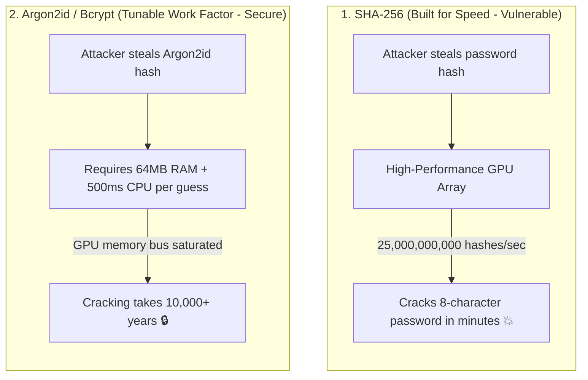

## 🎯 The Question

> **"In college web programming, students are often taught to hash passwords using `SHA256(password + salt)`. Why is using SHA-256 for password storage considered a critical security vulnerability in production engineering?"**

---

## ⚡ 30-Second Elevator Pitch

The fundamental flaw is that **SHA-256 was engineered to be fast**:
* Its purpose is data integrity, block hashing, and checksum verification—computing hashes for gigabytes of data in milliseconds.
* A single consumer GPU (like an NVIDIA RTX 4090) can compute **over 25 billion SHA-256 hashes every second**.

If an attacker breaches a database and steals salted SHA-256 hashes, they don't attack your online login form; they run **offline brute-force attacks**. An 8-character alphanumeric password hashed with SHA-256 can be cracked in **under 1 hour**.

**The Production Standard**: Passwords must be hashed using **deliberately slow, memory-hard key derivation functions** like **Bcrypt, Scrypt, or Argon2id**.

---

## 🧠 Under-the-Hood: Fast Hashing vs. Memory-Hard Slow Hashing

---

## 🔬 Why Salting Alone Cannot Save SHA-256

* **What Salting Does**: Adding a random salt per user prevents **Rainbow Table lookups** (precomputed hash tables) and stops attackers from cracking identical passwords across multiple users simultaneously.
* **What Salting Fails to Do**: Salting does **nothing** to slow down brute-force search. An attacker with a salted hash simply computes `SHA256(guess + known_salt)` 25 billion times per second on their GPU.

---

## 📌 Comparison Matrix: SHA-256 vs. Bcrypt vs. Argon2id

| Metric | SHA-256 (Cryptographic Hash) | Bcrypt (Adaptive Hash) | Argon2id (Modern Winner) |
| :--- | :--- | :--- | :--- |
| **Design Goal** | Fast data integrity & verification | Deliberately slow password storage | Memory-hard & side-channel resistant |
| **GPU Cracking Speed** | ⚡ Billions of guesses / sec | ~10,000 guesses / sec | ~100 guesses / sec (GPU bottlenecked) |
| **Configurable Work Factor** | ❌ Fixed (Cannot increase work) | ✅ Yes (Exponential cost rounds) | ✅ Yes (Time, Memory, and Parallelism) |
| **Memory Requirement** | Near-zero (Registers only) | 4 KB | 64 MB – 1 GB of physical RAM |
| **Production Recommendation** | File checksums, Git commits, HMAC | Industry standard legacy web auth | Current gold standard (Password Hashing Competition Winner) |

---

## 💡 What Interviewers Ask Next (Follow-Up Traps)

1. **"What is a Work Factor (Cost Parameter) in Bcrypt?"**
   - *Answer*: Bcrypt uses an iteration parameter $2^{\text{cost}}$. A cost factor of 12 means computing the hash takes $2^{12} = 4,096$ rounds of Blowfish encryption ($\approx 250\text{–}300\text{ ms}$ on modern server CPUs). As hardware becomes faster over time, engineers can increment the cost factor without altering existing user passwords.

2. **"Why is Argon2id superior to Bcrypt on modern hardware?"**
   - *Answer*: Bcrypt is **CPU-bound** but requires very little memory (only 4 KB). Attackers can build custom ASIC chips or FPGA boards with thousands of parallel cores to crack Bcrypt. **Argon2id is Memory-Hard**: each hashing operation requires large blocks of physical RAM (e.g. 64 MB), saturating GPU memory buses and making specialized hardware cracking economically unfeasible.

---

:::tip Placement & Interview Takeaway
**Interview Answer**: SHA-256 fails for password storage because it was designed for fast execution. High-performance GPUs compute billions of SHA-256 hashes per second, making salted hashes trivial to crack offline. Production systems enforce slow, memory-hard algorithms like Argon2id or Bcrypt with tunable work factors.
:::

---

## 📺 Video Explanation

<YouTubeEmbed 
  id="IFTn26poscc" 
  title="College vs Production: Why SHA-256 Fails for Passwords | Interview Question #51" 
/>
