## 🎯 The Question

> **"When building a live search autocomplete bar (like Google or Amazon search), should you use Debouncing or Throttling? Why is throttling a mistake for user search inputs?"**

---

## ⚡ 30-Second Elevator Pitch

When a user types `"laptop"` into a search bar, 6 input events fire in under 1 second. Firing an HTTP request on every keystroke floods your database with useless intermediate queries (`"l"`, `"la"`, `"lap"`), drives up server costs, and introduces frontend **Race Conditions** where an older query overwrites newer search results.

* **Throttling (Fixed Rate Execution)**:
  Guarantees a function executes at most once every $X$ milliseconds. If set to 300 ms, typing `"laptop"` still fires 2 to 3 intermediate requests for incomplete words.
* **Debouncing (Cooldown Delay Execution - Correct Choice)**:
  Postpones function execution until a specified delay has elapsed **since the last keystroke**. Every new keystroke resets the countdown timer. Only when the user pauses typing for 300 ms does **ONE clean API request** fire for `"laptop"`.

---

## 🧠 Under-the-Hood: Debounce vs. Throttle Timeline

```mermaid
flowchart TD
    subgraph Raw["1. Raw Keystrokes: 'l' -> 'a' -> 'p' -> 't' -> 'o' -> 'p'"]
        direction LR
        K1["'l' (0ms)"] --> K2["'a' (80ms)"] --> K3["'p' (160ms)"] --> K4["'t' (240ms)"] --> K5["'o' (320ms)"] --> K6["'p' (400ms)"]
    end

    subgraph Throttle["2. Throttled (300ms Interval - Intermediate Calls Fired)"]
        direction LR
        T1["Fires 'l' (0ms)"] --> T2["Fires 't' (300ms)"] --> T3["Fires 'p' (600ms)"]
    end

    subgraph Debounce["3. Debounced (300ms Cooldown - Optimal)"]
        direction LR
        D1["Timer resets on every key..."] --> D2["User pauses at 400ms"] --> D3["Fires ONE query: 'laptop' at 700ms ⚡"]
    end
```



---

## 🔬 Preventing Frontend Network Race Conditions

Even with debouncing, a fast network response for query `"cat"` might arrive *after* a slower response for `"caterpillar"`, rendering stale results on screen.

Production implementations cancel pending requests using **`AbortController`**:

```javascript
let controller = null;

function searchAPI(query) {
  if (controller) controller.abort(); // Cancel previous in-flight HTTP request
  controller = new AbortController();

  fetch(`/api/search?q=${encodeURIComponent(query)}`, { signal: controller.signal })
    .then(res => res.json())
    .then(data => renderResults(data))
    .catch(err => { if (err.name !== 'AbortError') console.error(err); });
}
```

---

## 📌 Comparison Matrix: Debounce vs. Throttle

| Dimension | Debounce | Throttle |
| :--- | :--- | :--- |
| **Execution Trigger** | Executes after an activity cooldown pause | Executes at regular fixed time intervals |
| **Timer Reset Behavior** | Timer **resets** on every new incoming event | Timer ignores subsequent events until window expires |
| **Ideal For** | Search inputs, auto-save drafts, window resize end | Infinite scroll pagination, mouse move, game tick loop |
| **Network Efficiency** | ⭐ Optimal (Only final intended query is sent) | Moderate (Intermediate events still fire) |
| **Mental Model** | *"Wait until the user stops typing for 300ms"* | *"Execute at most once every 300ms"* |

---

## 💡 What Interviewers Ask Next (Follow-Up Traps)

1. **"What is the difference between a Leading-Edge and Trailing-Edge Debounce?"**
   - *Answer*: A **Trailing-Edge Debounce (Default)** executes after the cooldown delay expires (perfect for search inputs). A **Leading-Edge Debounce (Immediate)** executes on the very first event immediately, and then ignores subsequent calls until the user pauses (ideal for preventing double-clicking a 'Submit Payment' button).

2. **"How do you implement a minimal Debounce function in JavaScript from scratch?"**
   - *Answer*:
     ```javascript
     function debounce(fn, delay) {
       let timer;
       return function(...args) {
         clearTimeout(timer);
         timer = setTimeout(() => fn.apply(this, args), delay);
       };
     }
     ```

---

:::tip Placement & Interview Takeaway
**Interview Answer**: Use Debouncing for search autocomplete because it waits for the user to pause typing before sending an API request, preventing redundant database calls for incomplete words. Use Throttling for continuous stream events (like infinite scroll or window resizing) where periodic progress updates are required.
:::

---

## 📺 Video Explanation

<YouTubeEmbed 
  id="PlyJcJItHYw" 
  title="Search Autocomplete: Debounce vs Throttle | Interview Question #52" 
/>
