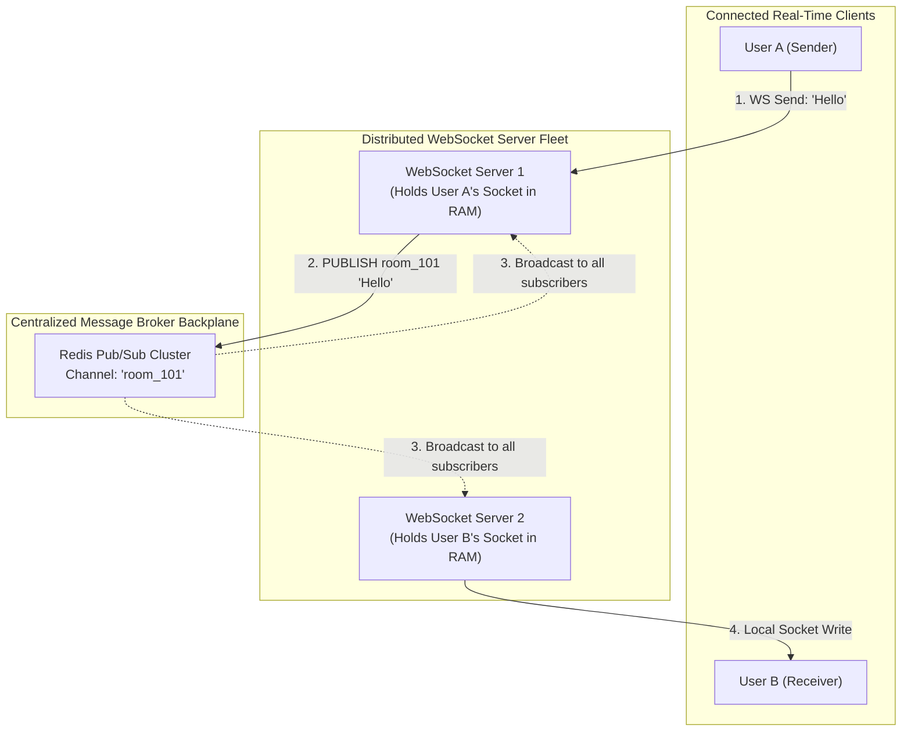

## 🎯 The Question

> **"In a real-time chat application (like Slack or Discord), User A is connected via WebSocket to Server 1, and User B is connected to Server 2. When User A sends a message, how does Server 1 deliver it to User B when it has no direct access to User B's socket connection?"**

---

## ⚡ 30-Second Elevator Pitch

Standard HTTP APIs are **stateless**: any server instance behind a load balancer can handle any request by reading from a centralized database.

**WebSockets are stateful**:
1. When a client connects, an active TCP socket descriptor is held in **that specific server's operating system RAM**.
2. If User A is on Server 1 and User B is on Server 2, Server 1 cannot write bytes to a socket held on Server 2.

**The Solution is a Message Broker Backplane (Redis Pub/Sub / Kafka)**:
* Each chat room or channel maps to a pub/sub topic in **Redis**.
* When Server 1 receives a message from User A, it publishes the payload to the Redis topic.
* All backend servers subscribed to that topic receive the message over the internal network.
* Server 2 receives the event, looks up User B in its local in-memory socket map, and pushes the message down the client's TCP socket.

---

## 🧠 Under-the-Hood: Redis Pub/Sub WebSocket Architecture



---

## 🔬 In-Memory Connection Routing Map

Each WebSocket server maintains a thread-safe connection registry in memory:

```javascript
// Local server RAM state
const localConnections = new Map(); // userId -> WebSocket connection

// When Redis delivers a message for room_101
redisSubscriber.on('message', (channel, message) => {
  const { targetUserId, text } = JSON.parse(message);
  
  // Check if target user has an active socket on THIS physical server
  if (localConnections.has(targetUserId)) {
    const clientSocket = localConnections.get(targetUserId);
    clientSocket.send(text); // Direct TCP write
  }
});
```

---

## 📌 Comparison Matrix: Stateless HTTP vs. Scaled WebSockets

| Architecture Layer | Stateless HTTP Service | Clustered WebSocket Fleet |
| :--- | :--- | :--- |
| **Connection Lifespan** | Ephemeral (Opens, responds, closes) | Persistent TCP session (Minutes to hours) |
| **Load Balancing** | Standard Round-Robin / Least Connections | Requires Sticky Sessions (or Layer 4 IP Hashing) |
| **Inter-Server Comm** | None needed (Central database is enough) | Mandatory **Message Broker Backplane** (Redis / Kafka) |
| **Reconnection Spike** | Natural handling | Thundering Herd on server restart (Requires backoff jitter) |
| **Server Failure** | Client seamlessly hits next server on next call | Active socket dies; client must reconnect and re-subscribe |

---

## 💡 What Interviewers Ask Next (Follow-Up Traps)

1. **"What happens if Redis crashes in a WebSocket cluster?"**
   - *Answer*: If the message backplane fails, inter-server communication breaks—users on the same server can still chat, but cross-server messages are dropped. High-availability architectures use **Redis Sentinel / Redis Cluster**, or durable distributed commit logs like **Apache Kafka / RabbitMQ** to ensure high availability and message replay.

2. **"Why do WebSocket Load Balancers require 'Sticky Sessions' during handshake?"**
   - *Answer*: A WebSocket connection begins as an HTTP request with an `Upgrade: websocket` header. The load balancer must route the HTTP upgrade request and all subsequent TCP packets to the exact same server instance to complete the handshake.

---

:::tip Placement & Interview Takeaway
**Interview Answer**: WebSockets cannot be scaled like stateless HTTP servers because socket descriptors are locked to an individual server's RAM. Scaled architectures connect all servers to a centralized message broker backplane (like Redis Pub/Sub), broadcasting messages across the fleet so each server can deliver events to its locally connected clients.
:::

---

## 📺 Video Explanation

<YouTubeEmbed 
  id="lSJ4eZR44ok" 
  title="How to Scale WebSockets Across Multiple Servers | Interview Question #53" 
/>
