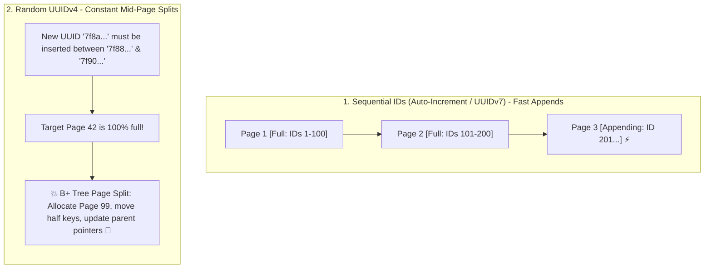

## 🎯 The Question

> **"In system design interviews, candidates often choose UUIDv4 for primary keys to avoid ID collision in distributed databases. Why does using random UUIDs cause write latency to spike and kill performance in relational engines like MySQL (InnoDB)?"**

---

## ⚡ 30-Second Elevator Pitch

In storage engines like MySQL (InnoDB), the Primary Key defines the **Clustered Index**, meaning table rows are physically stored on disk in **strictly sorted Primary Key order** inside 16 KB B+ Tree pages.

* **Sequential Auto-Increment IDs / UUIDv7**:
  Every new record has an ID greater than the last. The database simply appends the row to the end of the last leaf page ($O(1)$ sequential write).
* **Random UUIDv4 (Pure Entropy)**:
  Every new UUID lands at an arbitrary sorted position in the tree:
  1. The database must fetch random 16 KB pages from disk into RAM (Buffer Pool Thrashing).
  2. If the target page is full, it forces an expensive **B+ Tree Page Split** (allocating a new page, moving half the rows, rebalancing pointers).
  3. Table storage becomes **fragmented**, wasting 30% to 50% of disk space and memory cache capacity.

---

## 🧠 Under-the-Hood: Sequential Appends vs. Random Page Splits

---

## 🔬 The Modern Production Solution: Time-Ordered IDs (UUIDv7)

You don't have to choose between distributed uniqueness and database performance. Modern engineering standards use **Time-Ordered Universally Unique Identifiers**:

* **UUIDv4**: `xxxxxxxx-xxxx-4xxx-yxxx-xxxxxxxxxxxx` (122 bits of pure random noise)
* **UUIDv7 (RFC 9562)**: `tttttttt-tttt-7xxx-yxxx-xxxxxxxxxxxx`
  - First 48 bits = **Unix Epoch Timestamp in Milliseconds**
  - Remaining 74 bits = Sub-millisecond sequence & cryptographically secure random bits

Because UUIDv7 IDs increase monotonically over time, they append cleanly to B+ Tree leaf pages with zero random page splits while maintaining 100% collision-free distributed generation!

---

## 📌 Comparison Matrix: Auto-Increment vs. UUIDv4 vs. UUIDv7

| Dimension | Auto-Increment BigInt | Random UUIDv4 | Time-Ordered UUIDv7 |
| :--- | :--- | :--- | :--- |
| **Distributed Generation** | ❌ Bottleneck (Single DB coordinator) | ✅ Safe (Offline generation anywhere) | ✅ Safe (Offline generation anywhere) |
| **Insert Performance** | ⚡ Maximum (Sequential append) | 🐢 Terrible (Random seeks & page splits) | ⚡ Maximum (Sequential append) |
| **B+ Tree Page Splits** | Near-zero | Extremely frequent (High write amplification) | Near-zero |
| **Storage Size** | 8 bytes (`BIGINT`) | 16 bytes (`BINARY(16)`) | 16 bytes (`BINARY(16)`) |
| **ID Enumeration Security** | Vulnerable (`/users/102` allows scraping) | ✅ Secure (Unpredictable entropy) | ✅ Secure (Random bits prevent guessing) |

---

## 💡 What Interviewers Ask Next (Follow-Up Traps)

1. **"How does storing UUID as `VARCHAR(36)` instead of `BINARY(16)` impact performance?"**
   - *Answer*: Storing UUIDs as formatted hex strings (`"a1b2c3d4-..."`) consumes 36 bytes per row instead of 16 bytes in binary format ($2.25\times$ bloat). Because secondary indexes also store the clustered primary key pointer, string UUIDs inflate secondary indexes and cut buffer pool efficiency by more than half.

2. **"What alternative distributed ID generators exist besides UUIDv7?"**
   - *Answer*: **Twitter Snowflake / Sonyflake** (64-bit integers composed of timestamp, machine ID, and sequence number) and **ULID** (Universally Unique Lexicographically Sortable Identifier, 128-bit base32 encoded string).

---

:::tip Placement & Interview Takeaway
**Interview Answer**: Random UUIDv4 destroys relational database performance because clustered index B+ Trees physically organize rows in sorted order. Random inserts cause frequent mid-page splits, high write amplification, and buffer pool thrashing. Use time-ordered IDs like UUIDv7 or Snowflake IDs to preserve sequential disk writes while retaining distributed uniqueness.
:::

---

## 📺 Video Explanation

<YouTubeEmbed 
  id="nZk2ioaDfac" 
  title="Why Random UUIDs SLOW DOWN Your Database | Interview Question #54" 
/>
