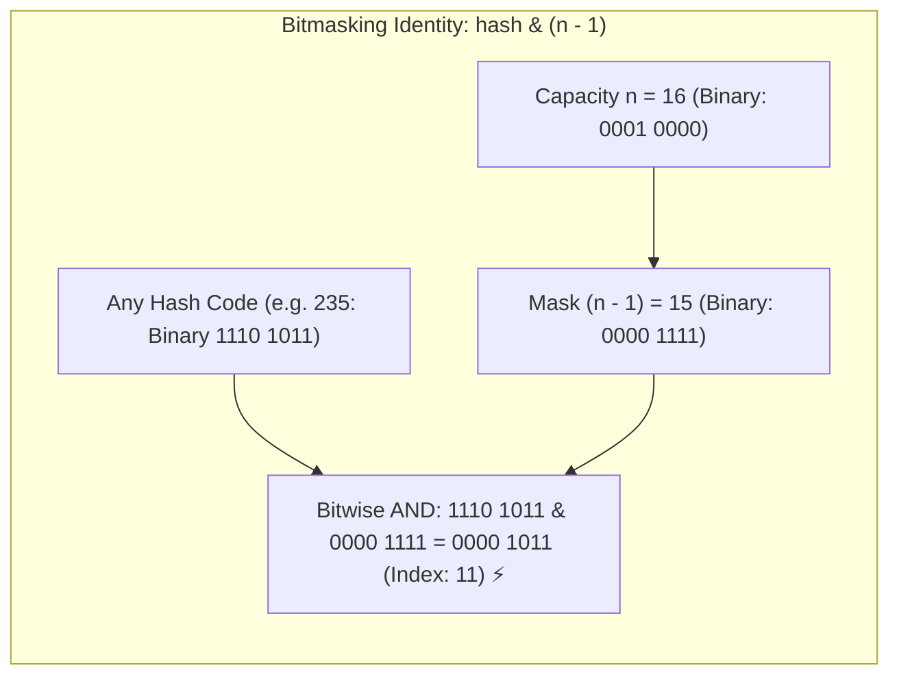

## 🎯 The Question

> **"In college textbooks, we calculate a hash table bucket index using `index = hash % capacity`. Why does Java's `HashMap` always enforce a capacity that is a power of 2 (16, 32, 64, 128...), and how does it compute bucket indices without using the modulo operator?"**

---

## ⚡ 30-Second Elevator Pitch

At the hardware CPU level, the **Modulo operator (`%`) requires integer division (`IDIV` in x86)**:
* Integer division is one of the slowest mathematical operations a CPU can perform, taking **20 to 40 clock cycles**.
* In high-throughput collections processing millions of `get()` and `put()` calls per second, modulo arithmetic creates a severe CPU pipeline bottleneck.

**The Power-of-2 Bitwise Optimization**:
When capacity $n$ is a power of 2 ($n = 2^k$), the mathematical modulo operation is **100% equivalent to a bitwise AND with $(n - 1)$**:

$$\text{hash} \pmod n \iff \text{hash} \ \& \ (n - 1)$$

A bitwise `AND` executes in **a single CPU clock cycle (0.5 nanoseconds)**—making index calculation up to **$30\times$ faster**.

---

## 🧠 Under-the-Hood: Why the Bitmask Identity Works

When $n$ is a power of 2, $(n - 1)$ creates a binary mask of **all 1s**:



The bitwise `AND` simply extracts the lower $k$ bits of the hash code, which is mathematically identical to remainder division by $2^k$.

---

## 🔬 The Danger of Non-Power-of-2 Sizes

If $n$ is **not** a power of 2, $(n - 1)$ contains zero bits in between, permanently disabling certain bucket indices:
* Suppose $n = 10 \implies (n - 1) = 9$ (`1001` in binary).
* Any number `& 1001` can only ever produce indices `0, 1, 8, 9`.
* Buckets `2, 3, 4, 5, 6, 7` will **never receive an element**, causing massive collision clustering and wasting 60% of array capacity!

---

## 📌 Comparison Matrix: Modulo (%) vs. Bitwise AND (&)

| Metric / Aspect | Modulo Indexing (`hash % n`) | Bitwise Indexing (`hash & (n - 1)`) |
| :--- | :--- | :--- |
| **CPU Instruction** | `IDIV` (Integer Division) | `AND` (Bitwise AND) |
| **Hardware Latency** | 🐢 20–40 CPU cycles | ⚡ **1 CPU cycle (~0.5 ns)** |
| **Capacity Constraint** | Any integer value | **Strictly a power of 2** ($2^k$) |
| **Bucket Utilization** | Uniform (if hash is uniform) | Uniform **only** if $n = 2^k$ |
| **Real-World Runtimes** | Educational implementations | Java `HashMap`, Go `map`, Python `dict` |

---

## 💡 What Interviewers Ask Next (Follow-Up Traps)

1. **"What is the HashMap Perturbation (Hash Defense) function in Java?"**
   - *Answer*: Because `hash & (n - 1)` only uses the lowest bits of the hash, if two objects have different high bits but identical lower bits, they will collide in the same bucket. Java fixes this by XORing the top 16 bits with the bottom 16 bits:
     ```java
     static final int hash(Object key) {
         int h;
         return (key == null) ? 0 : (h = key.hashCode()) ^ (h >>> 16);
     }
     ```
     This spreads high-bit entropy down to the lower bits, preventing collision storms.

2. **"If a user initializes a HashMap with `new HashMap<>(10)`, what will its actual capacity be?"**
   - *Answer*: It will be **16**. Java's `tableSizeFor()` method rounds any input integer up to the nearest power of 2 using bit-shifting (`numberOfLeadingZeros`).

---

:::tip Placement & Interview Takeaway
**Interview Answer**: HashMaps enforce power-of-2 capacities to replace expensive integer division (`%`, 20–40 CPU cycles) with bitwise AND (`& (n - 1)`, 1 CPU cycle). The bitmask $(n - 1)$ isolates the lower bits to calculate the array index in a single clock cycle without arithmetic overhead.
:::

---

## 📺 Video Explanation

<YouTubeEmbed 
  id="GPs1KWtC2ls" 
  title="Why HashMap Capacity is ALWAYS a Power of 2 | Interview Question #55" 
/>
